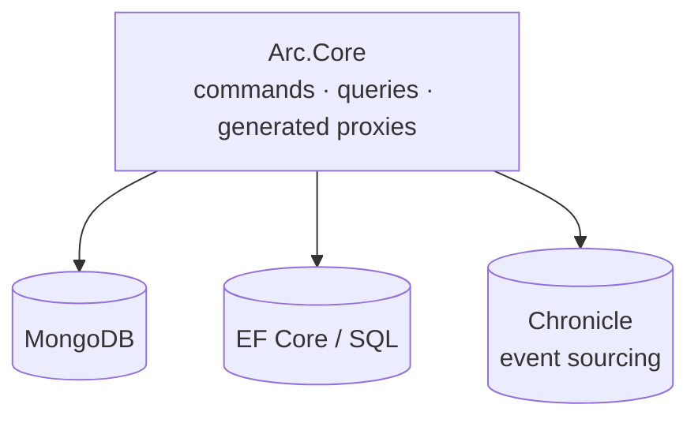

It's easy to assume Arc and [Chronicle](/chronicle/) are a package deal, because they work well together. But Arc does not require an event store. Its core is a *persistence-agnostic* application model: **commands, queries, and the generated C# → TypeScript proxies that keep your React frontend in lockstep with your backend.** Where the data actually lives is your choice.

This page shows Arc on its own — the same typed full-stack experience, backed by a plain database instead of an event log — and exactly where the line between the two sits.

## The line between Arc and Chronicle

Arc is a layer that can sit *on top of* Chronicle; Chronicle never depends on Arc. That direction is the whole point — it's why you can drop Chronicle entirely and keep everything Arc gives you. In the backend docs, Chronicle is one **integration** among peers — [Chronicle](./backend/chronicle/index.md), [MongoDB](./backend/mongodb/index.md), and [Entity Framework](./backend/entity-framework/index.md) — each a way to give your commands and queries somewhere to read and write.



Pick MongoDB or EF Core and you have a complete, fully-typed full-stack app with no events anywhere in sight.

## A standalone slice, end to end

Here's the whole thing — register an author, and list authors live — with the data stored straight in a MongoDB collection.

**The read model is just a document.** Mark it `[ReadModel]` so Arc exposes its query methods; there's no `[FromEvent]` and no projection. A static method *is* the query, and returning an `ISubject<>` makes it live:

```csharp
[ReadModel]
public record Author(AuthorId Id, AuthorName Name)
{
    // This static method is the query — served over HTTP, and live.
    public static ISubject<IEnumerable<Author>> AllAuthors(IMongoCollection<Author> authors) =>
        authors.Observe();
}
```

**The command writes the document directly.** Inject the collection and insert — `Handle()` returns nothing, because there's no event to record:

```csharp
[Command]
public record RegisterAuthor(AuthorId Id, AuthorName Name)
{
    public Task Handle(IMongoCollection<Author> authors) =>
        authors.InsertOneAsync(new Author(Id, Name));
}
```

That's the backend. Register MongoDB once at startup:

```csharp
var builder = WebApplication.CreateBuilder(args);
builder.AddCratisArc();
builder.UseCratisMongoDB();

var app = builder.Build();
app.UseCratisArc();
app.Run();
```

Build, and Arc generates the typed proxies for `RegisterAuthor` and `AllAuthors` exactly as it would for an event-sourced slice. The React side is unchanged from any other Arc app:

```tsx
const [authors] = AllAuthors.use();   // live — re-renders when the collection changes

<CommandDialog command={RegisterAuthor} title="Add author">
    <InputTextField value={i => i.name} title="Name" />
</CommandDialog>
```

> [!NOTE]
> `AllAuthors` is live with no event sourcing involved. `IMongoCollection<T>.Observe()` watches MongoDB's change stream, so the moment the command inserts a document, every subscribed browser re-renders. Entity Framework gets the same treatment through [observed DbSets](./backend/entity-framework/observing.md).

## What actually changes when you add Chronicle

Set this slice next to the same slice with [Chronicle added later](/arc/backend/chronicle/add-event-sourcing/). The query and the React are **identical**. The only thing that differs is the command's write path:

| | Standalone (this page) | With Chronicle |
| --- | --- | --- |
| What `Handle()` does | inserts a document | appends an event |
| What fills the read model | the command, directly | a projection over the event |
| What you can read | current state | current state **and full history** |

So adopting Chronicle later is a *write-side* change. Your queries, your generated proxies, and your screens don't move.

## What you give up — and when to add Chronicle back

Storing current state directly is simpler, and for plenty of applications it's the right call. What you don't get is everything an event log buys you: an audit trail, the ability to rebuild a read model a brand-new way from history, temporal queries, and reactors that fire on facts. [Why Event Sourcing](/chronicle/why-event-sourcing/) is the honest look at that trade-off.

The reassuring part, from the table above: you don't have to decide up front. Start with Arc over a database, and the day history starts to matter, move the write side to Chronicle — the read side and the entire frontend come along unchanged. [Adopting Cratis](/adopting-cratis/) walks through doing exactly that, one step at a time.

## Go deeper

- [MongoDB integration](./backend/mongodb/index.md) — setup, serializers, class mapping, and [observing collections](./backend/mongodb/observing-collections.md) for live queries.
- [Entity Framework integration](./backend/entity-framework/getting-started.md) — DbContexts, read-only contexts, and [observing DbSets](./backend/entity-framework/observing.md).
- [Commands](./backend/commands/index.md) and [Queries](./backend/queries/index.md) — the full model-bound and controller-based reference.
- [Why Arc](./why-arc.md) — the problem Arc solves, with or without an event store.
