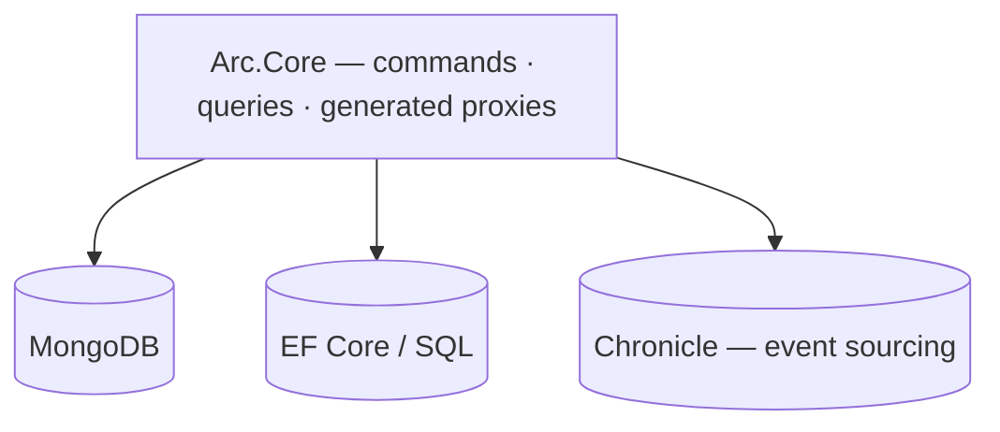

It's easy to assume Arc and [Chronicle](/chronicle/) are a package deal, because they work well together. We think event sourcing is the default architecture for information systems, and Chronicle is the Cratis event-sourcing platform. But Arc itself is CQRS: **commands, queries, and the generated C# → TypeScript proxies that keep your React frontend in lockstep with your backend.** Where the data actually lives is a separate decision.

This page shows Arc on its own — the same typed full-stack experience, backed by a plain database instead of an event log — so the line between CQRS and event sourcing is explicit. CQRS and event sourcing fit naturally together, but neither depends on the other.

## The line between Arc and Chronicle

Arc is a layer that can sit *on top of* Chronicle; Chronicle never depends on Arc. That direction is the whole point — it's why a bounded current-state slice can keep everything Arc gives you without storing events. In the backend docs, Chronicle, [MongoDB](./backend/mongodb/index.md), and [Entity Framework](./backend/entity-framework/index.md) are integrations: each gives commands and queries somewhere to read and write, while Chronicle adds the event-sourced backbone.


```mermaid
flowchart TB
    Core["Arc.Core — commands · queries · generated proxies"]
    Core --> Mongo[("MongoDB")]
    Core --> EF[("EF Core / SQL")]
    Core --> Chr[("Chronicle — event sourcing")]
```

Pick MongoDB or EF Core and you have a complete, fully-typed CQRS app without an event log. Pick Chronicle and the same Arc boundary records facts, builds projections, and keeps history.

## A standalone slice, end to end

These **illustrative excerpts** show registering an author and listing authors live in MongoDB. For the runnable project, domain declarations/imports, ASP.NET host, MongoDB settings and replica-set bootstrap, start with [standalone setup](./backend/getting-started/index.md) and its [backend checkpoint](/arc/backend/getting-started/your-first-command/). The explanation here does not replace those prerequisites.

**The read model is just a document.** Mark it `[ReadModel]` and Arc exposes its query methods. A static method *is* the query, and returning an `ISubject<>` makes it live:

```csharp
[ReadModel]
public record Author(AuthorId Id, AuthorName Name)
{
    // This static method is the query — served over HTTP, and live.
    public static ISubject<IEnumerable<Author>> AllAuthors(IMongoCollection<Author> authors) =>
        authors.Observe();
}
```

**The command writes the document directly.** Inject the collection and insert — `Handle()` returns nothing, because there's no event to record:

```csharp
[Command]
public record RegisterAuthor(AuthorId Id, AuthorName Name)
{
    public Task Handle(IMongoCollection<Author> authors) =>
        authors.InsertOneAsync(new Author(Id, Name));
}
```

**A command can take the read model it acts on.** Mark the property holding the key and Arc loads the document, so the command decides against current state instead of fetching it first:

```csharp
using System.ComponentModel.DataAnnotations;

[Command]
public record RenameAuthor([property: Key] AuthorId Id, AuthorName NewName)
{
    public Task Handle(Author author, IMongoCollection<Author> authors) =>
        authors.ReplaceOneAsync(_ => _.Id == author.Id, author with { Name = NewName });
}
```

This works the same for a read model held in MongoDB and one carried by an Entity Framework `ReadOnlyDbContext`. [Read models in commands](./backend/chronicle/read-models/injecting-into-commands.md) covers what a nullable parameter means, and [Read models from other providers](./backend/chronicle/read-models/other-providers.md#declaring-the-key-without-chronicle) how to declare the key when it is not a single property.

That's the backend behavior. This host excerpt assumes the setup's `Cratis:MongoDB` configuration; Arc auto-discovers collections and serializers rather than requiring per-model registrations:

```csharp
var builder = WebApplication.CreateBuilder(args);
builder.AddCratisArc();
builder.UseCratisMongoDB();

var app = builder.Build();
app.UseCratisArc();
app.Run();
```

Install `Cratis.Arc.ProxyGenerator.Build`, configure `CratisProxiesOutputPath`, and build in Debug as shown in setup to generate `RegisterAuthor` and `AllAuthors`. Building with Arc alone does not generate them. This React **fragment** assumes the [frontend setup](/arc/frontend/getting-started/) imports/providers and the [per-operation `id` state](/arc/tutorial/first-slice/) (`Guid.create()` from `@cratis/fundamentals`), with a fresh dialog instance for each registration:

```tsx
const [authors] = AllAuthors.use();   // live — re-renders when the collection changes

<CommandDialog<RegisterAuthor> command={RegisterAuthor} title="Add author" initialValues={{ id }}>
    <InputTextField<RegisterAuthor> value={i => i.name} title="Name" />
</CommandDialog>
```

> [!NOTE]
> `AllAuthors` is live with no event sourcing involved. `IMongoCollection<T>.Observe()` watches MongoDB's change stream, so the moment the command inserts a document, every subscribed browser re-renders. [Observed DbSets](./backend/entity-framework/observing.md) receive same-host `SaveChanges` notifications through Arc's configured interceptor. SQLite does not detect arbitrary external-process writes; other EF providers need their database notification setup for that.

## Test the slice the same way

Arc's command testing does not depend on Chronicle either. Start with `Cratis.Arc.Testing`, drive the
command through a `CommandScenario<TCommand>`, and assert the `CommandResult` exactly as you would in an
event-sourced slice. The only difference is what you assert after the command runs: a current-state slice
checks the database or application service it wrote to, while a Chronicle-backed slice can also assert
the appended events.

That keeps the CQRS boundary testable before you decide whether the slice needs an event log. See
[Arc testing](./backend/testing/) and [command scenarios](./backend/testing/command-scenario.md) for the
base testing loop; add the [Chronicle testing extension](./backend/testing/chronicle.md) only when the
command appends events.

## What actually changes when you add Chronicle

Set this slice next to the same slice with [Chronicle added later](/arc/backend/chronicle/add-event-sourcing/). You can preserve the query and frontend **contracts**, while replacing direct writes with events and configuring a projection. The provider lookup/observation implementation may need to change; adding a package does not migrate existing data automatically:

| | Standalone (this page) | With Chronicle |
| --- | --- | --- |
| What `Handle()` does | inserts a document | appends an event |
| What fills the read model | the command, directly | a projection over the event |
| What you can read | current state | current state **and full history** |

Adopting Chronicle changes persistence and adds projection/bootstrap work. If you preserve the query's contract and route, its generated caller and screen can remain unchanged.

## The trade-off

Storing current state directly is simpler for bounded CRUD surfaces, reference data, settings, and adoption steps. What you don't get is everything an event log buys you: an audit trail, the ability to rebuild a read model a brand-new way from history, temporal queries, and reactors that fire on facts. For information systems, we prefer starting with Chronicle because those needs show up often. [Why Event Sourcing](/chronicle/why-event-sourcing/) explains the default.

The reassuring part, from the table above: the boundary stays clean. If a direct-database slice later belongs in the event-sourced model, move persistence to Chronicle and deliberately preserve the public read contracts so the frontend need not change. [Adopting Cratis](/adopting-cratis/) walks through doing exactly that, one step at a time.

## Go deeper

- [MongoDB integration](./backend/mongodb/index.md) — setup, serializers, class mapping, and [observing collections](./backend/mongodb/observing-collections.md) for live queries.
- [Entity Framework integration](./backend/entity-framework/getting-started.md) — DbContexts, read-only contexts, and [observing DbSets](./backend/entity-framework/observing.md).
- [Commands](./backend/commands/index.md) and [Queries](./backend/queries/index.md) — the full model-bound and controller-based reference.
- [Why Arc](./why-arc.md) — the problem Arc solves, and how CQRS relates to event sourcing.
