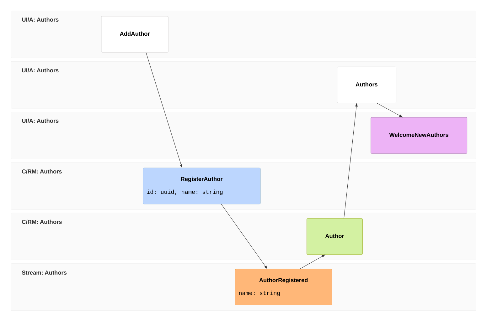

import { Aside } from '@astrojs/starlight/components';
import FullStackTabs from '@components/FullStackTabs.astro';

You have a complete, typed, live full-stack app from the Arc tutorial — and so far it used a database directly. This page shows the write-side move that puts [Chronicle](/chronicle/) underneath the same CQRS boundary. For information systems, this is the direction we usually recommend: keep the Arc command/query shape, and let Chronicle store the facts.

You can preserve your query signatures, generated proxies, and React screens. That requires preserving the read model's storage contract as well as changing the write side.

## Before changing the slice

This is a migration outline, not a runnable host checkpoint. First:

- Add the **`Cratis` package** to the ASP.NET Core host and follow its [basic setup](./cratis-package.md#basic-setup): `builder.AddCratis()` before building, then `app.UseCratis()`. This supplies both Arc and Chronicle's ASP.NET Core integration. If you bring your own authentication, retain the `Cratis` package reference and follow its [split-registration example](./cratis-package.md#running-arc-or-chronicle-on-their-own) instead. `Cratis.Arc.Chronicle` alone does not establish the ASP.NET Core extension surface used by that example.
- Run a compatible Chronicle server and configure its connection, event store, namespace, and read-model sink. The client registration does not start the server.
- For the MongoDB query below, separately install/configure `Cratis.Arc.MongoDB`. Align its database, collection naming, key mapping, serialization, and tenant mapping with Chronicle's sink. Sharing an application host does not establish that alignment.
- Decide how existing rows become history: import explicit initial facts, backfill, or cut over to a new model. Adding a projection does not turn existing rows into events. Plan replay and prevent old direct writes from racing the new projection.

After the change, append one author and verify its event-source id, projected key, and query result agree. Expect asynchronously materialized state to become visible after projection processing, not necessarily when the command response arrives.

If you drew the database-backed slice as an **[event model](/event-modeling/)**, the model barely changes here. The screen, the command, the `AuthorRegistered` fact, the read model, and the query all stay put. What changes is *where the fact lives* — a database row becomes a real, stored event — and that unlocks one genuinely new block: a **reactor** (frame `06`), automation that fires *when a fact happens*.



Frames `01`–`05` are unchanged from the intro — the fact at `03` is just stored differently now. Frame `06` is the new part: a reactor, which you couldn't have before because there were no stored events to react to. Let's prove it on the very first slice.

## What changes, and what doesn't

Set the two versions of the author slice side by side.

**The command stops writing a document and starts recording a fact.** `Handle()` returns the event that happened instead of inserting:

```csharp
[Command]
public record RegisterAuthor(AuthorId Id, AuthorName Name)
{
    public AuthorRegistered Handle() => new(Name);   // returns the fact, doesn't write
}

[EventType]
public record AuthorRegistered(AuthorName Name);
```

The event is an immutable, past-tense fact. `[EventType]` carries **no name argument** — Chronicle uses the type name, `AuthorRegistered`, as its identity. For Chronicle to use an author's id as the key of their event stream, derive the identity from `EventSourceId<Guid>` (in `Cratis.Chronicle.Events`):

```csharp
public record AuthorId(Guid Value) : EventSourceId<Guid>(Value)
{
    public static readonly AuthorId NotSet = new(Guid.Empty);
    public static AuthorId New() => new(Guid.NewGuid());
    public static implicit operator AuthorId(Guid value) => new(value);
}
```

**The read model stops being filled by the command and starts being filled by a projection.** Mark it `[FromEvent<T>]` and Chronicle folds the event onto it — **AutoMap** matches `AuthorRegistered.Name` straight onto `Author.Name`, so you write no update code:

```csharp
[ReadModel]
[FromEvent<AuthorRegistered>]
public record Author(AuthorId Id, AuthorName Name)
{
    // The query is UNCHANGED from chapter 1.
    public static ISubject<IEnumerable<Author>> AllAuthors(IMongoCollection<Author> collection) =>
        collection.Observe();
}
```

Those are the slice's type changes. With bootstrap, existing-data treatment, and sink alignment in place, the intended contract is:

| | Over a database | With Chronicle |
| --- | --- | --- |
| What `Handle()` does | writes a document | returns an event |
| What fills the read model | the command, directly | a projection over the event |
| What you can read | current state | current state **and full history** |
| The query method | `AllAuthors` | `AllAuthors` — *identical* |
| The generated proxies & React | as built | *identical* |

## The frontend doesn't notice

The query is the same method, so the generated proxy is the same type, so the screen you wrote in chapter 1 keeps working untouched — it's still subscribed to the read model, which a projection now keeps current instead of the command:

<FullStackTabs>
  <Fragment slot="csharp">
  ```csharp
  // the read model is now event-sourced — the query signature is unchanged
  public static ISubject<IEnumerable<Author>> AllAuthors(IMongoCollection<Author> collection) =>
      collection.Observe();
  ```
  </Fragment>
  <Fragment slot="typescript">
  ```tsx
  // not one character changes
  const [authors] = AllAuthors.use();
  ```
  </Fragment>
</FullStackTabs>

## What the events unlock

Now that state changes are recorded as facts, you get things a plain database can't give you:

- **A history of recorded facts** — with explicit retention and [causation privacy](./commands/causation.md) decisions; it does not automatically audit writes outside Chronicle.
- **Rebuild read models from history** — model a brand-new view of the past by replaying the events into it.
- **Reactors** — automate a follow-up *when a fact happens*. A reactor is a class marked `IReactor`; the method's first parameter is the event it reacts to:

  ```csharp
  public class WelcomeNewAuthors(INotificationService notifications) : IReactor
  {
      [OnceOnly]
      public Task AuthorRegistered(AuthorRegistered @event, EventContext context) =>
          notifications.Notify($"Welcome aboard, {@event.Name}!");
  }
  ```

  `[OnceOnly]` skips this notification handler during replay; it does not deduplicate retries. The notification service must tolerate duplicate delivery. These fragments assume the Chronicle event, projection, and reactor namespaces and your existing domain types.

  <Aside type="note">
  This is why the live-screen chapter was just *observable queries* and not "make it react" — reactions fire on **events**, and you didn't have any until now. Reactors are an event-sourcing feature.
  </Aside>

## Why this is usually the better backbone

Storing current state directly is simpler for bounded CRUD surfaces and adoption steps. Event sourcing earns its keep for information systems because history, auditability, replay, integration, and process insight show up over time. [Why Event Sourcing](/chronicle/why-event-sourcing/) explains why we treat it as the default, and [When to use event sourcing](/chronicle/concepts/when-to-use-event-sourcing/) names the exceptions.

You also saw why the boundary matters: the read side and the entire frontend came along unchanged.

- **The event-sourcing side, in depth** — the [Chronicle tutorial](/chronicle/tutorial/) builds the same library model one event-sourcing concept at a time.
- **The two together, end to end** — the [Cratis Stack tour](/cratis-stack/) and the [full-stack capstone](/build-a-full-app/) put Arc, Chronicle, and Components together on a real feature.
- **Adopt it incrementally** — [Adopting Cratis](/adopting-cratis/) walks through moving an existing Arc app's write side to Chronicle, one slice at a time.

That's the library slice — built full-stack and type-safe, with CQRS at the boundary and Chronicle underneath when the slice belongs in the event-sourced model. You have the model; go build your own.
