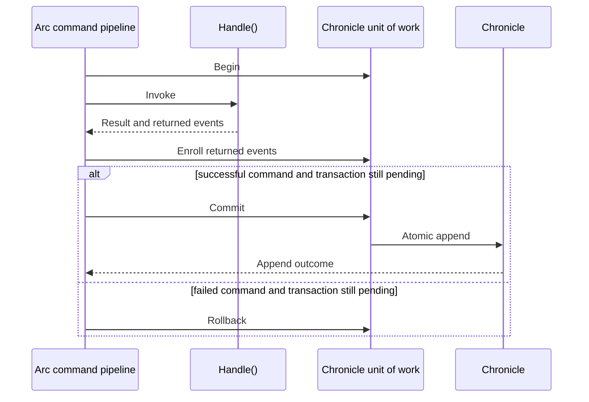

With `Cratis.Arc.Chronicle` registered, a model-bound command executed through Arc's command pipeline owns a Chronicle transaction. Returned events and explicit `eventLog.Transactional` appends enroll in it. Pending enrolled events commit atomically when the command succeeds; a failed command rolls them back. This is a **Chronicle event transaction**, not a transaction over arbitrary databases, HTTP calls, or external services.

The integration uses Arc's [command execution scope](../../commands/command-execution-scopes.md) extension point. Standalone Arc does not supply this event-store guarantee.

## Choosing an append style

| Style | Boundary | Outcome |
| --- | --- | --- |
| Return events from `Handle()` | Enroll in the command transaction | Final `CommandResult` |
| Return `EventsWithConcurrencyScopes` | Enroll ordered cross-source events with exact revision expectations | Final `CommandResult` |
| `eventLog.Transactional.Append(...)` | Enroll; no append has occurred yet | `Task`, not a per-append result |
| `eventLog.Append(...)` or `eventStore.EventLog.Append(...)` | Immediate and final | Real `AppendResult`; observed failures can also fail the command |
| Aggregate `Apply(...)` | Enroll aggregate events | Await mutation; see aggregate failure handling below |
| Aggregate `Commit()` | Commit the shared unit of work immediately | `AggregateRootCommitResult` |

Returning events is the recommended path. This complete command/type example assumes the integration is configured:

```csharp
using Cratis.Arc.Commands.ModelBound;
using Cratis.Chronicle.Events;
using Cratis.Chronicle.EventSequences;
using Cratis.Concepts;

public record OnboardingId(Guid Value) : EventSourceId<Guid>(Value)
{
    public static readonly OnboardingId NotSet = new(Guid.Empty);

    public static OnboardingId New() => new(Guid.NewGuid());
    public static implicit operator OnboardingId(Guid value) => new(value);
}

public record InvitationId(Guid Value) : EventSourceId<Guid>(Value)
{
    public static readonly InvitationId NotSet = new(Guid.Empty);

    public static InvitationId New() => new(Guid.NewGuid());
    public static implicit operator InvitationId(Guid value) => new(value);
}

public record OrganizationNumber(string Value) : ConceptAs<string>(Value)
{
    public static readonly OrganizationNumber NotSet = new(string.Empty);

    public static implicit operator OrganizationNumber(string value) => new(value);
}

[Command]
public record StartOnboarding(OnboardingId OnboardingId, InvitationId InvitationId, OrganizationNumber OrganizationNumber)
    : ICanProvideEventSourceId
{
    public EventSourceId GetEventSourceId() => OnboardingId;

    public IEnumerable<EventForEventSourceId> Handle() =>
    [
        new(OnboardingId, new OnboardingStarted(OrganizationNumber)),
        new(InvitationId, new AdminInvited(OnboardingId))
    ];
}

/// <summary>
/// Records that onboarding started for an organization.
/// </summary>
[EventType]
public record OnboardingStarted(OrganizationNumber OrganizationNumber);

/// <summary>
/// Records an administrator invitation associated with an onboarding.
/// </summary>
[EventType]
public record AdminInvited(OnboardingId OnboardingId);
```

Keep each concept in its own application file. The named ids prevent swapping an invitation and an onboarding. Because both derive from `EventSourceId<Guid>`, `GetEventSourceId()` explicitly selects the command's identity; each returned wrapper still selects its own append target. `AdminInvited` keeps the onboarding id as a foreign reference, not the invitation's own stream id.

If Chronicle rejects one event, none of this returned batch lands. A constraint must actually be configured to enforce uniqueness; the event/type declarations above do not create one.

## Explicit transactional and immediate appends

These are method-body fragments, not complete commands. `eventLog` is an `IEventLog`; `sensorId` is an `EventSourceId`; the event records are application types.

```csharp
await eventLog.Transactional.Append(sensorId, new ReadingRegistered(reading));
```

This awaits enrollment, not commit. Use it only with an active transaction. Outside a command or another explicitly established unit of work, it throws.

```csharp
var result = await eventLog.Append(sensorId, new ImportAttempted());
```

A successful immediate append survives any subsequent failure. The command scope observes failed append operations on its event log and merges attributable failures into the command result; it cannot un-append earlier successes. This is not a guarantee for arbitrary other stores or event sequences.

[ARCCHR0007](../code-analysis/index.md#arcchr0007-command-handler-injects-ieventlog) warns on `IEventLog` parameters in `Handle()`, even for reads or deliberate transactional use. Prefer returned events. For an intentional advanced use, narrowly suppress that warning with a documented reason; suppression does not change the append boundary.

## Completion



Commit violations are translated to the command result, including validation details where available. An exception or validation failure rolls back **pending** enrollment, not an already completed transaction or immediate append.

The scope applies to HTTP model-bound commands, direct `ICommandPipeline` execution, reactor commands, and `CommandScenario`. A controller action does not participate merely because it is an HTTP request; explicitly executing through the pipeline does. Chronicle's request-level unit-of-work middleware is a separate boundary: an Arc command starts its own transaction rather than joining that request-level unit of work.

## Nested commands and aggregates

A nested pipeline command joins the outer command's active transaction. Only the outer owner completes it. A successful nested result reflects enrollment, not final persistence; commit-time violations arrive at outer completion. The outer command must inspect/propagate a nested failure rather than treating a failed nested call as success.

Aggregate mutations share this unit of work. Explicit aggregate `Commit()` finalizes **all events enrolled so far**, not just one aggregate. The command scope leaves a completed transaction alone. Do not enroll further events or do fallible work afterward while expecting rollback to undo that commit.

There is a separate failure-propagation limitation: `AggregateRoot.Commit()` checks the aggregate's accumulated `Failed(...)` results; automatic command completion commits the unit of work directly and does not collect those lists. Removing explicit commit from an aggregate that uses `Failed(...)` can change behavior. Return its commit result and end the handler at that boundary, or propagate rejection through the command's result before automatic completion. Committing one aggregate does not validate every other aggregate's private failures. See [Defining an aggregate root](../aggregates/defining-an-aggregate-root.md).

## Things to know

- **Reads do not see pending enrollment.** An event-log read observes persisted events, not the pending batch. It can see successful immediate appends.
- **Keep the transaction in its owner lifetime.** Do not use `Transactional` from fire-and-forget work or continuations that outlive the command. Enrollment against a completed unit of work can be silently discarded; use an awaited command or a reactor for follow-up work.
- **One batch is not a distributed transaction.** Keep a unit of work within one event store, namespace, and event sequence. The ordered-batch API rejects mixing event sequences; do not infer a cross-sequence guarantee from legacy imperative enrollment. Independently configured databases and external calls need their own consistency design.
- **Several returned reactor commands are separate transactions.** Earlier successes remain if a later command fails. Model one command when its events must commit together.
- **Concurrency is a separate decision.** Atomic append does not bind a decision to the revision it read. See [Concurrency](./concurrency.md), including empty-history expectations.

For test patterns that assert no partial returned batch and inspect command failures, see [Testing with Chronicle](../../testing/chronicle.md).
