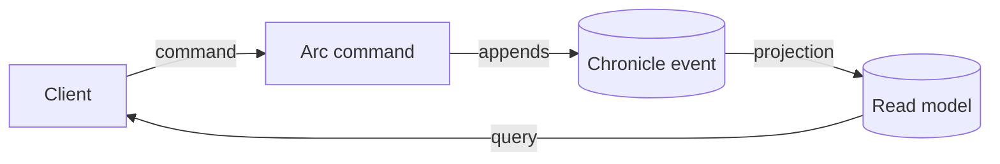

# Cratis Package

Wiring an event-sourced application by hand means bringing up Arc for commands and queries, Chronicle for the event store, MongoDB for read models, and identity for authentication — and making sure they all agree on tenancy, serialization, and hosting. The `Cratis` package collapses that into one dependency and two calls.

## What is the Cratis Package?

The `Cratis` package is a convenience package that bundles the whole stack:

- **Arc Application Framework** — CQRS commands and queries, validation, multi-tenancy, proxy generation
- **Chronicle Event Sourcing** — event store, aggregates, projections, reactors, and reducers
- **Swagger/OpenAPI** — automatic API documentation

It exists to get you to a running, end-to-end event-sourced application without wiring each component yourself.

## Installation

Add the Cratis package to your ASP.NET Core project:

```bash
dotnet add package Cratis
```

## Basic Setup

Configure Cratis in your `Program.cs` with one call on the builder and one on the app:

```csharp
var builder = WebApplication.CreateBuilder(args);

// Add Cratis (Arc + Chronicle) with default configuration
builder.AddCratis();

var app = builder.Build();

// Wire up Cratis middleware and endpoints
app.UseCratis();

app.Run();
```

`AddCratis()` registers Arc's command and query infrastructure, Chronicle's event store and event handling, Swagger, and validation/model binding. `UseCratis()` activates both halves — it calls `UseCratisArc()` and `UseCratisChronicle()` for you.

## What AddCratis sets up for you

`AddCratis` is opinionated — it makes a few decisions so you don't have to. Knowing them up front avoids surprises:

- **Arc and Chronicle in one host.** It calls `AddCratisArc` and adds Chronicle through `WithChronicle`, so commands, queries, and the event store share a single application.
- **Microsoft Identity Platform authentication is wired automatically** (`AddMicrosoftIdentityPlatformIdentityAuthentication`). If you don't want identity baked in, wire Arc and Chronicle separately with `AddCratisArc` + `WithChronicle` instead of `AddCratis`.
- **Chronicle is tenant-aware by default.** `WithChronicle` resolves the event store namespace per tenant (via `TenantNamespaceResolver`), so every event store is automatically scoped to the active tenant. See [Namespaces](/chronicle/namespaces/) for how the namespace becomes the tenancy boundary.

## How Arc and Chronicle fit together

The two halves connect at a single seam: an Arc **command** appends a Chronicle **event**, a Chronicle **projection** turns events into a **read model**, and an Arc **query** serves that read model back to the client.



Because both run in the same host, they share the things that would otherwise need to be kept in sync by hand: the **MongoDB** connection that stores read models, the **identity** that authenticates requests and scopes tenancy, and the **hosting** (one Kestrel server, one configuration). That shared wiring is exactly what the `Cratis` package assembles for you.

## Advanced Configuration

You can customize both Arc and Chronicle through the optional configuration callbacks:

```csharp
builder.AddCratis(
    configureArcOptions: options =>
    {
        // Configure Arc options (ArcOptions)
    },
    configureArcBuilder: arcBuilder =>
    {
        // Add additional Arc features
        arcBuilder.WithMongoDB();
    },
    configureChronicleOptions: options =>
    {
        // Configure Chronicle options (ChronicleAspNetCoreOptions)
        options.EventStore = "my-store";
    },
    configureChronicleBuilder: chronicleBuilder =>
    {
        // Configure Chronicle features
        chronicleBuilder.WithCamelCaseNamingPolicy();
    });
```

`options.EventStore` names the Chronicle event store the application connects to. The Chronicle options are bound from the `Cratis:Chronicle` section of `appsettings.json`, so the connection string and other settings come from configuration — see the [ChronicleOptions reference](/chronicle/configuration/chronicle-options/).

## Adding MongoDB Support

By default, the Cratis package doesn't include MongoDB support. To use MongoDB with your application, add the MongoDB package separately:

```bash
dotnet add package Cratis.Arc.MongoDB
```

Then configure MongoDB using the `WithMongoDB` extension method:

```csharp
builder.AddCratis(
    configureArcBuilder: arcBuilder =>
    {
        arcBuilder.WithMongoDB();
    });
```

### MongoDB Configuration Options

You can customize MongoDB settings using the configuration callback:

```csharp
builder.AddCratis(
    configureArcBuilder: arcBuilder =>
    {
        arcBuilder.WithMongoDB(
            configureOptions: options =>
            {
                options.Server = "mongodb://localhost:27017";
                options.Database = "my-database";
            });
    });
```

### MongoDB Configuration from appsettings.json

Alternatively, configure MongoDB settings in `appsettings.json`:

```json
{
  "MongoDB": {
    "Server": "mongodb://localhost:27017",
    "Database": "my-database"
  }
}
```

The `WithMongoDB` extension automatically reads these settings from the configuration section.

### Custom Configuration Section Path

If your MongoDB settings are in a different configuration section:

```csharp
arcBuilder.WithMongoDB(
    mongoDBConfigSectionPath: "MyApp:Database:MongoDB");
```

## Adding Entity Framework Core Support

To use Entity Framework Core with your application, add the Entity Framework Core package:

```bash
dotnet add package Cratis.Arc.EntityFrameworkCore
```

Once added, you can define and configure your `DbContext` classes as you normally would in Entity Framework Core. Arc automatically discovers and configures registered DbContexts with enhanced features like:

- Automatic multi-tenancy support
- Integration with Arc's dependency injection
- Streamlined configuration patterns

See the [Entity Framework Core](../entity-framework/index.md) documentation for detailed configuration options and best practices.

## A complete Program.cs

Putting it together, a realistic full-stack host wires Arc + Chronicle with MongoDB read models and a named event store:

```csharp
var builder = WebApplication.CreateBuilder(args);

builder.AddCratis(
    configureArcBuilder: arc => arc.WithMongoDB(),
    configureChronicleOptions: chronicle => chronicle.EventStore = "my-store",
    configureChronicleBuilder: chronicle => chronicle.WithCamelCaseNamingPolicy());

var app = builder.Build();

app.UseCratis();
app.Run();
```

This is the same shape the `dotnet new cratis` full-stack template scaffolds.

## Next Steps

Now that you have Cratis set up, you can:

- Define [Commands](../commands/index.md) to handle user actions
- Create [Queries](../queries/index.md) to retrieve data
- Build [Aggregates](aggregates/index.md) to model your domain
- Configure [MongoDB](../mongodb/index.md) for read models and projections
- Set up [tenancy](../tenancy/overview.md) for your application

For more advanced scenarios, explore the individual Arc and Chronicle components in the documentation.
