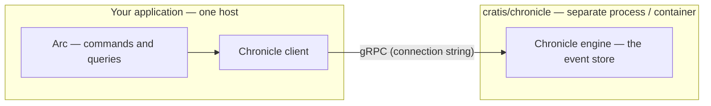
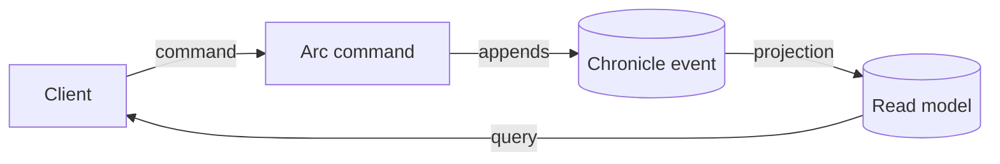

The `Cratis` package bootstraps Arc, the Chronicle client, and identity with one dependency and two host calls. It does not start the Chronicle server or install/configure Arc's MongoDB integration. Configure the server's sink and the application's query provider separately.

## What is the Cratis Package?

The `Cratis` package is a convenience package that bundles the whole stack:

- **Arc Application Framework** — CQRS commands and queries, validation, multi-tenancy, proxy generation
- **Chronicle Event Sourcing** — the event store **client** (connecting to a separately running Chronicle server), aggregates, projections, reactors, and reducers
- **Swagger/OpenAPI** — automatic API documentation

It exists to get you to a running, end-to-end event-sourced application without wiring each component yourself.

## Installation

Add the Cratis package to your ASP.NET Core project:

```bash
dotnet add package Cratis
```

## Basic Setup

Configure Cratis in your `Program.cs` with one call on the builder and one on the app:

> [!WARNING]
> `AddCratis()` installs a [header-based identity adapter](../asp-net-core/microsoft-identity.md), not token validation. Use it only behind trusted ingress that authenticates users, strips/replaces incoming identity headers, and prevents direct backend access. Otherwise, [wire your own authentication](#running-arc-or-chronicle-on-their-own).

```csharp
var builder = WebApplication.CreateBuilder(args);

// Add Cratis (Arc + Chronicle) with default configuration
builder.AddCratis();

var app = builder.Build();

// Wire up Cratis middleware and endpoints
app.UseCratis();

app.Run();
```

`AddCratis()` registers Arc's command and query infrastructure, the Chronicle client (which connects to a separately running event store — see [what AddCratis sets up for you](#what-addcratis-sets-up-for-you)), Swagger, and validation/model binding. `UseCratis()` activates both halves — it calls `UseCratisArc()` and `UseCratisChronicle()` for you.

## What AddCratis sets up for you

`AddCratis` is opinionated — it makes a few decisions so you don't have to. Knowing them up front avoids surprises:

- **It adds a Chronicle _client_ — not the Chronicle engine.** `AddCratis` calls `AddCratisArc` and then `WithChronicle`, and `WithChronicle` registers the Chronicle **client**: a gRPC client that connects to a Chronicle **server running as its own separate process** — the `cratis/chronicle` container you deploy. Your application never runs the event store; it connects to one over gRPC using the connection string from configuration. When you read "Arc and Chronicle in one host," it's the _client_ that shares your host — the engine runs elsewhere.
- **Microsoft Identity Platform authentication is wired automatically** (`AddMicrosoftIdentityPlatformIdentityAuthentication`). If you don't want identity baked in, wire Arc and Chronicle separately with `AddCratisArc` + `WithChronicle` instead of `AddCratis` — see [Running Arc or Chronicle on their own](#running-arc-or-chronicle-on-their-own).
- **Chronicle is tenant-aware by default.** `WithChronicle` resolves the event store namespace per tenant (via `TenantNamespaceResolver`), so every event store is automatically scoped to the active tenant. See [Namespaces](/chronicle/namespaces/) for how the namespace becomes the tenancy boundary.

There are always **two processes**: your application (Arc plus the Chronicle client) and the Chronicle server (the event store). `AddCratis` sets up the first and connects it to the second — it never starts the second for you.


```mermaid
flowchart LR
    subgraph app["Your application — one host"]
        arc["Arc — commands and queries"]
        client["Chronicle client"]
        arc --> client
    end
    subgraph server["cratis/chronicle — separate process / container"]
        engine["Chronicle engine — the event store"]
    end
    client -- "gRPC (connection string)" --> engine
```

> [!NOTE]
> The same `AddCratis` code connects to a local `cratis/chronicle` container in development and a shared Chronicle instance in production — only the connection string changes between environments. There is no in-process Chronicle to run, and you should not see event-store traffic served from inside your app. If you haven't started a `cratis/chronicle` container, your app has nothing to connect to.

## How Arc and Chronicle fit together

The two halves connect at a single seam: an Arc **command** appends a Chronicle **event**, a Chronicle **projection** turns events into a **read model**, and an Arc **query** serves that read model back to the client.


```mermaid
flowchart LR
    UI[Client] -->|command| CMD[Arc command]
    CMD -->|appends| EV[(Chronicle event)]
    EV -->|projection| RM[(Read model)]
    RM -->|query| UI
```

Arc and the Chronicle client share the application host and its configured integration services. The server's materialized sink is a separate configuration boundary. For `IMongoCollection<T>` queries, install `Cratis.Arc.MongoDB` and align database, collection names, key/serialization conventions, and tenant mapping with the sink. One host does not automatically share a MongoDB connection with the Chronicle server.

## Running Arc or Chronicle on their own

`AddCratis` is the batteries-included front door, but the pieces underneath are independent — take just the part you need:

- **Arc without an event store.** Call `AddCratisArc()` on its own and back your commands and queries with MongoDB or EF Core instead of Chronicle. You keep the full CQRS and proxy-generation experience with no event log. See [CQRS without event sourcing](../../arc-without-event-sourcing.md).
- **Arc + Chronicle without the baked-in identity.** Retain the **`Cratis` package reference** for this ASP.NET Core example. Call `AddCratisArc()` and add its ASP.NET Core `WithChronicle()` composition yourself. This is exactly what `AddCratis` does, minus `AddMicrosoftIdentityPlatformIdentityAuthentication()` — reach for it when you bring your own authentication. `Cratis.Arc.Chronicle` alone provides the generic-host integration, not all the ASP.NET Core extensions below.

```csharp
var builder = WebApplication.CreateBuilder(args);

builder.AddCratisArc(configureBuilder: arc =>
    Microsoft.AspNetCore.Builder.ArcBuilderExtensions.WithChronicle(arc));

var app = builder.Build();

app.UseCratisArc();
app.UseCratisChronicle();   // UseCratis() calls both — wire both halves yourself when you split them
app.Run();
```

The explicit static call selects the ASP.NET Core `WithChronicle()` composition. It avoids an ambiguous call when both `Cratis.Arc` and `Microsoft.AspNetCore.Builder` extensions are in scope; the generic-host overload is a different setup surface.

> [!IMPORTANT]
> Running Arc without Chronicle is a valid setup — but only if you don't use Chronicle. If you call `AddCratisArc()` **without** `WithChronicle()` yet the project uses Chronicle (an aggregate root, reactor, reducer, projection, `[EventType]` event, or a command that injects `IEventLog`), the [ARCCHR0005](code-analysis/ARCCHR0005.md) analyzer flags it at **compile time**. Should it slip through (for example, setup lives in a separate host project), resolution then fails at runtime with a message that points at the same fix: add `WithChronicle()`, or switch to `AddCratis()`.

## Advanced Configuration

You can customize both Arc and Chronicle through the optional configuration callbacks:

```csharp
builder.AddCratis(
    configureArcOptions: options =>
    {
        // Configure Arc options (ArcOptions)
    },
    configureArcBuilder: arcBuilder =>
    {
        // Add additional Arc features
        arcBuilder.WithMongoDB();
    },
    configureChronicleOptions: options =>
    {
        // Configure Chronicle options (ChronicleAspNetCoreOptions)
        options.EventStore = "my-store";
    },
    configureChronicleBuilder: chronicleBuilder =>
    {
        // Configure Chronicle features
        chronicleBuilder.WithCamelCaseNamingPolicy();
    });
```

`options.EventStore` names the Chronicle event store the application connects to. The Chronicle options are bound from the `Cratis:Chronicle` section of `appsettings.json`, so the connection string and other settings come from configuration — see the [ChronicleOptions reference](/chronicle/configuration/chronicle-options/).

## Adding MongoDB Support

By default, the Cratis package doesn't include MongoDB support. To use MongoDB with your application, add the MongoDB package separately:

```bash
dotnet add package Cratis.Arc.MongoDB
```

Then configure MongoDB using the `WithMongoDB` extension method:

```csharp
builder.AddCratis(
    configureArcBuilder: arcBuilder =>
    {
        arcBuilder.WithMongoDB();
    });
```

### MongoDB Configuration Options

You can customize MongoDB settings using the configuration callback:

```csharp
builder.AddCratis(
    configureArcBuilder: arcBuilder =>
    {
        arcBuilder.WithMongoDB(
            configureOptions: options =>
            {
                options.Server = "mongodb://localhost:27017";
                options.Database = "my-database";
            });
    });
```

### MongoDB Configuration from appsettings.json

Alternatively, configure MongoDB settings in `appsettings.json`:

```json
{
  "Cratis": {
    "MongoDB": {
      "Server": "mongodb://localhost:27017",
      "Database": "my-database"
    }
  }
}
```

The `WithMongoDB` extension automatically reads these settings from `Cratis:MongoDB`.

### Custom Configuration Section Path

If your MongoDB settings are in a different configuration section:

```csharp
arcBuilder.WithMongoDB(
    mongoDBConfigSectionPath: "MyApp:Database:MongoDB");
```

## Adding Entity Framework Core Support

To use Entity Framework Core with your application, add the Entity Framework Core package:

```bash
dotnet add package Cratis.Arc.EntityFrameworkCore
```

Package installation alone does not register your contexts. Call `WithEntityFrameworkCore()` in `configureArcBuilder` and configure a nonempty connection string and eligible context types, or use explicit registration. Follow [Entity Framework Core registration and configuration](../entity-framework/getting-started.md) for the required constructor, discovery options, and migration boundary.

Pooled context registration does not automatically select a database per Arc tenant. Design and test tenant isolation separately; see the [provider limits](../entity-framework/getting-started.md#scope-and-provider-limits).

## Program.cs composition

This host-body fragment assumes the packages above, the relevant extension namespaces (`Cratis.Arc` and `Microsoft.AspNetCore.Builder`, plus Chronicle extensions used by your configuration), and configured authentication/server/sink connections. It composes registrations; it is not a standalone deployment checkpoint:

```csharp
var builder = WebApplication.CreateBuilder(args);

builder.AddCratis(
    configureArcBuilder: arc => arc.WithMongoDB(),
    configureChronicleOptions: chronicle => chronicle.EventStore = "my-store",
    configureChronicleBuilder: chronicle => chronicle.WithCamelCaseNamingPolicy());

var app = builder.Build();

app.UseCratis();
app.Run();
```

This is the same shape the `dotnet new cratis` full-stack template scaffolds.

## Next Steps

Now that you have Cratis set up, you can:

- Define [Commands](../commands/index.md) to handle user actions
- Create [Queries](../queries/index.md) to retrieve data
- Build [Aggregates](aggregates/index.md) to model your domain
- Configure [MongoDB](../mongodb/index.md) for read models and projections
- Set up [tenancy](../tenancy/index.md) for your application

For more advanced scenarios, explore the individual Arc and Chronicle components in the documentation.
