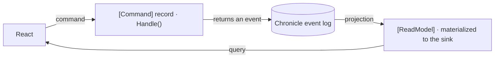

`Cratis.Arc.Chronicle` is the integration package that extends Arc with [Cratis Chronicle](https://github.com/Cratis/Chronicle) capabilities. It wires the two frameworks together so that Arc's application model — commands, queries, identity, tenancy, and code generation — works seamlessly with Chronicle's event sourcing infrastructure.

Arc does not require Chronicle, and Chronicle does not require Arc. That independence is useful for adoption and bounded current-state slices. In a full Cratis information system, though, this integration is the natural pairing: Arc gives the CQRS boundary and Chronicle keeps the event-sourced facts underneath it.

## How the two fit together

The frameworks meet at one seam: an Arc **command** appends a Chronicle **event**, a Chronicle **projection** folds events into a **read model**, and an Arc **query** serves that read model back — with the generated TypeScript proxy carrying both ends to React.

Reading that loop in code:

- **A command writes by *returning*.** A `[Command]` record carries the command's inputs as its **properties**, and the decision lives in a `Handle()` method on the record. Whatever `Handle()` **returns** is what Chronicle does with it — return an `[EventType]` event and it's appended; the [return signature](commands/events.md) (a single event, several, a tuple, a `Result<,>`, or nothing) decides the outcome. You never touch an event log directly.
- **The event source id picks the stream.** Every event belongs to one **event source** — one entity's stream of history. Chronicle resolves that id from the command: a `[Key]` parameter, a property whose type converts to `EventSourceId` (typically a `ConceptAs<Guid>` with an `implicit operator EventSourceId`), or `ICanProvideEventSourceId`. See [Resolving EventSourceId](resolving-event-source-id.md).
- **The read model is projected, then queried.** A `[ReadModel]` record declares the shape you want; `[FromEvent<T>]`, `[SetFrom<T>]`, and `[SetValue<T>]` map events onto its properties and Chronicle keeps it **materialized** in the configured sink (MongoDB by default). An Arc query — a static method on the read model, often returning an observable so the UI stays live — serves it through the generated proxy. See [Read Models](read-models.md).

So the round-trip is: a fact happens (command → event), it's folded into state (projection → read model), and the UI reads it (query → proxy). Each piece is one of the topics below.

## What it provides

Without this package, Arc and Chronicle are independent. With it:

- **Commands return events** — `Handle()` methods on commands can return event records directly; the package appends them to the correct event log automatically.
- **Event source resolution** — the command context (current user identity, tenant, route parameters) is used to resolve the event source id without manual plumbing.
- **Read models backed by projections** — Arc's read model conventions drive Chronicle projections so that query responses always reflect the current projected state.
- **Tenant-aware event stores** — each tenant's event log and projections are namespaced automatically, matching Arc's tenancy model.
- **Compliance integration** — PII-annotated properties are decrypted transparently before read models are served, and the compliance subject is set on commands from the current identity.
- **Aggregate support** — aggregate roots are discoverable and invocable via the standard command pipeline, with Chronicle managing the event stream and rehydration.
- **Validation with read models** — domain constraint checks can read current projected state directly inside `Handle()` without an extra query round-trip.

## Topics

| Topic | Description |
| ----- | ----------- |
| [Aggregates](aggregates/index.md) | Working with aggregate roots and event sourcing. |
| [Add event sourcing to an Arc slice](add-event-sourcing.md) | Move one database-backed slice to Chronicle while keeping its query and React screen in place. |
| [Cratis Package](cratis-package.md) | The convenience package for Arc + Chronicle applications. |
| [React to an event](react-to-an-event.md) | Run side effects or follow-up commands from Chronicle events with reactors. |
| [Commands](commands/index.md) | Returning events from commands, event source id resolution, and concurrency scoping. |
| [Resolving EventSourceId](resolving-event-source-id.md) | How Chronicle resolves aggregate and read model identity from commands and query arguments. |
| [Read Models](read-models.md) | How read models are hooked up to Chronicle projections. |
| [Tenancy](tenancy.md) | Tenant-aware namespaces for event stores and projections. |
| [Validation](validation.md) | Validation with read models and identity resolution conventions. |
| [Compliance](compliance/index.md) | PII decryption on read models and compliance subject resolution on commands. |
| [Code Analysis](code-analysis/index.md) | Diagnostics and analyzers specific to the Chronicle integration. |
