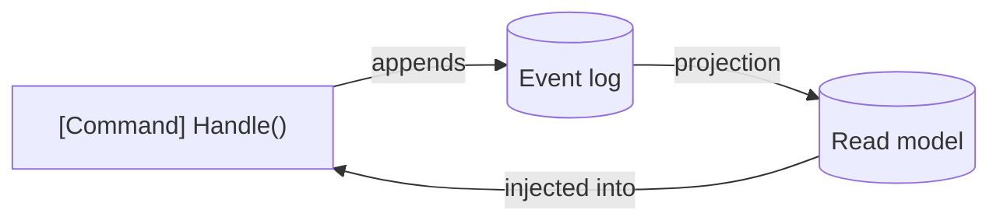

# Chronicle Integration

This is where Arc and [Chronicle](/chronicle/) meet: your commands stop writing rows and start
**appending events**, and your read models are built from those events by projections. You write the
same `[Command]` records and read models you saw in the rest of the backend — this integration is what
makes their state event-sourced, with a full audit trail and strong-consistency guarantees for free.

That last arrow is the loop worth noticing: a command appends events, a projection folds them into a
read model, and that read model can be **injected back into a command's `Handle()`** so business rules
decide based on current state.

## The essentials

| Topic | What it covers |
| ------- | ----------- |
| [Commands](./commands/index.md) | How a command appends events to Chronicle from its `Handle()`. |
| [Read Models](./read-models/index.md) | How read models are built from Chronicle projections — and injected into commands as state. |
| [Resolving Event Source ID](./resolving-event-source-id/index.md) | How Arc figures out which event source a command writes to. |
| [Aggregates](./aggregates/index.md) | Aggregate roots that encapsulate business logic and emit events. |

## Rules and compliance

| Topic | What it covers |
| ------- | ----------- |
| [Validation](./validation.md) | Validating commands in the Chronicle integration. |
| [Constraints](./constraints/index.md) | Unique constraints and rules backed by events. |
| [Compliance](./compliance/index.md) | GDPR and compliance features for event-sourced data. |
| [Tenancy](./tenancy.md) | Multi-tenant isolation with Chronicle. |

New to event sourcing itself? Read [Why Event Sourcing](/chronicle/why-event-sourcing/) and the
[Chronicle tutorial](/chronicle/tutorial/) first, then come back to wire it into Arc.
