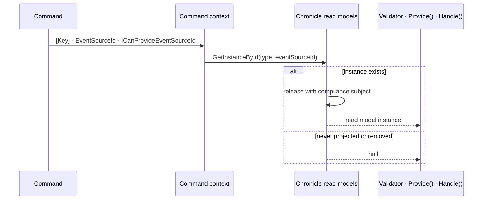

A Chronicle read model is current state folded out of events. Arc makes that state available to a command as an ordinary constructor or method parameter, resolved for the key the command already carries — no query, no repository, no manual lookup.

This section explains the mechanism. To *use* it, start with [Use current state in a command](../../../scenarios/use-current-state-in-a-command.md) for the recipe, or [Read models in commands](./injecting-into-commands.md) for the full reference on each position.

## What makes a read model injectable

A read model can be injected into command-scoped code because it is **resolvable by key** — the event source id Arc resolved from the command — through Chronicle's read model store. That resolvability comes from a Chronicle backing artifact, so a read model is registered when it has one of:

- a fluent [`IProjectionFor<T>`](/chronicle/projections/) projection
- a model-bound projection (`[FromEvent<T>]`, `[SetFrom<T>]`, `[SetValue<T>]`)
- an [`IReducerFor<T>`](/chronicle/reducers/) reducer

You declare the dependency identically in every case — which artifact materializes the state is an implementation detail Arc hides.

### `[ReadModel]` alone is not enough

The `[ReadModel]` attribute does **not** make a type injectable into commands. `[ReadModel]` is an Arc concept used for queries, and it can be backed by stores other than Chronicle — Entity Framework Core, for example. Injection into command scope only makes sense for a type that is resolvable by key, and key resolution is owned by the backing provider. Chronicle registers the read models it can resolve; a read model backed by another provider is registered by that provider, not by Chronicle.

The practical consequence: adding `[ReadModel]` to a record with no projection or reducer behind it will not make it appear in a validator. Add the backing artifact.

## How an instance is resolved

Step by step:

1. **Identity strategy** — Arc inspects the command to determine its key, using one of the strategies in [Resolving EventSourceId](../resolving-event-source-id.md).
2. **Command context lookup** — the resolved identity is read from the current `CommandContext`.
3. **Guard** — if no usable identity is available, resolution fails with [`UnableToResolveReadModelFromCommandContext`](./failures.md#unabletoresolvereadmodelfromcommandcontext).
4. **Store query** — Chronicle's read model store is queried by the resolved identity.
5. **Subject release** — if the command context carries a compliance `Subject` and the instance exists, it is released with that subject, so `[PII]` properties decrypt under the same identity used for the events.
6. **Result** — the instance is returned, or `null` when the projection instance does not exist.

Resolution happens exactly once per command. The same instance is handed to the validator, `Provide()`, and `Handle()`.

### The key does not prove existence

A `[Key]` or event source id tells Arc *which* instance to resolve; it does not prove that instance exists. A projection may never have been created, may have been removed, or may be mid-rebuild. Whether that is a normal business condition or a fault is yours to declare — see [nullable versus required](./injecting-into-commands.md#nullable-means-you-handle-absence).

## Lifetime and mutability

Read models are registered as **command-scoped** services:

- The state is fetched once per command and shared across that command's validator, `Provide()`, and `Handle()`.
- The instance is tied to the identity resolved from the command context.
- It is disposed when the command completes.

And they are **read-only snapshots**:

- **Immutable in practice** — changes made to an injected instance are not persisted anywhere.
- **Eventually consistent** — the state reflects events processed so far, not necessarily every event appended.
- **Current as of the command** — the fetch happens when the command runs.

To *change* state, return events from `Handle()` or use an [aggregate root](../aggregates/index.md). A read model is an input to a decision, never the place a decision is recorded.

## Read models or aggregate roots

Both give a command access to current state, and they answer different questions.

| Reach for | When |
|---|---|
| **Read model** | You need projected, possibly denormalized state to validate against or compute from, and eventual consistency is acceptable |
| **Aggregate root** | You need to emit events, enforce an invariant inside a consistency boundary, or work from source-of-truth stream state |
| **Both** | Validate against projected state, then make the change through the aggregate |

If correctness depends on source-of-truth state under concurrency, prefer aggregate or event-stream state over a read model — or enforce it with a Chronicle [constraint](/chronicle/constraints/), which is checked at append time.

## Topics

| Topic | Description |
| ----- | ----------- |
| [Read models in commands](./injecting-into-commands.md) | Injecting into a validator, `Provide()`, and `Handle()`, and what nullability means. |
| [When resolution fails](./failures.md) | Every failure mode, what it means, and how to fix it. |
