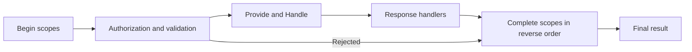

A pre-execution filter cannot report how a command finished. An execution scope brackets model-bound execution: begin before the filters, then complete with the outcome after the handler and response processing. Use it for timing or for a storage coordination mechanism you actually implement.

:::tip[Use operations for per-command side effects]
Prefer [command operations](./operations/index.md), rather than a custom scope and rollback stack, for work chosen by one command. Arc manages operation failure handling and optional compensation. Scopes remain the integration mechanism for cross-cutting lifetime and commit concerns.
:::

## How it works

Arc discovers `ICommandExecutionScope` implementations and resolves them from the command's service scope. Once a handler and context are available, the pipeline:

1. Materializes the scope instances and calls synchronous `Begin(context)` on each.
2. Runs filters, resolves provided data and handler arguments, awaits `Handle()`, and processes its response.
3. Calls asynchronous `Complete(context, result)` in reverse scope order, including when validation fails or execution throws.

`Begin` is synchronous so ambient state it establishes can flow into execution. Each materialized scope completes once, but its `Begin` may never have run if an earlier scope threw. Missing-handler or context/scope-construction failures before scopes are available do not run this lifecycle. Pre-flight `Validate` does not run execution scopes.

Relative discovery order is unspecified; keep scopes independent. An exception in one `Complete` is merged into the result and does not prevent remaining scopes from completing.



## Implementing a custom execution scope

This complete scope records elapsed time through .NET logging. It requires a resolvable `ILogger<CommandTimingScope>` and a logging provider to observe output. It stores state in the per-command values dictionary, so shared scope instances do not share timers across commands.

```csharp
using System;
using System.Diagnostics;
using System.Threading.Tasks;
using Cratis.Arc.Commands;
using Microsoft.Extensions.Logging;

public class CommandTimingScope(ILogger<CommandTimingScope> logger) : ICommandOperationExecutionScope
{
    const string TimerKey = "Example.CommandTimingScope.Timer";
    static readonly Action<ILogger, string, double, bool, Exception?> _completed =
        LoggerMessage.Define<string, double, bool>(LogLevel.Information, new EventId(1, "CommandTimed"),
            "Command {CommandType} took {Milliseconds} ms; success at timing completion: {IsSuccess}");

    public bool IsCommitParticipant => false;

    public CommandCommitDisposition GetCommitDisposition(CommandContext context) =>
        CommandCommitDisposition.NoCommit;

    public void Begin(CommandContext context) =>
        context.Values[TimerKey] = Stopwatch.StartNew();

    public Task Complete(CommandContext context, CommandResult result)
    {
        if (context.Values.TryGetValue(TimerKey, out var value) && value is Stopwatch timer)
        {
            timer.Stop();
            _completed(logger, context.Type.FullName ?? context.Type.Name,
                timer.Elapsed.TotalMilliseconds, result.IsSuccess, null);
            context.Values.Remove(TimerKey);
        }
        return Task.CompletedTask;
    }
}
```

The timing scope implements `ICommandOperationExecutionScope`, declaring that it does not commit business changes. This makes its lifetime behavior explicit for operation-bearing commands while preserving ordinary execution-scope behavior. A scope that actually commits storage must report its real commitment facts instead; see the [supported operation scope profile](./operations/reference.md#supported-scope-profile).

If `Begin` did not run, completion safely does nothing. This duration includes response processing and any scopes that complete before this one. Another scope can still change the outcome afterward, so the log deliberately describes success **at this completion callback**, not an immutable final verdict.

## Mutating the result — handle with care

`Complete` receives a mutable `CommandResult`. Add failures when completing your concern fails; never erase earlier authorization, validation, or exception outcomes. Removing failures could report success after another scope already acted on failure.

A response may already be present in the callback context. It is not proof that every scope will succeed. After completion, the pipeline clears the **result's** response if execution is unsuccessful. See [response phase availability](./response-value-handlers.md#response-object-availability).

## Optional integrations

Standalone Arc supplies this extension point, not an automatic database transaction. Your own scope must implement any begin/commit/rollback behavior it promises, including failure and nesting semantics.

`Cratis.Arc.Chronicle` supplies a separate `TransactionalCommandScope`. Its event-store-specific guarantees are documented under [Chronicle transactional commands](./transactional-commands.md); they do not apply to arbitrary service writes.

Execution scopes apply wherever the model-bound pipeline runs, including HTTP and direct [pipeline calls](./command-pipeline.md). They do not wrap MVC controller actions. Use [command filters](./command-filters.md) when you only need a pre-execution decision.
