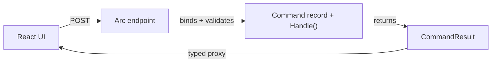

# Commands

A command is how something *asks your system to change* — open an account, check out a book, change an
address. In Arc a command is a small, intent-revealing record that carries the data for that change and
knows how to handle itself. There's no separate handler class, no controller boilerplate to write: you
declare the intent and what it does, and Arc wires up the HTTP endpoint, validation, and a typed
TypeScript proxy for the frontend.



## Your first command

Here's the whole thing — the command, its data, and its behavior, in one record:

```csharp
public interface IAccounts
{
    Task Open(AccountId id, AccountHolder owner);
}

[Command]
public record OpenAccount(AccountId Id, AccountHolder Owner)
{
    public Task Handle(IAccounts accounts) =>
        accounts.Open(Id, Owner);
}
```

`Handle()` is defined **directly on the record** — that's the convention. Arc discovers it, exposes the
command as an HTTP `POST`, binds the incoming JSON to the record, runs any validation, then calls
`Handle()`. Whatever you inject into `Handle()` is resolved from the container. In this example
`IAccounts` is an application-owned service; it might write MongoDB, EF Core, another application
service, or anything else your slice owns. With the [Chronicle integration](../chronicle/) installed, a
command can return events instead and let Arc append them for you.

> [!TIP]
> When a decision needs data you have to *fetch* — external data, application-service data, a score, or a
> lookup — move that fetch into a `Provide()` method next to `Handle()`, so `Handle` stays a pure, easily
> tested function of its arguments. See [Provide data to a command handler](../../scenarios/provide-data-to-a-command.md).

`Handle()` can return what suits the operation:

- **nothing** (`void` / `Task`) — fire-and-forget changes
- **a value** — becomes a typed `CommandResult<T>` the frontend can read
- **a tuple** — return an event *and* a value (e.g. a generated id)
- **a `Result<TSuccess, TError>`** — model success and failure explicitly

Whatever you return, the caller gets a `CommandResult` carrying success, validation, and authorization
state — so the frontend always knows what happened.

## Two ways to define one

| Style | What it looks like | Reach for it when |
| --- | --- | --- |
| [Model-bound](./model-bound/index.md) | A `[Command]` record with `Handle()`, as above | **The default.** Least boilerplate; the intent and behavior live together. |
| [Controller-based](./controller-based.md) | A command type posted to a controller action | You need full control over the HTTP surface, or you're integrating with existing controllers. |

## Then make it bulletproof

Once the command exists, layer on the cross-cutting concerns Arc handles for you:

| Concern | Page |
| --- | --- |
| Validate input before it runs | [Validation](./validation.md) |
| Check validity without executing (pre-flight) | [Command Validation](./command-validation.md) |
| Run a command in code, not over HTTP | [Command Pipeline](./command-pipeline.md) |
| Carry ambient values through the pipeline | [Command Context](./command-context.md) |
| Apply cross-cutting logic to every command | [Command Filters](./command-filters.md) |
| Authorize by role or policy | [Authorization](../core/authorization.md) |
| Shape the response the frontend receives | [Response Value Handlers](./response-value-handlers.md) · [Response Examples](./response-examples.md) |

## The payoff: it's already on the frontend

You didn't write a DTO or an API client. When you build the backend, Arc's
[proxy generator](../proxy-generation/index.md) emits a typed TypeScript proxy for `OpenAccount`, ready
to call from React with full type checking — see [Commands in React](../../frontend/react/commands/).
Rename a property in the C# record, rebuild, and the frontend won't compile until it's fixed. That's the
whole point of building on Arc: one definition, typed end to end.

Next, read about the [queries](../queries/index.md) that read the data your commands change.
