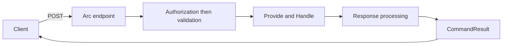

Opening an account or adding a cart line should not require a handwritten HTTP client and repeated endpoint boilerplate. In Arc, a command carries the input for an operation and can handle itself. Arc supplies the endpoint, command result, and generated TypeScript proxy.

Arc is a standalone CQRS framework. Your handler can call application services backed by any suitable storage; it does not have to return an event or use Chronicle.

:::tip[Return operations for inline side effects]
Prefer [command operations](./operations/index.md) when `Handle()` decides which external work to perform. The decision returns inspectable values; Arc executes them and manages optional compensation without application-written error handling. Direct service calls remain supported, and durable follow-up work still belongs in a reactor or appropriate workflow.
:::


```mermaid
flowchart LR
    UI[Client] -->|POST| EP[Arc endpoint]
    EP --> A[Authorization then validation]
    A --> H[Provide and Handle]
    H --> V[Response processing]
    V --> R[CommandResult]
    R --> UI
```

## Your first command

This is a declaration fragment using the shared `CartLineId`, `Sku`, and `Quantity` concepts and fully implemented `ICartService` from the [model-bound command example](./model-bound/index.md#a-service-backed-command):

```csharp
using Cratis.Arc.Commands.ModelBound;

[Command]
public record AddItemToCart(Sku Sku, Quantity Quantity)
{
    public CartLineId Handle(ICartService carts) => carts.AddItem(Sku, Quantity);
}
```

Arc discovers the public instance `Handle()` on the `[Command]` record. It resolves `ICartService` from the command scope, waits for the operation, and places the `CartLineId` in the response. Follow the linked example for the service implementation, registration, and an execution checkpoint.

Choose the return shape that fits the operation:

- **`void` or `Task`** — no response value. A task is awaited; this is not fire-and-forget execution.
- **A value or `Task<T>`** — an unhandled value becomes the typed response.
- **An operation or `CommandOperations`** — declare one or many server-side actions, with optional compensation.
- **A tuple** — combine one response with [command operations](./operations/index.md) and other values consumed by [response value handlers](./response-value-handlers.md).
- **`Cratis.Monads.Result<TSuccess, TError>`** — process the active alternative. A recognized validation value becomes a rejection; arbitrary error types are not automatically failures.

Use [provided data](../../scenarios/provide-data-to-a-command.md) when fetching handler input separately makes the operation clearer.

## Two ways to define a command

| Style | Choose it when |
| --- | --- |
| [Model-bound](./model-bound/index.md) | You want input and behavior together with minimal endpoint boilerplate. |
| [Controller-based](./controller-based.md) | You need MVC action control or are integrating existing controllers. |

The model-bound pipeline and MVC action filters are different execution paths. Do not assume extensions or authorization attributes for one automatically govern the other.

## Build on the basics

| Next concern | Read |
| --- | --- |
| Validate input | [Validation](./validation.md) |
| Protect commands | [Model-bound authorization](./model-bound/authorization.md) |
| Check without invoking the handler | [Pre-flight validation](./command-validation.md) |
| Execute from application code | [Command pipeline](./command-pipeline.md) |
| Keep inline side effects out of the decision | [Command operations](./operations/index.md) · [Testing operations](../testing/command-operations.md) |
| Understand scalar and tuple responses | [Response value handlers](./response-value-handlers.md) · [Examples](./response-examples.md) |
| Carry cross-cutting data | [Command context](./command-context.md) |
| Extend execution | [Filters](./command-filters.md) · [Execution scopes](./command-execution-scopes.md) |

## Optional Chronicle integration

If your application uses event sourcing, [Chronicle command integration](../chronicle/commands/index.md) adds returned-event handling. Its [transactional command behavior](./transactional-commands.md) belongs to that integration, not standalone Arc. You do not need it for service-backed commands or `Guid` responses.

## The frontend follows the backend

The [proxy generator](../proxy-generation/index.md) generates the TypeScript command contract from the backend. After building the backend, use [commands in React](../../frontend/react/commands/index.md) to submit it and inspect the result. Continue to [queries](../queries/index.md) to read the data your commands change.
