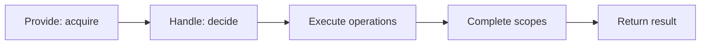

A booking command often needs to decide **which seat to reserve** and then call a reservation service. Mixing those responsibilities makes a decision test depend on network substitutes, and adding a second external call soon introduces a hand-written cleanup stack.

Command operations separate the decision from the work. Your `Handle()` returns immutable descriptions of what should happen. Arc executes them, handles failures, and invokes an optional business reversal when the command's commit boundary permits recovery.

**Command operations are the recommended way to express immediate, inline side effects in model-bound commands.** Direct service calls remain supported; operations are useful when you want an inspectable decision, consistent execution, and framework-managed compensation. They require neither Chronicle nor a separate operation-handler class.

## Decide first, execute afterward

An operation implements `ICommandOperation`. Its public `Execute()` method performs the work; its optional `Compensate()` method describes the reversal. Both receive services through method-parameter injection.

Your command constructs the operation without invoking either method. Calling `Handle()` directly therefore lets a spec inspect the proposed work without reserving a seat. Calling the command through Arc executes the operation. [CommandScenario](../../testing/command-operations.md) follows the same production pipeline; it does not silently replace execution with a recording stub.

This extends the separation already offered by [Provide()](../../../scenarios/provide-data-to-a-command.md):

The decision is pure only when it has no I/O, clock reads, randomness, or mutable external state. Returning an operation does not make an otherwise impure handler pure. Supply the identity and state the decision needs rather than creating hidden dependencies inside `Handle()`.

Continue with [implementing an operation](./implementing.md) for a complete reservation example. If you already have a service-backed handler, [migrate its inline work](./migrating.md) while preserving the command's input and caller response.

## You write the reversal, not the error handling

For a reservation, the reversal is canceling the reservation owned by that request. Arc takes care of tracking started operations, stopping after a failure, selecting recovery, and running compensators in reverse order.

You do not need a `try/catch`, a rollback stack, a success flag, or a switch identifying which operation failed. If an operation does not have a useful reversal, omit `Compensate()`; Arc does not invent one or report that it reversed the work.

Consider four returned operations. A and B complete, C enters `Execute()` and throws, and D never starts. When compensation is permitted, Arc attempts C, then B, then A. It never compensates D.

Why include C? A remote service may have accepted C's request before the connection failed. A thrown exception proves that the local invocation failed—not that the external system did nothing.

:::caution[Compensation applies to attempted work]
A compensator must be safe when its operation was partially applied or its acknowledgment was lost. Cancel by an ownership-aware request key. A simple "delete if present" can race a create request still in flight; your provider must supply appropriate terminal cancellation or reconciliation semantics. Duplicate requests must also protect previously finalized work: a new failed attempt must not cancel an earlier successful reservation because they share a key.
:::

The [execution reference](./reference.md) describes ordering, cancellation, and the optional failure context without making those concerns mandatory application boilerplate.

## Compensation is not an atomic rollback

A compensating action is new work. Releasing a reservation does not erase the fact that it was reserved; refunding money does not mean a payment never happened.

With Chronicle, returned events are enrolled before operations execute, and the event transaction completes afterward. A known commit rejection can permit compensation. A successful commit followed by an unrelated cleanup failure must not automatically cancel reservations associated with already-committed business facts.

An unknown commit outcome is different again. A timeout may mean that the store committed but its acknowledgment was lost. Arc does not infer "nothing committed" from a failed `CommandResult`, and it does not automatically retry or reverse operations while commitment is uncertain.

:::note[Recovery stays on the backend]
Arc handles operation failures and compensation on the server. Backend callers and scenarios can inspect recovery observations; the existing HTTP and TypeScript command-result contract stays unchanged. Clients receive the ordinary command success, validation, exception, and response behavior—not operation descriptors or a rollback protocol to implement.
:::

Compensation is best-effort and in-process. It is not a durable queue, a distributed transaction, or recovery after a process crash. Read the [commit and recovery contract](./reference.md#commit-and-recovery) before relying on reversal.

## Choose the right boundary

| Your need | Prefer |
| --- | --- |
| Acquire data for a decision | `Provide()` or a directly supplied decision input |
| Reject invalid input or a business decision | A validator or a recognized `ValidationResult` alternative |
| Return information to the caller | An ordinary command response |
| Perform immediate external work chosen by a command | A command operation |
| Reverse an attempted operation when the command fails safely before commitment | Its optional `Compensate()` method |
| Record a durable domain fact with Chronicle | Return an event |
| React reliably to an already-committed fact | A Chronicle reactor or an appropriate durable workflow/outbox |
| Obtain an external call's result to make the decision itself | An explicit service interaction; a post-decision operation cannot supply that earlier input |
| Extend the framework's interpretation of specialized return types | A [response value handler](../response-value-handlers.md) |

Do not replace durable email delivery, payment workflows, or retriable webhooks with inline operations merely to shorten a handler. Choose the delivery and reconciliation guarantees first. [Reactor-returned commands](../../chronicle/reactors/command-side-effects.md) are a separate composition mechanism; a reactor retry can execute its command operations again.

## What to test

Three boundaries answer three different questions:

1. **Decision:** call `Handle()` and assert the returned operation data and order.
2. **Operation adapter:** call `Execute()` or `Compensate()` with a substitute and verify the provider request.
3. **Arc composition:** use `CommandScenario` with controlled dependencies to prove execution, failure, compensation, and the resulting command outcome.

None proves that a production reservation provider has correct idempotency or cancellation semantics. Test that provider at its own integration boundary.

Follow [testing command operations](../../testing/command-operations.md) to turn this separation into executable specifications.
