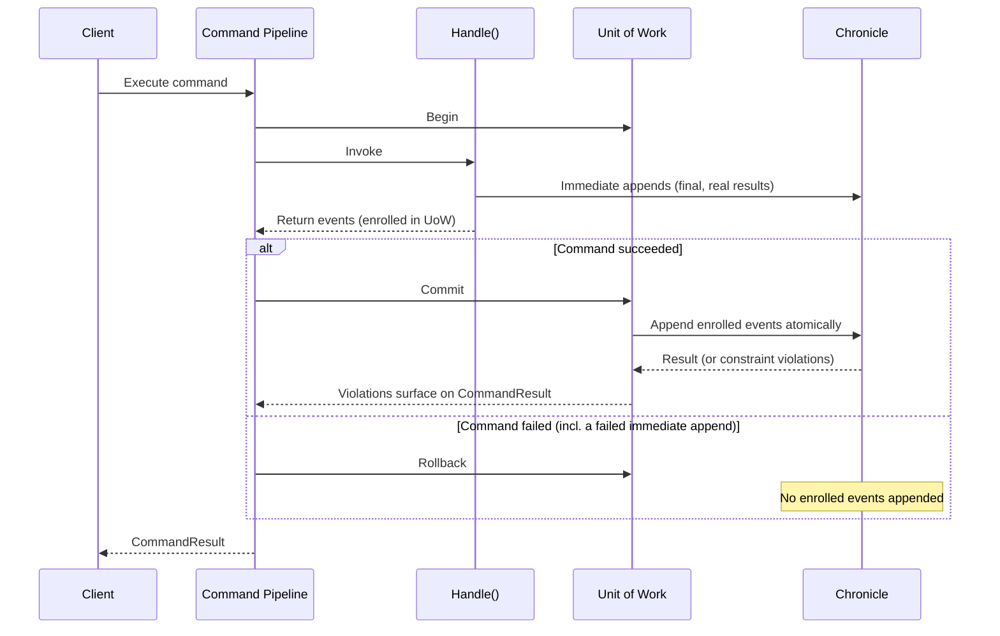

# Transactional Commands

Every command executed through the command pipeline runs in a transactional scope. The events a command declares transactional — the events it **returns from `Handle()`** and appends made through the explicit **`eventLog.Transactional`** style — are committed together, atomically, when the command succeeds. If the command fails for **any** reason — a validation error, a constraint violation, or an exception — none of them are appended.

> **Note**: The transactional scope applies to the **model-bound command pipeline** — commands executed over HTTP, directly through `ICommandPipeline`, from reactors, and in the `CommandScenario` test harness. Controller-based commands do not participate.

Appends through an injected `IEventLog` (or `IEventStore.EventLog`) are **immediate and final** — they behave identically everywhere, inside and outside commands, returning the real `AppendResult`. They are still never silently swallowed: a failed immediate append during a command **fails the command**, which also rolls back everything enrolled in the transaction.

## Choosing an Append Style

| You write | Semantics | What you get back |
| --- | --- | --- |
| Return events from `Handle()` | Transactional — atomic with the command | The `CommandResult` is the outcome |
| Return `EventsWithConcurrencyScopes` | Transactional — ordered cross-source events with the exact revisions the decision used | The `CommandResult` is the outcome |
| `eventLog.Transactional.Append(...)` | Transactional — atomic with the command | A plain `Task` — no per-append result exists until commit |
| `eventLog.Append(...)` / `eventStore.EventLog.Append(...)` | Immediate and final — same as any event sequence | The real `AppendResult`; a failed one also fails the command |

Returning events is the recommended style:

```csharp
[Command]
public record StartOnboarding(OnboardingId OnboardingId, InvitationId InvitationId, OrganizationNumber OrganizationNumber)
{
    public IEnumerable<EventForEventSourceId> Handle() =>
    [
        new(OnboardingId, new OnboardingStarted(OrganizationNumber)),
        new(InvitationId, new AdminInvited(OnboardingId))
    ];
}
```

If the `OnboardingStarted` append is rejected by a unique constraint on the organization number, the `AdminInvited` event on the other stream is rolled back with it — the command fails cleanly and the `CommandResult` carries the violation, attributed to the offending member.

For imperative transactional appends, use the explicit `Transactional` style — its shape tells the truth about the deferral: `Append` returns a plain `Task`, because no per-append result exists until the command commits:

```csharp
[Command]
public record RegisterReadings(SensorId SensorId, IEnumerable<Reading> Readings)
{
    public async Task Handle(IEventLog eventLog)
    {
        foreach (var reading in Readings)
        {
            await eventLog.Transactional.Append(SensorId, new ReadingRegistered(reading));
        }
    }
}
```

And when you deliberately want an append to be immediate — final the moment it succeeds, surviving even if the command later fails — use the plain `Append`, which behaves exactly like it does everywhere else:

```csharp
[Command]
public record ImportReadings(SensorId SensorId)
{
    public async Task Handle(IEventLog eventLog)
    {
        // Appends immediately — this event stays even if the command fails afterwards.
        await eventLog.Append(SensorId, new ImportAttempted());

        // ... work that may fail ...
    }
}
```

## How It Works

When a command executes, Arc begins a Chronicle unit of work bounded by the command. Events the command returns — and appends through `Transactional` — enroll in it instead of hitting the event store immediately. When the command completes:

- **Success** — the unit of work commits all enrolled events as one atomic operation. If the commit is rejected — for example by a unique constraint — the violation surfaces as a validation error on the `CommandResult`, attributed to the offending member, and the command fails.
- **Failure** — the unit of work rolls back and none of the enrolled events are appended.

Immediate appends are observed throughout: if one fails during the command, its violations surface on the `CommandResult` and the command fails — rolling back the enrolled events with it.



The mechanism behind this is the [command execution scope](./command-execution-scopes.md) extension point — the transactional scope is its built-in implementation.

## Nested Commands and Aggregates

A command executed from within another command — for example through `ICommandPipeline` from a handler — joins the outermost command's transaction. Only the outermost command commits or rolls back, so the whole composition is atomic for its enrolled events.

Aggregate roots already use the unit of work for their `Commit()`. Within a command they share the command's unit of work, so aggregate mutations and enrolled events from the same command commit together. Note that calling an aggregate's `Commit()` inside a handler commits the command's transaction **at that point** — anything enrolled afterwards is outside the committed batch. Prefer letting the command complete the transaction: apply the aggregate's events and let the pipeline commit when the command finishes.

## Things to Know

- **Immediate appends are final.** A successful `eventLog.Append(...)` is in the log the moment it returns, and stays there even if the command fails afterwards. The safety net guarantees a *failed* append fails the command — it cannot un-append earlier successful ones. If you need all-or-nothing, return events or use `Transactional`.
- **Reads don't see the transaction's enrolled events.** Reading through `IEventLog` inside a handler queries the event store, which doesn't contain events that are enrolled but not yet committed. Immediate appends *are* visible right away.
- **A nested command's result reflects enrollment, not the final outcome.** Its enrolled events commit — and any violation surfaces — when the outermost command completes.
- **Never use `Transactional` from background work.** An append through `eventLog.Transactional` from a continuation that outlives the command targets a completed unit of work and is **silently lost**. Plain immediate appends from background work go to the event store normally. If you need side effects after events are committed, use a reactor.
- **`Transactional` requires an active transaction.** Outside a command — for example in a controller action with no ambient unit of work — it throws; use the plain `Append` there.
- **Chronicle's ASP.NET Core unit of work middleware coexists.** A command always begins its own transaction rather than joining a request-level unit of work, and controller-based code keeps the request-level behavior it had.

For how the guarantee shows up in tests — asserting that a failed command committed nothing transactional, and that violations surface on the result — see [Testing with Chronicle](../testing/chronicle.md).
