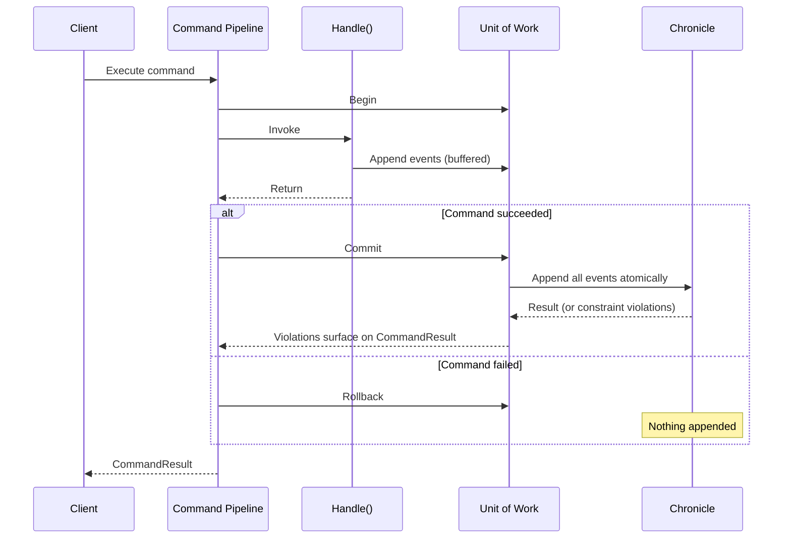

# Transactional Commands

Every command executed through the command pipeline is a transactional scope. All events a command appends — whether returned from `Handle()` or appended directly through an injected `IEventLog` — are committed together, atomically, when the command succeeds. If the command fails for **any** reason — a validation error, a constraint violation, or an exception — nothing is appended at all.

> **Note**: The transactional scope applies to the **model-bound command pipeline** — commands executed over HTTP, directly through `ICommandPipeline`, from reactors, and in the `CommandScenario` test harness. Controller-based commands do not participate; appends from a controller action go to the event store immediately.

This gives you one simple guarantee to reason about:

> If the `CommandResult` is not successful, no events were appended.

You never end up with a half-applied command: an event that landed on one stream while its sibling on another stream was rejected, or an append that was silently lost while the command reported success.

## How It Works

When a command executes, Arc begins a Chronicle unit of work bounded by the command. Every append the command performs enrolls in that unit of work instead of hitting the event store immediately. When the command completes:

- **Success** — the unit of work commits all buffered events as one atomic operation. If the commit is rejected — for example by a unique constraint — the violation surfaces as a validation error on the `CommandResult`, attributed to the offending member, and the command fails.
- **Failure** — the unit of work rolls back and none of the events are appended.

The mechanism behind this is the [command execution scope](./command-execution-scopes.md) extension point — the transactional scope is its built-in implementation.



Both styles of appending participate:

```csharp
// Returned events enroll in the command's transaction.
[Command]
public record StartOnboarding(OnboardingId OnboardingId, InvitationId InvitationId, OrganizationNumber OrganizationNumber)
{
    public IEnumerable<EventForEventSourceId> Handle() =>
    [
        new(OnboardingId, new OnboardingStarted(OrganizationNumber)),
        new(InvitationId, new AdminInvited(OnboardingId))
    ];
}

// Direct appends through IEventLog enroll in the same transaction.
[Command]
public record RegisterReading(SensorId SensorId, Reading Reading)
{
    public async Task Handle(IEventLog eventLog) =>
        await eventLog.Append(SensorId, new ReadingRegistered(Reading));
}
```

If the `OnboardingStarted` append above is rejected by a unique constraint on the organization number, the `AdminInvited` event on the other stream is rolled back with it — the command fails cleanly and the `CommandResult` carries the violation.

## Nested Commands and Aggregates

A command executed from within another command — for example through `ICommandPipeline` from a reactor or a handler — joins the outermost command's transaction. Only the outermost command commits or rolls back, so the whole composition is atomic.

Aggregate roots already use the unit of work for their `Commit()`. Within a command they share the command's unit of work, so aggregate mutations and direct appends made *before* the aggregate's `Commit()` commit together. Note that calling an aggregate's `Commit()` inside a handler commits the command's transaction **at that point** — anything the handler appends afterwards is outside the committed batch. Prefer letting the command complete the transaction: apply the aggregate's events and let the pipeline commit when the command finishes.

## Appending Outside the Transaction

If you deliberately want an append to happen immediately — outside the command's transaction, surviving even if the command later fails — be explicit about it by injecting `IEventStore` and using its `EventLog` directly:

```csharp
[Command]
public record ImportReadings(SensorId SensorId)
{
    public async Task Handle(IEventStore eventStore)
    {
        // Appends immediately — this event stays even if the command fails afterwards.
        await eventStore.EventLog.Append(SensorId, new ImportAttempted());

        // ... work that may fail ...
    }
}
```

Use this sparingly — audit-style events like the one above are the typical fit. If you find yourself escaping the transaction for domain events, reconsider the command's design.

## Things to Know

- **The per-append result inside a command is deferred.** An `Append` inside a command returns an accepted placeholder — the real outcome, including constraint violations, is only known when the command commits and is reported on the `CommandResult`. Don't branch on the `AppendResult` of an individual append inside a command; the `CommandResult` is the source of truth.
- **Reads don't see the command's own uncommitted appends.** Reading through `IEventLog` inside a handler — `HasEventsFor`, `GetFromSequenceNumber`, and friends — queries the event store, which doesn't contain the events the command has buffered but not yet committed. Base decisions on the events and read models you already have, not on reading back your own appends.
- **A nested command's result reflects buffering, not the final outcome.** A command executed from within another command reports success when its events are enrolled in the outer transaction — the actual commit, and any violation, happens when the outermost command completes.
- **Don't append from background work after the command returns.** An append from a background continuation started inside a handler runs after the command's transaction completed and goes to the event store immediately, outside any transaction. If you need side effects after events are committed, use a reactor.
- **Chronicle's ASP.NET Core unit of work middleware coexists.** A command always begins its own transaction rather than joining a request-level unit of work, so the guarantee holds with or without the middleware — and controller-based code keeps the request-level behavior it had.

For how the guarantee shows up in tests — asserting that a failed command appended nothing, and that violations surface on the result — see [Testing with Chronicle](../testing/chronicle.md).
