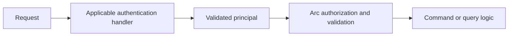

Before a command can check a role, something must establish who sent the request. In the lightweight `Cratis.Arc.Core` host, `IAuthenticationHandler` implementations produce a `ClaimsPrincipal`. ASP.NET Core applications instead configure their host's authentication; see [Microsoft Identity integration](../asp-net-core/microsoft-identity.md).

## Authentication flow

Arc discovers `IAuthenticationHandler` implementations through `IInstancesOf<IAuthenticationHandler>` and tries them sequentially:

1. `AuthenticationResult.Anonymous` means this handler does not apply; try the next one.
2. `AuthenticationResult.Succeeded(principal)` stops the sequence and supplies the request principal.
3. `AuthenticationResult.Failed(reason)` stops the sequence without authenticating.

Do not depend on a particular discovery order or assume individual DI registrations define that order. If mechanisms overlap, make their applicability unambiguous. An earlier success means later handlers cannot veto it.



## Implementing an authentication handler

This **illustrative integration fragment** defines the Arc adapter and an application-owned validator contract, not a runnable JWT implementation. Register a real `ITokenValidator` implementation before using it. The validator must verify signature, trusted issuer, audience, lifetime, and applicable revocation requirements using your identity library. Decoding a token is not validation.

```csharp
using System.Security.Claims;
using Cratis.Arc.Authentication;
using Cratis.Arc.Http;

public interface ITokenValidator
{
    Task<ClaimsPrincipal?> Validate(string token);
}

public class BearerTokenAuthenticationHandler(ITokenValidator validator) : IAuthenticationHandler
{
    public async Task<AuthenticationResult> HandleAuthentication(IHttpRequestContext context)
    {
        if (!context.Headers.TryGetValue("Authorization", out var header) ||
            !header.StartsWith("Bearer ", StringComparison.OrdinalIgnoreCase))
        {
            return AuthenticationResult.Anonymous;
        }

        var token = header["Bearer ".Length..].Trim();
        if (token.Length == 0)
        {
            return AuthenticationResult.Failed("Invalid credentials");
        }

        try
        {
            var principal = await validator.Validate(token);
            return principal?.Identity?.IsAuthenticated == true
                ? AuthenticationResult.Succeeded(principal)
                : AuthenticationResult.Failed("Invalid credentials");
        }
        catch (Exception)
        {
            return AuthenticationResult.Failed("Authentication unavailable");
        }
    }
}
```

Missing bearer credentials let another mechanism try. Empty, invalid, or unverifiable bearer credentials never become a successful principal. Log operational failures server-side without recording tokens or disclosing validation internals to clients. API keys and passwords likewise need a real credential store and validator; never compare against sample hardcoded secrets or put credentials into claims.

## Microsoft Identity Platform (Azure)

Core already supplies `Cratis.Arc.Identity.MicrosoftIdentityPlatformAuthenticationHandler`, discovered with the other authentication handlers. Do not implement a second EasyAuth parser. It reads these forwarded headers:

| Header | Purpose |
| --- | --- |
| `x-ms-client-principal-id` | User ID |
| `x-ms-client-principal-name` | Display name |
| `x-ms-client-principal` | Base64 JSON principal containing roles and claims |

The handler requires all three headers, rejects an invalid principal representation, replaces forwarded subject/identifier claims, and takes the reserved `MicrosoftIdentityPlatformClaims.IdentityProvider` claim from the payload's `identityProvider` field. This establishes single provenance **within the payload**, not authenticity of the sender.

> [!WARNING]
> These headers are not signed credentials. Deploy this mechanism only behind trusted ingress that authenticates callers, strips caller-supplied identity headers, writes its own values, and prevents direct access to the backend. A custom `X-User-ID` or `X-User-Role` header needs the same protections. Adding a bearer validator does not make a separately accepted forwarded-header mechanism safe.

In the ASP.NET Core package, the corresponding registration is `builder.Services.AddMicrosoftIdentityPlatformIdentityAuthentication()`. It is not the Core registration API. See [Microsoft Identity Platform](../asp-net-core/microsoft-identity.md) for that host's setup and local-development principals.

## Endpoint enforcement and limits

The lightweight authentication middleware installs the successful principal on `IHttpRequestContext.User`. With handlers present, an endpoint not explicitly allowing anonymous access returns HTTP 401 if authentication does not succeed. An endpoint with `AllowAnonymous = true` proceeds even when credentials fail. If **no handlers** are available, the middleware currently proceeds without authenticating; metadata alone is not a fail-closed protection in that configuration.

Arc command/query authorization is a separate pipeline check. Read the current principal through `ICurrentPrincipalAccessor` from `Cratis.Arc.Authorization`, not the client-readable identity cookie. See [Authorization](authorization.md) for roles, result status, and direct-call boundaries.

## Testing authentication handlers

Before exposing the service, exercise missing credentials, malformed input, arbitrary tokens, expired/wrong-issuer/wrong-audience tokens, a genuinely valid token, forged forwarded headers, and backend access bypassing ingress. Also test endpoints with and without anonymous metadata and every accepted authentication mechanism. A valid-token-only test cannot establish a fail-closed boundary.

## Next steps

- [Authorization](authorization.md) — apply authentication and role requirements.
- [Identity](../identity/index.md) — supply frontend identity details without treating cookies as credentials.
- [Endpoint mapping](endpoint-mapping.md) — understand manual endpoint responsibilities.
