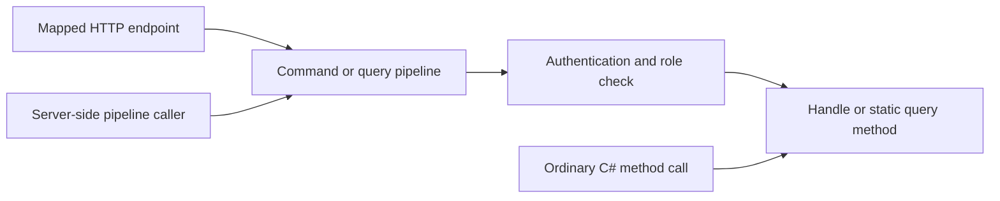

An authenticated caller is not necessarily allowed to perform every operation. Arc's authorization filters check the current principal before command or query logic runs. These checks belong to `Cratis.Arc.Core`; they do not require ASP.NET Core, a database, or Chronicle.

## Authorization attributes

Use attributes from `Cratis.Arc.Authorization`:

| Attribute | Arc pipeline behavior |
| --- | --- |
| `[Authorize]` | Requires an authenticated principal. |
| `[Authorize(Roles = "Admin,Manager")]` | Requires authentication and at least one listed role. |
| `[Roles("Admin", "Manager")]` | The same OR-role check; derives from Arc's `AuthorizeAttribute`. |
| `[AllowAnonymous]` | Explicitly allows anonymous access. |
| No authorization attribute | No authentication or role requirement from the Arc evaluator. |

> [!WARNING]
> Arc's evaluator reads authentication and roles only. The `Policy` and `AuthenticationSchemes` properties on Arc's attribute are **not enforced** by that evaluator. It takes the first applicable authorization attribute; stacking `[Authorize]` and `[Roles]` does not combine requirements. Use a single attribute. ASP.NET Core middleware can enforce its own endpoint policies when configured with Microsoft metadata; that is a separate boundary, not a guarantee for direct Arc pipeline execution.

## Protect a command

This complete type fragment uses only Arc and .NET; add it to the [Core host](getting-started.md). Its return value is an ordinary response, not an event append:

```csharp
using Cratis.Arc.Authorization;
using Cratis.Arc.Commands.ModelBound;

[Authorize]
[Command]
public record Greet(string Name)
{
    public string Handle() => $"Hello, {Name}!";
}
```

Through the command pipeline, anonymous callers cannot reach `Handle()`. For role protection, replace `[Authorize]` with `[Roles("Admin", "Manager")]`.

## Protect a query

This complete type fragment requires either role for every query unless a method specifies a different requirement:

```csharp
using Cratis.Arc.Authorization;
using Cratis.Arc.Queries.ModelBound;

[Roles("Admin", "Auditor")]
[ReadModel]
public record ServiceStatus(string State)
{
    public static ServiceStatus Internal() => new("Running");

    [AllowAnonymous]
    public static ServiceStatus Public() => new("Available");
}
```

Method authorization takes precedence over type authorization. Arc rejects conflicting `[Authorize]` and `[AllowAnonymous]` on the same target with `AmbiguousAuthorizationLevel`; do not combine them.

## The pipeline boundary



Attributes do not intercept ordinary C# calls. `new Greet("World").Handle()` and `ServiceStatus.Internal()` bypass pipeline authorization, validation, filters, and result handling. Use mapped endpoints or [the command pipeline](../commands/command-pipeline.md) / [query pipeline](../queries/query-pipeline.md) when those guarantees are required. Server-side callers must also establish an appropriate principal through the supported execution scope; being in-process does not itself prove permission.

## Working with claims

Core supplies `ICurrentPrincipalAccessor.Current`, a nullable `ClaimsPrincipal` independent of transport. During HTTP requests it reads the request principal; outside HTTP it can read the principal established by a server-side execution scope.

This complete type fragment returns a claim as query data:

```csharp
using System.Security.Claims;
using Cratis.Arc.Authorization;
using Cratis.Arc.Queries.ModelBound;

[Authorize]
[ReadModel]
public record CurrentUser(string? Id)
{
    public static CurrentUser Mine(ICurrentPrincipalAccessor principalAccessor) =>
        new(principalAccessor.Current?.FindFirst(ClaimTypes.NameIdentifier)?.Value);
}
```

Use `FindFirst(ClaimTypes.NameIdentifier)?.Value` or `IsInRole(...)` on this principal for application checks. No `IHttpContextAccessor` is required by the lightweight host. [Identity details](../identity/index.md) are presentation data and do not add trusted claims to this principal.

## Custom authorization logic

Authentication and roles are coarse-grained. Ownership, tenant membership, and resource-specific permissions still need application checks based on trusted claims and authoritative data. Put reusable permission checks into appropriate pipeline filters; a command filter rejecting access returns `CommandResult.Unauthorized(context.CorrelationId)`, not `CommandResult.Error(...)`.

A handler can instead return a `ValidationResult.Error(...)` using a typed `Result<TResponse, ValidationResult>` for a business rejection. That is **validation**, not an authorization result: callers receive validation errors rather than a forbidden result. Do not describe it as policy enforcement or assume it rolls back side effects already performed. Standalone Arc does not append events; event-return behavior belongs to the optional [Chronicle integration](../chronicle/commands/events.md).

## Authorization results

An Arc pipeline authorization rejection sets `IsAuthorized = false`; mapped HTTP results use **403 Forbidden**. Lightweight authentication middleware may reject earlier with **401 Unauthorized**. ASP.NET Core authentication/authorization middleware has its own challenge/forbid behavior. Do not infer which layer ran solely from an HTTP status.

## Testing authorization

Use [command scenarios](../testing/command-scenario.md) to exercise the actual pipeline and assert `ShouldNotBeAuthorized()` or `ShouldBeAuthorized()`. Test anonymous, authenticated-without-role, and allowed-role principals. Add resource and tenant membership cases for custom rules. Test HTTP separately when relying on ingress or ASP.NET middleware; direct pipeline specs cannot prove those boundaries.

## Next steps

- [Authentication](authentication.md) — establish a trustworthy principal.
- [ASP.NET Core authorization](../asp-net-core/authorization.md) — separate host policies from Arc checks.
- [Tenancy](../tenancy/index.md) — distinguish tenant selection from permission and storage isolation.
