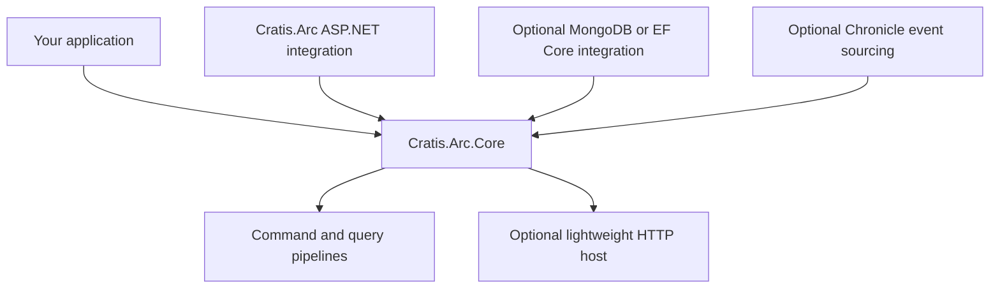

A worker or small HTTP service does not always need MVC and Kestrel. `Cratis.Arc.Core` gives you Arc's command/query pipelines and a lightweight `HttpListener` host without an ASP.NET Core dependency. `Cratis.Arc` adds the ASP.NET integration when you need that ecosystem. Neither package requires event sourcing.

## What Core provides

- Model-bound commands and queries, validation, authorization, and result handling.
- Identity details and tenant context; application authorization and tenant membership still need deliberate configuration.
- Correlation IDs, dependency injection, and convention-based discovery.
- GET/POST manual endpoints, [static files and SPA fallback](static-files.md), and [basic OpenAPI route metadata](openapi.md).



Persistence integrations do not require Chronicle. Adding an integration can introduce its own dependencies; the Core-only dependency boundary is not a promise about every combined package graph.

## Comparison with ASP.NET Core

| Capability | Arc.Core lightweight host | Arc with ASP.NET Core |
| --- | --- | --- |
| Package | `Cratis.Arc.Core` | `Cratis.Arc` |
| HTTP server | `HttpListener` | ASP.NET hosting, commonly Kestrel |
| Request handling | Arc's simplified route/static/fallback handling | ASP.NET middleware ecosystem |
| Manual routing | Literal-path GET/POST helpers | ASP.NET routing APIs |
| Static files | Built-in support and SPA fallback | ASP.NET static-file middleware |
| MVC/Razor | Not included | Available through ASP.NET |
| OpenAPI | Basic route metadata in Core | Optional `Cratis.Arc.OpenApi` or `Cratis.Arc.Swagger` |
| Pipelines, validation, identity, tenant context | Available | Available |

Core does have request-processing middleware internally; it does not expose ASP.NET's full middleware pipeline. Native AOT compatibility, startup time, memory usage, deployment size, and throughput depend on discovery, serialization, integrations, and deployment. Validate your actual publish configuration and benchmark your workload rather than treating “lightweight” as an AOT or performance guarantee.

## When to choose each host

Choose Core for small standalone HTTP services, workers with management endpoints, or learning the pipelines without a web-framework dependency. Choose ASP.NET Core for controllers, Razor, advanced routing, standard authentication middleware, or other ASP.NET libraries. Arc pipelines can participate in other application architectures, but Core does not itself supply a gRPC server or arbitrary protocol implementation.

## Architecture

The builder registers services; activation maps Arc endpoints and schedules listener startup. This **bootstrap fragment** belongs in a console project's `Program.cs` with `using Cratis.Arc;`:

```csharp
var builder = ArcApplication.CreateBuilder(args);
builder.AddCratisArc();
var app = builder.Build();
app.UseCratisArc();
await app.RunAsync();
```

The default listener binds `http://+:5001/`; the [getting-started checkpoint](getting-started.md) uses an explicit loopback URL. Review [anonymous discovery defaults](../introspection/index.md) before exposing the host.

## Next steps

- [Getting started](getting-started.md) — run a complete command/query example.
- [Authentication](authentication.md) and [authorization](authorization.md) — establish and enforce trust.
- [Configuration](../configuration/index.md) — all runtime options and host differences.
- [Invariant culture](invariant-culture.md) — culture-sensitive behavior.
- [Chronicle integration](../chronicle/index.md) — optional event sourcing, not a prerequisite.
