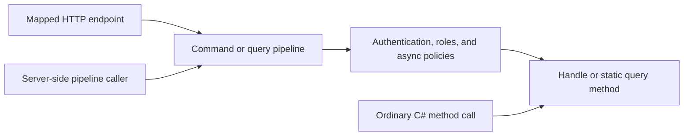

An authenticated caller is not necessarily allowed to perform every operation. Arc's authorization filters check the current principal before command or query logic runs. These checks belong to `Cratis.Arc.Core`; they do not require ASP.NET Core, a database, or Chronicle.

## Authorization attributes

Use attributes from `Cratis.Arc.Authorization`:

| Attribute | Arc pipeline behavior |
| --- | --- |
| `[Authorize]` | Requires an authenticated principal. |
| `[Authorize(Roles = "Admin,Manager")]` | Requires authentication and at least one listed role. |
| `[Roles("Admin", "Manager")]` | The same OR-role check; derives from Arc's `AuthorizeAttribute`. |
| `[Authorize(Policy = "ActiveSubscription")]` | Requires authentication by default and the named policy to succeed asynchronously. An explicitly opted-in policy may evaluate guests. |
| `[AllowAnonymous]` | Explicitly allows anonymous access. |
| No authorization attribute | No authentication or role requirement unless a fallback evaluator supplies one. |

Every authorization attribute on a declaration applies: stacked roles and policies are combined with AND. Register each policy before starting the host; an unknown or duplicate policy fails startup, and an unresolved policy at runtime never grants access. The standalone Arc host cannot authenticate named schemes: `AuthenticationSchemes` fails startup (and [ARC0021](../code-analysis/index.md#arc0021-unevaluated-authorization-settings) flags it). Use [ASP.NET Core integration](../asp-net-core/authorization.md) for actual scheme authentication.

## Protect a command

This complete type fragment uses only Arc and .NET; add it to the [Core host](getting-started.md). Its return value is an ordinary response, not an event append:

```csharp
using Cratis.Arc.Authorization;
using Cratis.Arc.Commands.ModelBound;

[Authorize]
[Command]
public record Greet(string Name)
{
    public string Handle() => $"Hello, {Name}!";
}
```

Through the command pipeline, anonymous callers cannot reach `Handle()`. For role protection, replace `[Authorize]` with `[Roles("Admin", "Manager")]`.

## Register a named policy

A policy resolves from the command or query's executing service scope, so it can depend on scoped collaborators. This example uses a trusted claim established by your host's authentication mechanism:

```csharp
using System.Threading;
using System.Threading.Tasks;
using Cratis.Arc.Authorization;

public class ActiveSubscription : IAuthorizationPolicy
{
    public ValueTask<bool> IsAuthorized(AuthorizationPolicyContext context, CancellationToken cancellationToken)
    {
        cancellationToken.ThrowIfCancellationRequested();
        return ValueTask.FromResult(context.Principal.HasClaim("subscription", "active"));
    }
}
```

In the host builder, before `Build()`:

```csharp
using Cratis.Arc.Authorization;

builder.Services.AddArcAuthorizationPolicy<ActiveSubscription>("ActiveSubscription");
```

Apply `[Authorize(Policy = "ActiveSubscription")]` to a model-bound command or read model. `AuthorizationPolicyContext.Target` names its type or query method; `Resource` is the executing `CommandContext` or `QueryContext`. `ReceivedAt` is the same `DateTimeOffset` as `Resource.ReceivedAt` for an Arc pipeline operation. It remains fixed when policy evaluation is delayed or repeated, including when a selected scheme moves execution into another service scope. Arc captures it at model-bound transport dispatch before binding and authentication preparation, at direct pipeline entry, or per hub subscribe operation (not per connection). It is Arc receipt time, not network arrival time or the time before application middleware. MVC action filters establish their contexts after MVC binding. By default, an authenticated principal is required even when a policy itself permits anonymous callers. To evaluate an unauthenticated caller, explicitly register a guest-aware Arc policy with `builder.Services.AddArcAuthorizationPolicy<PublicOrMember>("PublicOrMember", evaluatesAnonymous: true)`; the policy must decide whether the guest is allowed. The policy receives an empty unauthenticated `ClaimsPrincipal` for guests. For ASP.NET Core-registered policies, register the policy as usual and also call `builder.Services.AddArcAnonymousAspNetAuthorizationPolicy("PublicOrMember")`; the policy must not require an authenticated user. Both Arc and Microsoft's `[Authorize(Policy = "PublicOrMember")]` work identically on the ASP.NET Core host. Every stacked requirement must be an opted-in policy without roles or authentication schemes to evaluate a guest; roles and schemes always require authentication. Policy checks are awaited before `Provide()`, `Handle()`, or a query method runs. Command context-value providers and execution-scope `Begin` run before the policy verdict so filters retain their established ordering; they may run for a caller ultimately denied by the policy. A named scheme, when supported by the ASP.NET Core host, is authenticated and selected before those hooks, but the hooks must not treat selection as authorization or perform irreversible business effects. The old synchronous `IAuthorizationEvaluator.IsAuthorized` entry points reject policy-bearing declarations; use the command/query pipelines instead.

Mapped model-bound HTTP endpoints whose effective declaration consists entirely of guest policies let unauthenticated callers reach the Arc pipeline on both hosts. This includes command validation and query GET/QUERY endpoints. The lightweight host does not reject these callers merely because authentication handlers are registered; the ASP.NET Core host emits anonymous endpoint metadata so an authentication-requiring `FallbackPolicy` does not reject them before Arc evaluates their policies. This metadata is not an authorization verdict: a policy denial still returns **403 Forbidden** and skips command/query logic. Do not add `[AllowAnonymous]` alongside the policy; that declaration remains ambiguous. Endpoints with an ordinary policy, a mixed guest/ordinary declaration, roles, authentication schemes, or no guest policy retain their existing HTTP authentication behavior. Query method declarations still replace type declarations, including when the method opts into a guest policy.

For a time-sensitive admission rule, use the captured receipt instead of reading the clock again after an asynchronous policy lookup. This complete policy type fragment assumes an Arc host with policies registered as above; the UTC window is illustrative, not a substitute for your application's authorization rules:

```csharp
using System;
using System.Threading;
using System.Threading.Tasks;
using Cratis.Arc.Authorization;

public class WeekdayAdmission : IAuthorizationPolicy
{
    public ValueTask<bool> IsAuthorized(AuthorizationPolicyContext context, CancellationToken cancellationToken)
    {
        cancellationToken.ThrowIfCancellationRequested();
        if (context.ReceivedAt == default) return ValueTask.FromResult(false);
        var weekday = context.ReceivedAt.UtcDateTime.DayOfWeek;
        return ValueTask.FromResult(weekday != DayOfWeek.Saturday && weekday != DayOfWeek.Sunday);
    }
}
```

Register this type with `builder.Services.AddArcAuthorizationPolicy<WeekdayAdmission>("WeekdayAdmission")` before `Build()`, then apply `[Authorize(Policy = "WeekdayAdmission")]`. The rule uses Arc receipt time even if evaluating the policy starts later and denies a missing receipt. Set the `TimeProvider` in tests when asserting a specific receipt date.

For policy- or scheme-protected declarations, Arc checks policy-input and ambient execution identity before and after each policy, including construction, and denies access on detected change before another policy runs. It also rechecks the execution principal and effective requirements after policy and legacy evaluator callbacks and before invoking a command handler or query action. A model-bound or controller-based query checks immediately before calling its method. A changed declaration or missing asynchronous verdict denies access. Roles-only and plain `[Authorize]` declarations are decided synchronously, without an asynchronous verdict to recheck.

Identity continuity compares captured standard identity content: claims (including claim properties), authentication type, name and role claim types, label, and the captured actor chain. It checks references for custom principal/identity types and opaque bootstrap contexts but cannot fingerprint mutable state hidden behind custom behavior or inside opaque objects. These checks do not sandbox trusted application code: a policy can mutate and restore identity within one callback (including ASP.NET Core handlers inside one `AuthorizeAsync` call). They do not detect changes in an external permission store after admission, prevent arbitrary work or side effects inside callbacks, bind separately writable ASP.NET Core and Arc principal views or pre-verdict tenant/service bindings, control raw contexts or services retained outside Arc's supported execution scope, or cover identity-bound services constructed outside Arc before pipeline entry. Identity continuity is not ongoing permission revocation: observable emissions need their own guards, and deferred query enumeration and observable emissions are not rechecked by this policy verdict. See [decision 0006](https://github.com/Cratis/Arc/blob/main/decisions/0006-opt-in-anonymous-authorization-policy-evaluation.md) for the trust boundary.

## Protect a query

This complete type fragment requires either role for every query unless a method specifies a different requirement:

```csharp
using Cratis.Arc.Authorization;
using Cratis.Arc.Queries.ModelBound;

[Roles("Admin", "Auditor")]
[ReadModel]
public record ServiceStatus(string State)
{
    public static ServiceStatus Internal() => new("Running");

    [AllowAnonymous]
    public static ServiceStatus Public() => new("Available");
}
```

Method authorization **replaces** the type declaration; it does not combine with it. For example, on a read model with type-level `[Roles("Admin")]`, a method-level `[Authorize(Policy = "PublicOrMember")]` registered with `evaluatesAnonymous: true` is reachable by guests when that policy allows them. The type-level Admin role no longer protects that method. Arc rejects conflicting `[Authorize]` and `[AllowAnonymous]` on the same target with `AmbiguousAuthorizationLevel`; do not combine them.

## Set baseline requirements without overriding anonymous access

Implement `IFallbackAuthorizationEvaluator` when you want an authentication or role requirement for commands and queries that have no explicit authorization declaration. Arc discovers implementations by convention; do not register one manually. This example requires the `Member` role by default in an existing Arc host:

```csharp
using System;
using System.Collections.Generic;
using System.Reflection;
using Cratis.Arc.Authorization;

public class MembersByDefault : IFallbackAuthorizationEvaluator
{
    public IEnumerable<AuthorizationRequirement> GetAuthorizationRequirements(Type type) =>
        [AuthorizationRequirement.FromRoles("Member")];

    public IEnumerable<AuthorizationRequirement> GetAuthorizationRequirements(MethodInfo method) => [];
}
```

An unannotated command type and an unannotated query now require the `Member` role. Commands and queries whose authorization target is a type consult only `GetAuthorizationRequirements(Type)`; `GetAuthorizationRequirements(MethodInfo)` applies only to query methods. Put a baseline intended for all commands in the `Type` overload. For query methods, Arc first checks the method and its declaring type for explicit declarations; only if neither has one does it consult the fallback evaluators. The type and method fallback requirements then **all** apply, including requirements supplied by different evaluators. `[AllowAnonymous]` on a method permits anonymous access even when its type has a baseline; a method-level `[Authorize]` or type-level `[Authorize]` replaces the baseline. Controller-based queries reached through Arc's observable hub path use the query pipeline and can receive this baseline. Direct HTTP GET and WebSocket requests to controller-based queries are MVC actions, not covered by `IFallbackAuthorizationEvaluator`; configure ASP.NET Core's [`FallbackPolicy`](../asp-net-core/authorization.md#protecting-all-endpoints-by-default) to protect those actions without authorization metadata, including controller-based commands. An unauthenticated or wrong-role caller is denied before an Arc command or query runs.

Use `IAuthorizationAttributeEvaluator` only to report **explicit** declarations from another attribute family. Its requirements still conflict with `[AllowAnonymous]` on the same member and raise `AmbiguousAuthorizationLevel`; they do not turn into a baseline automatically. Baseline evaluators return requirements, not authorization verdicts or cached principal-specific results. For resource-dependent checks, use a named policy or a pipeline filter instead.

## The pipeline boundary


```mermaid
flowchart LR
    HTTP[Mapped HTTP endpoint] --> Pipeline[Command or query pipeline]
    Caller[Server-side pipeline caller] --> Pipeline
    Pipeline --> Check[Authentication, roles, and async policies]
    Check --> Logic[Handle or static query method]
    Direct[Ordinary C# method call] --> Logic
```

Attributes do not intercept ordinary C# calls. `new Greet("World").Handle()` and `ServiceStatus.Internal()` bypass pipeline authorization, validation, filters, and result handling. Use mapped endpoints or [the command pipeline](../commands/command-pipeline.md) / [query pipeline](../queries/query-pipeline.md) when those guarantees are required. Server-side callers must also establish an appropriate principal through the supported execution scope; being in-process does not itself prove permission. A nested Core pipeline may use a different trusted server-side principal in a no-scheme execution scope, restoring the outer actor afterward. The restriction on changing a scheme-selected actor after an outer command has bound its unit of work applies to ASP.NET Core scheme selection, not to ordinary no-scheme `BeginScope` nesting.

## Working with claims

Core supplies `ICurrentPrincipalAccessor.Current`, a nullable `ClaimsPrincipal` independent of transport. During HTTP requests it reads the request principal; outside HTTP it can read the principal established by a server-side execution scope.

This complete type fragment returns a claim as query data:

```csharp
using System.Security.Claims;
using Cratis.Arc.Authorization;
using Cratis.Arc.Queries.ModelBound;

[Authorize]
[ReadModel]
public record CurrentUser(string? Id)
{
    public static CurrentUser Mine(ICurrentPrincipalAccessor principalAccessor) =>
        new(principalAccessor.Current?.FindFirst(ClaimTypes.NameIdentifier)?.Value);
}
```

Use `FindFirst(ClaimTypes.NameIdentifier)?.Value` or `IsInRole(...)` on this principal for application checks. No `IHttpContextAccessor` is required by the lightweight host. [Identity details](../identity/index.md) are presentation data and do not add trusted claims to this principal.

## Custom authorization logic

Authentication and roles are coarse-grained. Ownership, tenant membership, and resource-specific permissions still need application checks based on trusted claims and authoritative data. Put reusable permission checks into appropriate pipeline filters; a command filter rejecting access returns `CommandResult.Unauthorized(context.CorrelationId)`, not `CommandResult.Error(...)`.

A handler can instead return a `ValidationResult.Error(...)` using a typed `Result<TResponse, ValidationResult>` for a business rejection. That is **validation**, not an authorization result: callers receive validation errors rather than a forbidden result. Do not describe it as policy enforcement or assume it rolls back side effects already performed. Standalone Arc does not append events; event-return behavior belongs to the optional [Chronicle integration](../chronicle/commands/events.md).

## Authorization results

An Arc pipeline authorization rejection sets `IsAuthorized = false`; mapped HTTP results use **403 Forbidden**. Lightweight authentication middleware may reject earlier with **401 Unauthorized**. ASP.NET Core authentication/authorization middleware has its own challenge/forbid behavior. Do not infer which layer ran solely from an HTTP status.

## Testing authorization

Use [command scenarios](../testing/command-scenario.md) to exercise the actual pipeline and assert `ShouldNotBeAuthorized()` or `ShouldBeAuthorized()`. Test anonymous, authenticated-without-role, and allowed-role principals. Add resource and tenant membership cases for custom rules. Test HTTP separately when relying on ingress or ASP.NET middleware; direct pipeline specs cannot prove those boundaries.

## Next steps

- [Authentication](authentication.md) — establish a trustworthy principal.
- [ASP.NET Core authorization](../asp-net-core/authorization.md) — separate host policies from Arc checks.
- [Tenancy](../tenancy/index.md) — distinguish tenant selection from permission and storage isolation.
