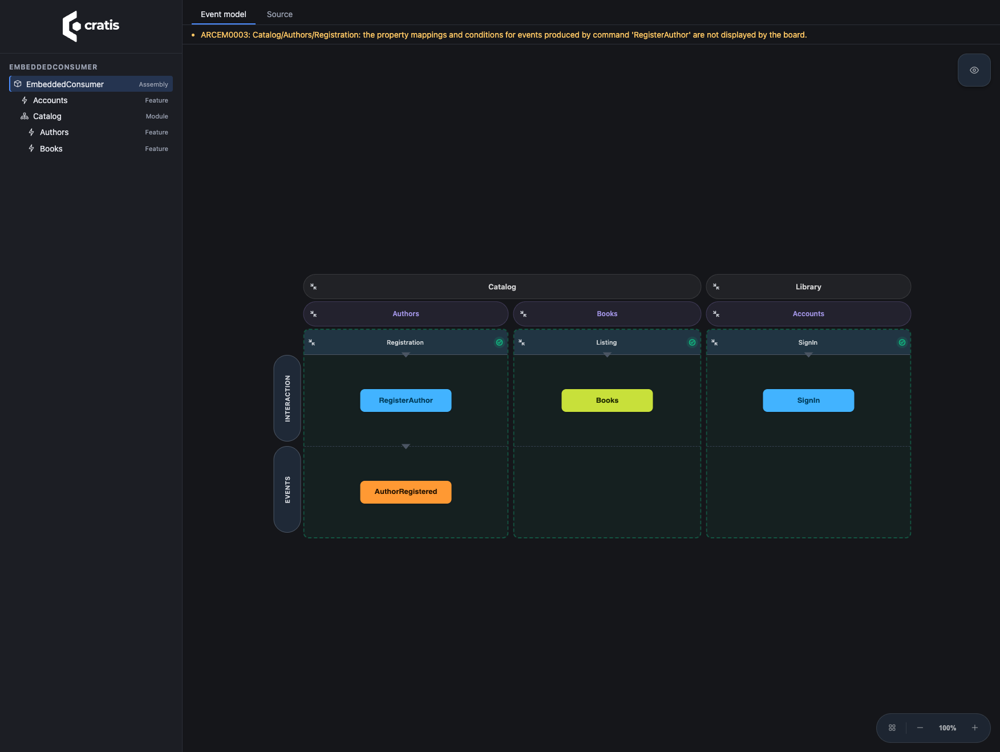
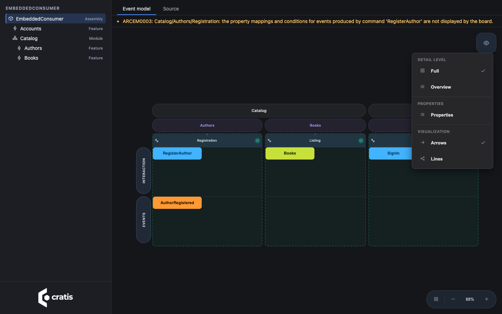
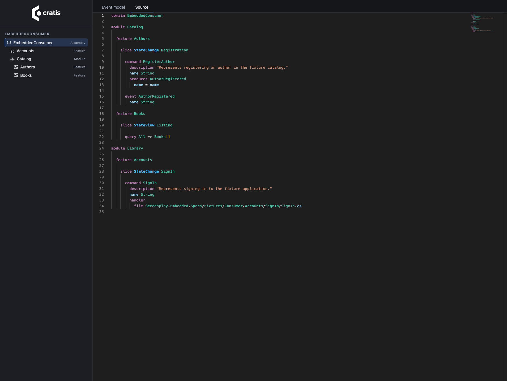

To inspect the model behind a running application without keeping a separate diagram up to date, embed its generated Screenplay documents during the build. `Cratis.Arc.Screenplay.Embedded` adds a read-only explorer at `/.cratis/event-model` with project, module, and feature navigation.

## Quickstart

1. Add the package to your ASP.NET Core application (skip this if you already reference the `Cratis` metapackage):

   ```bash
   dotnet add package Cratis.Arc.Screenplay.Embedded
   ```

2. Map the viewer after `builder.Build()` and before `app.Run()`:

   ```csharp
   if (app.Environment.IsDevelopment())
   {
       app.MapCratisEventModel();
   }
   ```

   With the `Cratis` metapackage, your existing `AddCratis` / `UseCratis` setup does this automatically for a Debug build running in Development; no explicit mapping is needed.

3. Run in Development and open `http://localhost:<port>/.cratis/event-model/`, using the port printed by your application:

   ```bash
   dotnet run --configuration Debug -- --environment Development
   ```

See [Security](#security) before exposing the viewer beyond your local development machine.

This is source-derived documentation, not a view of stored events or live application data. Use it to review a feature's command/event/read-model flow, orient yourself in an unfamiliar codebase, or compare a scoped feature with the whole application without maintaining a second diagram. It uses the same analysis as [Screenplay generation](generating-a-screenplay.md); its limitations and diagnostics still apply.

Arc does not require event sourcing. An ordinary command that returns a response has no event card. Commands that produce recognized Chronicle events show those events, including events declared in another slice; state-view slices show the events they consume.

## Open the explorer in a Cratis application

The `Cratis` metapackage includes the embedded-generation package. In an existing ASP.NET Core host configured with `AddCratis` and activated with `UseCratis`, build and run in Debug with the hosting environment set to Development, then open `/.cratis/event-model/`. The build creates and embeds the documents automatically; `UseCratis` maps the viewer automatically only when both conditions hold.

The build check uses the application's `DebuggableAttribute` and whether optimizations are disabled. Production, Staging, and other environments do not expose the viewer automatically, even for a Debug build. Release-built applications do not expose it automatically, even in Development. Through the metapackage, Release builds also disable generation by default.

To opt out, configure services before building the host:

```csharp
builder.Services.AddCratisEventModelViewer(options => options.Enabled = false);
```

For Arc-only hosts, or when you want to choose the exposed assemblies and policy yourself, use the explicit setup below.

## Map the explorer explicitly

In an ASP.NET Core application that already declares Arc commands or queries, add the package:

```bash
dotnet add package Cratis.Arc.Screenplay.Embedded
```

Map the explorer in your existing `Program.cs` after building the application. This is a complete minimal host; retain your application's existing Arc setup when adding the mapping:

```csharp
var builder = WebApplication.CreateBuilder(args);
var app = builder.Build();

if (app.Environment.IsDevelopment())
{
    app.MapCratisEventModel();
}

app.Run();
```

Build and start your application, then open `/.cratis/event-model/`. Select a document in the hierarchy to view its event-model board or its generated `.play` source. The viewer is bundled in the package; your application's users do not need to install Node.js.

Outside automatic metapackage hosting, nothing is mapped until you call the extension. By default it reads the entry assembly. For an application whose model lives in other assemblies, select them explicitly:

```csharp
app.MapCratisEventModel(typeof(MyApplicationMarker).Assembly);
```

`MyApplicationMarker` is a type in the assembly containing your application artifacts. Each selected assembly must have been built with the embedded-generation package enabled. Documents remain assembly-scoped; this does not merge multiple projects into one model.

## Keep it out of release builds

Endpoint mapping and resource generation are separate switches. An unmapped explorer cannot be requested, but generated resources still reside in the assembly unless you disable generation.

To generate documents only in Debug, add this to your application project:

```xml
<PropertyGroup>
    <CratisEmbeddedScreenplayEnabled Condition="'$(Configuration)' != 'Debug'">false</CratisEmbeddedScreenplayEnabled>
</PropertyGroup>
```

A direct reference to `Cratis.Arc.Screenplay.Embedded` enables generation by default; the `Cratis` metapackage disables it in Release unless you explicitly set `CratisEmbeddedScreenplayEnabled` to `true`. Generation does not run during design-time builds. A real build regenerates the resources from the current source; disabling generation prevents previously generated files from being included.

## Understand the hierarchy

Namespace placement is relative to your project's `RootNamespace`. Set it explicitly when your assembly name and application namespace differ:

```xml
<PropertyGroup>
    <RootNamespace>Company.Library</RootNamespace>
</PropertyGroup>
```

For example:

| Namespace | Placement |
| --- | --- |
| `Company.Library.Catalog.Authors.Registration` | Module `Catalog`, feature `Authors`, slice `Registration` |
| `Company.Library.Catalog.Books.Listing` | Module `Catalog`, feature `Books`, slice `Listing` |
| `Company.Library.Accounts.SignIn` | Rooted feature `Accounts`, slice `SignIn` |

The first segment after the root is a module when it contains feature namespaces beneath it. If its children are only namespaces identified as slices, it is a rooted feature rather than a module. Nested features remain nested. The assembly document includes everything; scoped documents describe the selected module or feature and its descendants.

Screenplay's current grammar requires a module container around features. Rooted features use the application's root container in the `.play` text; they remain direct children of the assembly in the explorer rather than being promoted to modules.

Slice identification comes from recognized application artifacts, not a fixed list of folder names. Shared supporting types do not turn an arbitrary namespace into a slice. Cross-scope event references remain explicit dependencies in scoped documents.

## Security

The viewer is development-only by default: the metapackage's automatic hosting requires both a non-optimized (Debug) build and `IHostEnvironment.IsDevelopment()` at runtime. A Debug build deployed to Production or Staging no longer exposes the viewer automatically.

:::caution[The event model reveals application structure]
The viewer is read-only, but its documents describe commands, events, read models, and feature boundaries. The default does not require authentication in Development. Do not expose it to untrusted callers, including on a shared development host.
:::

Explicit `app.MapCratisEventModel()` calls work in every environment and bypass the automatic exposure options. To opt in deliberately outside Development, apply your application's authorization policy to the returned route group:

```csharp
app.MapCratisEventModel().RequireAuthorization("Developers");
```

This assumes your host has already registered authentication and the `Developers` policy. The group protects the viewer, static assets, and every document query together. Explicit and automatic mapping reuse the same group, so adding authorization does not create a second unprotected copy.

To opt into automatic hosting outside Development, explicitly enable it and configure the same policy during service registration:

```csharp
builder.Services.AddCratisEventModelViewer(options =>
{
    options.Enabled = true;
    options.RequireAuthorization = true;
    options.AuthorizationPolicy = "Developers";
});
```

`Enabled = true` explicitly opts into automatic hosting for any build and environment; it does not add authorization or generate documents. Set `CratisEmbeddedScreenplayEnabled` to `true` as well if you want resources in Release. `Assemblies` lets you name additional application assemblies; automatic selection otherwise uses the entry assembly and its already-loaded, directly referenced application assemblies, not framework assemblies or arbitrary loaded libraries.

## Explore the model

The solid sidebar lists each assembly and its module/feature documents. Selecting a document opens a read-only board to the right; its initial camera centers and fits the model. The lower-right rounded toolbar controls zoom and the minimap. Pan and zoom freely after opening a document: the initial fit does not keep overriding your camera.



Open **View** in the upper right to choose:

- **Full** or **Overview** detail level.
- **Properties** to show or hide card properties.
- **Arrows** or **Lines** visualization.

These choices are stored in your browser's local storage and restored on the next visit. If the browser blocks persistence, the viewer applies the choice but displays a warning that it could not remember it.

Each slice shows the specifications the document declares for it, in declaration order. A specification is drawn as cards: the events given before it, what it does, the events it expects and the errors it expects (`then denied` appears as an error named `denied`). What it does is the slice's own command when it runs it, with the values it sets; any other action is named for its kind, such as `append AuthorRegistered` or `clock 2026-10-05T08:00:00Z`, with its values. An event stated `for` a source carries that source in its card's name.

What a specification states that has no card travels in its header, after its name: the caller, the clock, generated values, read models given or expected, read models expected to be absent, the response `then returns` expects, query results, operations, and stream routes. Nothing a specification states is dropped, so the board and the generated source always say the same thing. The board does not run specifications; it has no run outcome to show.



Choose **Source** to inspect the generated Screenplay for the selected document, highlighted the way the Screenplay editor shows it. The source is read-only because it is generated from your code. This is useful when a conversion warning says a declaration or mapping cannot be represented on the board.



## Query the documents

All paths below are relative to `/.cratis/event-model/`:

| GET path | Response |
| --- | --- |
| `hierarchy` | Selected projects and their document hierarchy |
| `documents/{projectId}/{documentId}/source` | Generated `.play` text |
| `documents/{projectId}/{documentId}/model` | Read-only canvas model with conversion warnings |

Use the IDs returned by `hierarchy` and URL-encode each path segment. Unknown projects, documents, and assets return HTTP 404. These queries read embedded resources only; they do not accept filesystem paths or fetch remote documents.

The board is a visualization, not another inference engine. Where its card model cannot show everything a Screenplay document expresses, conversion warnings make that limitation visible. Use the source view for the full generated document. Generation errors fail the build instead of embedding a document that the Screenplay compiler rejects.

## Serve the explorer from another host

Everything the explorer answers comes from types you can use without mapping its routes. A tool that views an application from the outside — the Cratis CLI's `cratis view` does exactly this — serves the same viewer over documents it reads from a built assembly or generates in memory:

| Type | Package | Role |
| --- | --- | --- |
| `EventModelCatalog` | `Cratis.Arc.Screenplay.Embedded` | Reads catalogs and document sources from assemblies or from any `IEventModelResources` |
| `AssemblyEventModelResources` | `Cratis.Arc.Screenplay.Embedded` | The manifest resources of an assembly built with this package |
| `InMemoryEventModelResources` | `Cratis.Arc.Screenplay.Embedded` | The same resources, held in memory under the names an assembly embeds them as |
| `EventModelExplorer` | `Cratis.Arc.Screenplay.Embedded` | Answers the hierarchy, a document's source, and the board model it compiles to |
| `EmbeddedViewerAssets.Viewer` | `Cratis.Arc.Screenplay.Embedded` | The viewer's own page and assets |
| `EmbeddedDocumentGenerator` | `Cratis.Arc.Screenplay.Embedded.Generation` | Generates the documents the build would embed, from one or more Roslyn compilations |

The following example generates the documents from compilations you have already loaded, without writing any files, and builds an explorer over them:

```csharp
using Cratis.Arc.Screenplay.Embedded.Generation;
using Cratis.Arc.Screenplay.Embedded.Hosting;
using Cratis.Arc.Screenplay.Embedded.Hosting.Catalog;
using Microsoft.CodeAnalysis;

public static class InMemoryExplorer
{
    public static EventModelExplorer For(IReadOnlyList<Compilation> compilations, string assemblyName, string rootNamespace)
    {
        var generation = new EmbeddedDocumentGenerator().Generate(compilations, new EmbeddedDocumentOptions(assemblyName, rootNamespace));
        var catalog = EventModelCatalog.For([generation.ToResources(assemblyName)]);

        return new EventModelExplorer(catalog);
    }
}
```

For documents an assembly already embeds, use `EventModelCatalog.For([assembly])` instead of generating them.

To serve the viewer, answer `GET` requests relative to the page the viewer is served from: the page itself from `EmbeddedViewerAssets.Viewer.TryReadIndex`, `assets/{path}` from `TryRead`, and the three paths in [Query the documents](#query-the-documents) from `EventModelExplorer`. Serialize models with `EventModelJson.SerializerOptions` so the board can read them.
