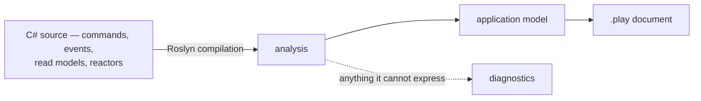

An [event model](/event-modeling/) is the picture of your system: which commands change state, which events they produce, which read models those events build, and which reactors turn one thing into another. Teams draw it on a whiteboard at the start, and then the code moves on without it. Six months later the picture is fiction and nobody trusts it enough to open.

**Screenplay** is a small language for writing that picture down as text — a `.play` file — so it can live in the repository next to the code it describes. Arc can _generate_ one from your application's source. The model stops being something you maintain by hand and becomes something you regenerate, the same way the [TypeScript proxies](/arc/understanding-the-proxy-boundary/) are regenerated rather than hand-written.

## Generated from source, not from a running system

The generator reads a Roslyn compilation of your C# — the same thing the compiler sees. It never starts your application, connects to Chronicle, or looks at a deployed instance.

That choice is what makes the output useful:

- **It works from a checkout, not a live store.** You still need the CLI, a compatible .NET/MSBuild environment, restored project dependencies, and the build inputs required to obtain a meaningful compilation. No running database or Chronicle connection is needed.
- **It is diffable in a pull request.** A commit that adds a command shows up as a few lines added to the `.play`. Reviewers see the model change next to the code change, and "did this alter the event model?" becomes a question the diff answers.
- **It is reproducible.** The same source always produces byte-identical output. Everything is ordered explicitly rather than by whatever order symbols happened to arrive in, so regenerating in CI and failing on a diff is a viable check.

A runtime-derived model would answer a different question — what one deployed instance looks like right now — and would vary with configuration and environment. There is one model, and its source of truth is your source code.



## Running it

The generator is used through the Cratis CLI, which ships separately from Arc:

```shell
cratis screenplay generate ./MyApp/MyApp.csproj --file MyApp.play
```

Point it at a project or a solution. A solution is one application rather than several, so its projects are read together into a single document — see [an application written as several projects](#an-application-written-as-several-projects). Anything the generator could not express is reported on the way out, and a run that reports an error exits non-zero — so a document nothing trustworthy went into never quietly looks fine. What the CLI has to do before it hands the source over is covered in [what the generator expects of its host](#what-the-generator-expects-of-its-host).

Because output is reproducible, a CI step can regenerate and fail when the committed `.play` no longer matches the source.

## Nothing is dropped silently

The gap between "what C# can say" and "what Screenplay can say" is real, and the worst thing a generator can do is paper over it. Every construct that cannot be expressed is reported as a located diagnostic — a stable code, a message you can act on, and where it came from — rather than quietly disappearing.

```text
Warning SP0019: The query 'Raw' returns 'IActionResult', which says how the result is
transported rather than what it is, so the query was left out (Library.Messaging.Feed)
```

Diagnostics come in three severities. **Information** describes a limitation without failing generation. **Warning** means something was left out or standalone generation found an unexpected semantic binding error (`SP0056`). Embedded generation reports `SP0056` as Information so a generator limitation cannot break your application's build. **Error** means the document should not be trusted at all — either because the generator produced something the language rejects, or because nothing at all was recovered from source the compiler accepted.

## What the generator expects of its host

The compatibility generator accepts either a Roslyn `Compilation` or a Generation `DotNetProjectCompilation`. It never opens a project file or loads a workspace, which is what lets it be driven from a CLI, from a specification, or from an editor. `DotNetProjectCompilation` adds the host-owned project role, authored syntax trees, and stable source-path context needed by neutral source adapters; the established compilation-only overloads remain available and produce the same `.play` bytes. The other side of that bargain is that **assembling the compilation the way a real build would is the caller's job** — the generator reads what it is handed and cannot tell a missing type from a type that was never written.

Distinguish **workspace source generators** from **MSBuild-generated inputs**. `GetCompilationAsync` belongs to Roslyn `Project`, not `MSBuildWorkspace`. A workspace project compilation can already contain source-generator output; do not run the same generators over it again unconditionally. Arc's CLI uses `project.GetCompilationAsync(cancellationToken)` and separately restores missing resource sources/framework references where needed. MSBuild/custom-tool output such as resource designer files is not interchangeable with Roslyn generator output. Arc's TypeScript proxy generator is a post-build executable, not a C# source generator.

For an already loaded workspace `Project`, the host fragment is:

```csharp
using Microsoft.CodeAnalysis;

static Task<Compilation?> GetCompilation(Project project, CancellationToken cancellationToken) =>
    project.GetCompilationAsync(cancellationToken);
```

Handle a null compilation and inspect diagnostics before passing it to Screenplay. Loading the workspace, restoring packages, and supplying missing build-generated files remain host responsibilities.

If you intentionally construct a **raw C# compilation outside the workspace compilation path**, run the selected generators once. This alternative fragment assumes `project` supplies the matching analyzer references and parse options, and `compilation` has not already received those generated trees:

```csharp
using Microsoft.CodeAnalysis;
using Microsoft.CodeAnalysis.CSharp;

static Compilation RunGenerators(Project project, Compilation compilation)
{
    var driver = CSharpGeneratorDriver.Create(
        generators: project.AnalyzerReferences
            .SelectMany(reference => reference.GetGenerators(LanguageNames.CSharp)),
        parseOptions: (CSharpParseOptions)project.ParseOptions!);

    driver.RunGeneratorsAndUpdateCompilation(compilation, out var generated, out var diagnostics);
    foreach (var diagnostic in diagnostics)
    {
        Console.Error.WriteLine(diagnostic);
    }

    return generated;
}
```

`AnalyzerReference.GetGenerators` already returns `ISourceGenerator` values. `AsSourceGenerator` converts an `IIncrementalGenerator`; applying it to those values does not compile. Real custom hosts must also supply any generator-required additional texts and analyzer-config options, and decide how diagnostics affect their exit status. This fragment is not a complete replacement for the CLI loader.

### What happens when it does not

Nothing is hidden, and nothing correct is thrown away. A compilation carrying errors is still analyzed, and `SP0024` says what happened — how many errors there were, the first of them, and how many artifacts came through anyway:

```text
Warning SP0024: The source did not compile - 607 error(s), the first being 'The name
'AccountsMessages' does not exist in the current context'. 341 artifact(s) were recovered
anyway, 341 of them from a declaration no error sits inside, so the document describes those
exactly as the source states them - a missing type named like 'SomethingMessages' or a
designer class usually means the compilation was handed over without the compile items a
build generates (Accounts)
```

Its **severity is decided rather than fixed**, because "the source did not compile" covers two outcomes that could not be further apart:

- **Warning** when at least one artifact was recovered from a declaration no compilation error sits inside. Those artifacts are described exactly as their source states them whatever failed elsewhere, so the run is successful and the document is worth keeping. A compilation missing its generated symbols lands here — the errors sit in code that declares no artifact, and the model is unaffected.
- **Error** when none were, either because nothing was recovered at all or because every declaration something came out of is one the compiler could not make sense of. There is then no part of the document a reader could trust, and a host following the contract exits non-zero.

A count is used rather than a proportion deliberately: any threshold would make the same recovery pass for a large application and fail for a small one, and zero is the only number that means recovery was _prevented_ rather than merely dented.

Either way the document is written out, so what was recovered can be read.

### An application written as several projects

Nothing says an application is one project. A layered one puts its contracts in a project of their own; a host sitting beside the bounded contexts it serves is two projects at least — and no single one of them describes the application. Pointed at any one, the generator would describe half of it and refer to events it never introduced.

So `Generate` takes a list of compilations as well as a single one, and a host generating from a solution hands over one per project:

```csharp
var result = generator.Generate([contracts, application, host], options);
```

A host that also runs neutral adapters should retain the project metadata instead of reducing each project to its compilation:

```csharp
IReadOnlyList<DotNetProjectCompilation> projects = LoadProjects();
var result = generator.Generate(projects, options);
```

This project-aware compatibility overload intentionally delegates to the same established generator. The source context is carried for the neutral adapter path, not used to reinterpret legacy placement.

What comes back is one document rather than one per project, because the boundaries between projects are a build concern rather than something the model has:

- A namespace two projects declare into is **one slice**, whichever project each artifact sits in.
- A concept is **declared once**, however many projects refer to it.
- An event a sibling project declares is one the application **has**, so it is declared like anything else — not imported the way an event from a referenced package outside the application is.

Paths stay readable because they are written relative to the directory all the projects sit under rather than to each project's own root, so every path opens with the project it belongs to — `Library/Shipping/Dispatching/Dispatching.cs` beside `Library.Contracts/Ordering/Placing/Placing.cs`. Projects checked out in unrelated places share no such directory; each one's paths then fall back to its own root, and `SP0038` says so, because two files can then come out as the same path.

The order the projects arrive in never reaches the document. Nothing decides what order a host enumerates a solution in, so they are sorted by assembly name before anything is read and the same projects always print the same bytes. Where that order has to decide something it says so: two projects declaring the same artifact name into one slice keep the first and report `SP0037`.

## Inline events and destinations

An event used by exactly one production site can appear as `produces event <Name>` inside its command. The generator counts production sites across every analyzed project, including reactors and other application code but excluding specification fixtures and `nameof` references. Runtime-typed appends and projects outside the analyzed set are not counted. Values whose event type is only known at runtime are not counted. It only inlines a local generation-one event in the same slice when the command has a required scalar identifier, the production is unconditional, and every payload member has a supported mapping. Tombstones, compensations, unsupported shapes, and payload copies of the identifier stay standalone.

Both forms preserve descriptions, documentation, rename pins, and the persisted payload shape. Inlining changes where the declaration appears, not its executable meaning. Scoped embedded documents still import an inline event declared outside their scope, and the board keeps its schema and flow links.

The generator emits `identifier` and explicit `for` destinations only when every production demonstrably uses command context. A directly returned `(TEvent, TResponse)` tuple preserves that destination when the response cannot be an event source identifier, including returns through `Task` or `ValueTask`. Arc handles the event through command context and returns the separate response to the caller; an ordinary response does not replace the event source. A response typed as an event source identifier, `object`, or an interface does not prove this routing. A routed wrapper, an unproven tuple destination, explicit append, or aggregate fetched for another identity keeps standalone productions without `for`; `SP0051` reports the unrepresented destination once per command, even when the command has no identifier, rather than retargeting it.

## Read models

Every read model the application declares gets a `readmodel` declaration of its own: each `[ReadModel]` type, and each type an `IProjectionFor<T>` or `IReducerFor<T>` builds. The declaration carries the properties of the type, its XML `<summary>` as `description`, and a `file` line when the file declaring it has a repository-relative path that stays true on another machine. Projections, reducers, and queries then name a read model the document declares, which is what lets them bind to the executable model.

```screenplay
query ById => Book optional
  by id Uuid

readmodel Book
  description "A book on the shelves and how many of it there are."
  file Library/Inventory/Listing/Book.cs
  id Uuid
  title String
  count Int

projection Book => Book
  automap
  from BookAddedToInventory
```

The declaration states the shape and nothing else. No property is marked `identifier`: the executable model identifies an instance through the read model's keyed query, so a read model with a `by` query answering with one instance is identifiable, and one without such a query is declared without claiming an identity it does not have.

A query's first required caller parameter becomes `by` only when its emitted name exactly matches an emitted read-model property name, including case. Otherwise it remains a `filter`: it narrows the result without claiming a key property the read model does not hold. For example, `GetById(string id)` returning a model with only a `Title` property emits `filter id String`, not `by id String`. Filtered queries are valid authoring syntax but are not yet executable.

A document refers to a read model by its simple name, so each read model is declared exactly once. It goes in the first slice, in namespace order, that matches the earliest of these:

1. The slice declaring a keyed query onto it.
2. The slice declaring the projection or reducer that builds it.
3. The slice its type is written in.
4. The slice declaring any other query onto it.
5. The slice declaring a command that reads it.

Scoped embedded documents import a read model declared in another scope, the same way they import an event declared elsewhere.

A read model is left undeclared, with Information diagnostic `SP0057`, when no declaration could say what the application holds:

- two read models come out under the same declaration name (`Order_Summary` and `OrderSummary` both become `OrderSummary`), or a query or a command reads a different type under that name;
- the name is already used by a concept or a type;
- a value it holds, at any depth, has a type the document cannot declare, is a collection whose elements may be null (`optional` on a collection says only that the collection may be absent), or shares its declaration name with a different type the document already declares, with another type the read model holds, or with a read model;
- no slice refers to it.

Whatever builds or reads it still names it, and none of the concepts or types it holds are declared on its behalf.

## Query descriptions and implementations

A query method's XML `<summary>` becomes its `description`. Parameters with explicit defaults become optional filters, including non-null defaults such as `int limit = 10`. Screenplay cannot state the default value itself; Information diagnostic `SP0019` reports that gap. Nullable scalar returns remain optional through `Task<T>` and `ValueTask<T>` wrappers. For collection returns, `optional` describes the collection, not its elements; nullable elements are reported as `SP0019` rather than described as an optional collection.

Set `ScreenplayOptions.AuthoringOnlyConstructs` to include a `performer` with the repository-relative file containing a query's block or expression body. A declaration without a body gets no performer. Performer-backed queries are not executable in the pinned language, so default output retains the query without its performer and reports Information diagnostic `SP0019`. A body with no portable source path is also reported rather than given a machine-specific file reference.

The generator does not infer `from $context.*` from a parameter's name or from reads inside the query body. Arc's model-bound parameter binder supplies caller arguments, dependencies, and cancellation tokens; it does not declare a scalar parameter-to-Screenplay-context binding. Arc's `QueryContext` is a host dependency with a different shape from Screenplay's context. It remains excluded from caller parameters, and `SP0041` explains why no context source was inferred. Paging and sorting remain serving concerns, not context-bound scalar filters.

## Policy claim targets

Readable `RequireAssertion` registrations can describe claims compared with command input properties instead of literal values. The supported shape guards `AuthorizationHandlerContext.Resource` as a `CommandContext` holding the command type, then calls the real `ClaimsPrincipal.HasClaim` with a constant claim type and a required string property. Positional record properties and nested positional record members become artifact paths; `&&`, `||`, and parentheses keep their meaning. The resource guard is removed only when every application use of that policy authorizes the guarded command type. An identifier comparison becomes `matches subject` for a command with an empty void `Handle()`; other proven comparisons keep their property paths rather than assuming the generated command retains an identifier.

A keyed snapshot query can also yield `matches subject`. Its assertion must guard the `QueryContext` argument dictionary, read the key with `TryGetValue`, check that the retrieved value is a string, and compare that value with `HasClaim`. Every use must have that same sole caller-supplied string key, matching a returned read-model property. A dictionary indexer, unchecked cast, another query shape, or an additional unreadable guard is not treated as equivalent.

Computed getters, transformations, nullable claim targets, conditional assertion registration, and arbitrary policy bodies retain `SP0026` rather than producing a partial recovered assertion. Existing literal-claim, role, and authenticated requirements remain supported. When nothing is recovered, the existing `require authenticated` fallback remains explicitly diagnosed; it is not a claim that the original policy allowed access. Negated assertions also retain this fallback; the generator does not emit Screenplay's `not` policy conditions.

## Generated values and responses

Readable generated UUID concepts are emitted by default only for commands without successful scenarios. A command response that does not depend on a generated value is also emitted for commands with successful scenarios, as long as each scenario that asserts the response does so in a form the generator can state as `then returns` (see [the scenarios a slice is specified by](#the-scenarios-a-slice-is-specified-by)). Otherwise the command keeps its legacy productions or handler reference without `generated` or `returns`, and `SP0052` explains what was withheld to preserve its scenarios. A generated value must be a required scalar concept backed by `Uuid`, with no concept validator or validation rules. Its local must be written only by its initializer, and the resolved constructor must construct that same concept type and forward the fresh UUID unchanged to the concept or event-source base, without casts or user-defined conversions. Response-record fields must be compiler-synthesized positional properties, not explicit properties that transform their inputs. Scalar responses use `returns <property>` only for a direct value of the same declared type without a value-changing conversion; fully readable response records use a `returns` block whose fields refer directly to command inputs or admitted generated values. These constructs select ESM v7; documents without them retain their existing ESM version.

Generated values do not exist during authorization or validation. Property rules and requirements cannot reference them (`PLAY0273`); when recovered protection reads a generated value, the command falls back to its legacy representation without `generated` or `returns`, and `SP0052` explains that the protection remains in code. The generator's recovered authorization policies describe the caller, not generated command properties.

Unadmitted generated shapes and dependent responses are omitted with `SP0052`. A required event payload mapping that needs such a value also selects the legacy command representation: the production remains standalone, the unreadable mapping is omitted with `SP0012`, and the command and its specifications stay visible. This preserves the existing document even when the missing required mapping prevents executable binding. For an optional payload member, only the blocked mapping is omitted; the production can still bind. A production whose condition depends on an unadmitted value is omitted with an explicit diagnostic; when no production remains, the command keeps a handler reference. An unproven tuple destination reports `SP0013`.

A generated identifier supplies an inline event's destination. Standalone productions using that identity carry explicit `for <identifier>`; a plain production without `for` still needs its separate allocation channel. Empty and provably response-only commands need no handler. Commands whose behavior lives in code keep a `handler` file reference by default, as before, rather than disappearing from the embedded board or being described as recording no facts. A command never carries both `produces` and `handler`.

The generator preserves the legacy authoring document and adds generated values and responses only where they are admitted. Documents containing handler references still compile and round-trip, but have **no executable model** because handlers report `PLAY0268`.

## Keeping documents below ESM v7

If your renderer does not yet admit ESM v7, set `ScreenplayOptions.MaximumExecutableModelVersion` to `Cratis.Screenplay.Semantics.SemanticVersion.V6`. The default is `null` (no cap), so existing output is unchanged. A cap below v7 withholds generated identifiers, other generated values, and scalar or record `returns` blocks. Commands keep the same legacy productions or handler references used when generation cannot be represented, and Information diagnostic `SP0052` names the cap.

Embedded generation exposes the same nullable version on `EmbeddedDocumentOptions`. For MSBuild generation, set `CratisEmbeddedScreenplayMaximumExecutableModelVersion` to the canonical version `6.0`; leave it empty for no cap. For example, this lets you generate a document for `cratis render` versions that refuse ESM v7 with `CLI-RENDER-004` until their Stage renderer admits it. The separately shipped CLI must expose the generation option before it can be selected there.

The cap also withholds v7 command values and responses when `AuthoringOnlyConstructs` is enabled, without disabling its other authoring constructs. It does not turn handler references or authoring-only constructs into executable behavior, nor downgrade earlier ESM features: a document may still have an existing binding limitation.

## Event sources and streams

A route tells you where a command's facts land, not just which event type it produces. Default output includes readable `eventsource` and source-owned `stream` declarations, command routes, and specification routes. These constructs select ESM v8. A command routed this way no longer repeats its route dimensions in a legacy `concurrency` block. Concurrency-only commands keep that block, with Information diagnostic `SP0044` describing its non-executable legacy meaning.

Command stream ids can come from a direct required scalar command property or a portable literal attribute. Explicitly typed composite parts in an application model are emitted together, in declaration order. C# formatting templates are not assumed to have Screenplay's escaped composite encoding: an unproven template remains in code with `SP0054`, rather than becoming a different stream id.

Property-path mappings and routes on handler commands remain authoring-only (`PLAY0268`). Generated-property mappings, incompatible source or stream declarations, and the reserved source name `Default` cannot be emitted faithfully (`PLAY0273`); `SP0054` identifies the reason and the complete route is withheld. No partial stream-id mapping or orphan source declaration is emitted.

Set `ScreenplayOptions.MaximumExecutableModelVersion` to `SemanticVersion.V7` or earlier to retain the previous default routing behavior: command routes and their declarations are withheld with `SP0044`, and routed scenarios are withheld whole with `SP0060`. Authoring mode still permits syntax-only routes regardless of this cap.

## Including authoring-only constructs

Set `ScreenplayOptions.AuthoringOnlyConstructs` to `true` when you want a fuller authoring document rather than an executable model. It defaults to `false`. Embedded generation exposes the same boolean on `EmbeddedDocumentOptions`; MSBuild projects can set `CratisEmbeddedScreenplayAuthoringOnlyConstructs` to `true`. The separately shipped CLI must expose the option before it can be selected there.

The option retains handler references even for response-only commands, and adds returned command operations with their external system and execute/compensate implementation files, plus syntax-only route mappings outside ESM v8's executable subset. It also retains generated authoring shapes outside the executable subset. An operation must use exactly one external system in the current grammar. Authoring mode retains existing, value-bearing concurrency dimensions; observer filters and dynamic concurrency flags without a value are still reported rather than invented.

It also describes keyed read-model dependencies of `Provide()` and `Handle()`, simple provisioning rejection comparisons as acceptance requirements, and event mappings from read-model members. Reads use the command's proven event-source key, matching Arc's dependency resolution. Arbitrary provisioning stays in code and is reported; no `provide` block is generated.

These documents still compile and round-trip, but **there is no executable model while `PLAY0268` constructs are present**. Binding legacy reads also reports `PLAY0271` because they cannot imply decision consistency. Enabling the option does not execute operations, generate implementation code, or weaken those admission checks. Unsupported types, ambiguous names and unreadable behavior retain diagnostics instead of guessed output.

## The generator checks its own output

Most diagnostics name something about _your application_ — a construct the language cannot hold, source that did not compile, projects that share no directory. `SP0034` and `SP0056` name defects in the generated document instead.

After the document is written, the generator hands it straight back to the Screenplay compiler. If the compiler rejects it, `SP0034` is reported as an error — because a `.play` that does not compile is output nobody can use, and there is no way of writing an application that avoids it. This is not a mode you turn on: it runs on every generation, since the only way a rejected document is ever found is by reading each one back.

```text
Error SP0034: The generated document did not compile - 1 error(s), the first being
'Invalid description 'description RequestDescription' - expected 'description "<text>"''
on line 6. That is the generator being wrong rather than anything the source declared,
and the document is returned as it stands so the line can be read (Library)
```

A document that compiles is also passed to Screenplay's executable semantic binder. Each unexpected binding error becomes `SP0056`, carrying the binder's code, message, line and column. It identifies a generator defect, not an application defect. `PLAY0268` alone does **not** mean an expected limitation: Screenplay also uses it for malformed bindings, including incompatible condition operands. The generator accepts only the pinned binder's known admission messages:

- In both modes: legacy handler attachments; read models without an unambiguous keyed query or conventional `*Id` property; queries with unsupported filtering, scope, implementation, caller-argument, or return shapes; concept compliance attributes whose execution needs portable data-subject semantics. Admitted collection and observable queries receive no exemption for unresolved references.
- With authoring-only constructs enabled: the explicit refusal of operations and systems, or property-path stream-id mappings.
- Legacy concurrency messages (`PLAY0271`) remain accepted for unrouted commands. Routed commands carrying legacy concurrency fail default verification. Legacy read messages remain accepted only in authoring mode. Informational diagnostics do not produce `SP0056`.

The classifier matches the complete reason after a declaration name, or the complete authoring-feature refusal message. Unknown or changed messages fail closed. Operand/type mismatches, undeclared operands, ambiguous references across slices, and invalid parent keys produce `SP0056` even when Screenplay reports them as `PLAY0268`.

Standalone generation reports `SP0056` as **Warning**. Embedded generation compiles every scoped document independently, but binds only the final assembly/root document that holds the whole application. Scoped documents contain subsets of that document and symbolic imports the executable binder does not admit; they are compiled but semantically verified through the whole-application document, not bound in isolation. Embedded generation reports `SP0056` as **Information**, so MSBuild warnings-as-errors cannot break a consumer build because of a generator limitation. Arc's end-to-end CI gate takes the stricter responsibility: it fails on **any `SP0056`, regardless of severity**, or any unexpected binding error, and runs all three sample applications with authoring-only constructs both disabled and enabled. Accepting an admission limitation never exempts unresolved references, type mismatches, or other binding defects.

The document is still written out, so you can open it at the reported line and see what happened. If you hit this, it is a bug worth [reporting](https://github.com/Cratis/Arc/issues) — include the line, and the C# declaration it came from.

Source that did not compile (`SP0024`) suppresses `SP0034` and `SP0056` **when it is reported as an error** — a model recovered from symbols the compiler never accepted describes an application that does not exist, so a poor document made from it is a consequence of the broken build rather than a second, separate defect. Fix the build and generate again.

As a warning it suppresses nothing. That severity says the model stands, and a document built from a model that stands is exactly what the check exists for — suppressing it there would hand back a `.play` the language rejects with nothing wrong reported.

## A value is only ever what the source states

Wherever the document states a value — the mapping a command's `produces` writes into an event, the values a scenario is issued with, the message a validation rule fails with — it states what the source states and nothing beyond it. Two sources survive: a constant the compiler already holds, and a path into the command's own input. Anything arrived at while the request runs is left out and reported, because a guessed value is worse than an absent one.

Messages are where that bites. An application speaking more than one language declares each message once in a resource and names it from the validator, and the property it names resolves its text against the caller's culture — so there is no text for the compiler to hold, and no single text the document could honestly state.

The key is there to be read even though the text is not, and it is the better of the two to take: text would settle the document on one language the application itself never settled on. So the key is what is written, unresolved:

```text
command RequestBook
  title String
  validate
    title not empty message $strings.RequestMessages.TitleRequired
```

A key is qualified by the class declaring it, because a key is unique to its own resource and to nothing wider. Two areas of one application both requiring an organization number is ordinary rather than a mistake, and bare, those two would be one key that can carry only one text.

A message genuinely put together in code — `string.Format`, an interpolation — still has no text to write down, and is reported as `SP0016` rather than guessed at. So is a key the language has no way of writing: a reference is a path of bare words, and a resource key is under no such constraint.

## Operational secrets

A concept carrying both `[Encrypted]` and `[NotAudited]` becomes `@sensitive`: encrypted at rest and withheld from the command's causation chain. With `[PII]` as well, it becomes `@pii @sensitive`. Markings on a property or its positional constructor parameter are read too. Encryption or audit suppression alone is not that contract; `SP0058` (Information) reports the partial marking without adding `@sensitive`. An existing `[PII]` marking is retained.

Screenplay rejects `@pii` and `@sensitive` concepts as command identifiers, event-source identifiers, destinations, and stream ids (`PLAY0515`). When a concept is used in one of those positions, the generator leaves its compliance annotations off and reports `SP0059` (Information). Its identity and route remain stated; the diagnostic identifies the compliance meaning the document cannot carry.

## Identifiers, event documentation, and named rules

A command's required scalar event-source key is emitted with `identifier`, and its productions carry `for <property>`. The generator follows Chronicle's key rules: a property assignable to `EventSourceId`, a generic `EventSourceId<T>`, or `[Key]` on the property or its matching constructor parameter. An implicit conversion from a `ConceptAs<Guid>` to `EventSourceId` does not make that concept a key. An `ICanProvideEventSourceId` implementation is recovered only when it directly returns a required scalar property.

Several candidates produce `SP0049`; an unreadable or optional identity produces `SP0050`. In either case the command remains, but no identifier or destination is guessed.

An event's XML `<summary>` becomes its `description`; `<remarks>` becomes a Markdown documentation block. References such as `<see cref="AuthorId"/>` retain their names in backticks. Remarks containing a Markdown fence are left out with `SP0014`, because the fence cannot be nested. A generation-1 `[EventType("PreviousName")]` whose persisted name differs from the current type name emits `id "PreviousName"`. Later generations still report `SP0014` and do not emit a rename pin.

### Validation rules

The generator emits unconditional declarative rules such as `NotEmpty`, `Length`, and `GreaterThan` for commands and concepts. Arc validates with the default FluentValidation context, which runs rules with no rule set and rules whose sets include `default`. FluentValidation splits a rule-set name on commas and semicolons and trims each part. The generator follows that behavior for compile-time constants, comparing `default` without regard to case: `RuleSet("default,draft", ...)` and `RuleSet("draft; Default", ...)` are retained too. Rules inside any set without `default`, or an unproven rule set, are omitted with `SP0016`, naming the rule and rule set.

Rules held to `When` or `Unless` (including async conditions and enclosing condition blocks), or declared after a possible constructor early exit such as `if (...) return;` or `throw`, are also omitted with `SP0016`. The diagnostic names the condition or early exit. A chained condition applies to preceding validators, or just the immediately preceding validator when `ApplyConditionTo.CurrentValidator` is specified; unconditional siblings remain. `DependentRules` conditions only its callback's rules on the parent succeeding, not the parent rule. `Otherwise` conditions only the alternative callback's rules on the enclosing `When` or `Unless` branch not applying. Those callback rules are omitted while unconditional rules outside them remain.

A throw caught before registration does not count as an exit when a covering catch has no explicit exit, its filter is absent or proven true, and the catch and any `finally` block have reachable endpoints and no explicit exits. A catch-all, `catch (Exception)`, or a catch covering the resolved exception type can establish this. Rules inside the throwing `try` still remain conditional: catching the throw would skip their registration. Unknown filters, unproven exception types, and possible exits in the catch or finally are treated conservatively and can keep rules out of the document.

Screenplay has no `when` clause on validation rules, and the generator does not invent an implication for an arbitrary C# predicate or constructor condition.

An unconditional top-level property rule written as `.Must(IsKnownName)` can become a named `rule IsKnownName` with a repository-relative `file` referencing the predicate's source. Its method name is preserved. Conditional named predicates remain omitted with `SP0016` rather than stated as unconditional constraints.

Named rules are opaque to reference execution. The generator withholds them when any scenario exercises the affected command, preserving the scenario's legacy declarative behavior instead of changing it to `SemanticUnsupported`. For a concept rule, this includes every command carrying that concept, directly or through nested composite properties and collections. `SP0016` names the command or concept and the scenario commands that caused the omission. This safeguard applies to both success and rejection scenarios, in both default and authoring-only mode.

Predicates without a portable implementation file, inline lambdas, and unsupported rule shapes also remain omitted with `SP0016`; a message following an omitted validator does not attach to the rule before it. Metadata modifiers such as `WithErrorCode`, `WithSeverity`, and `WithName` do not add a validator, so a subsequent `WithMessage` still belongs to the preceding retained rule.

## Reactors

Every reactor becomes a `reaction` with one `when` trigger per event it handles. What happens under each trigger depends on the handler.

A handler whose only effect is the value it returns is stated as what that value sets off, so specifications can run it:

```csharp
public class Welcomer : IReactor
{
    public AuthorWelcomed Welcome(AuthorRegistered @event) => new(@event.Name, "Welcome");
}
```

```screenplay
reaction Welcomer
  when AuthorRegistered
    produces AuthorWelcomed
      name = name
      greeting = "Welcome"
```

The generator only writes this form when it is exactly what Chronicle and Arc do with the returned value:

- **`produces`** comes from an event returned by a synchronous handler declared to return that event, or from a literal collection of events returned as a sequence of events or of `object`. Chronicle appends the events to the event source of the triggering event, which is what `produces` says when it names no `for`.
- **`invokes`** comes from a command returned through `Task<TCommand>` (`Task.FromResult(...)`, or an `async` handler that only returns it), or from a literal collection of commands returned as a sequence of `object`. Arc's command side effect handlers run each command through the pipeline with no caller, in order, and stop at the first that fails, which is how a reaction invokes a command. Chronicle rejects a synchronous handler declared to return a command type, so that shape stays code.
- The handler takes only the event and, optionally, its `EventContext`. Its body is a single unconditional return of one construction or one literal collection of them, and every value it sets is a property of the triggering event, `context.Occurred` (`$context.occurred`), or a constant. A text constant must be written into the document unchanged, so text with surrounding or repeated whitespace, line breaks, double quotes or backslashes stays code, as do numbers a double cannot hold exactly.
- The construction gives every property the event or command carries a value, directly: a positional record property through its constructor argument, or an automatic property with no initializer through the object initializer. A computed property, a property with an initializer or accessor body, a redeclared positional property, an explicit field, or a type deriving from another type keeps the handler as code.
- Every event and command it names is declared once in the document, with the properties the mapping fills in. An invoked command receives every one of its properties, and none of them is generated.

Anything else keeps the trigger's `file` reference, exactly as before: a branch, a computed value, a call to a collaborator, any other parameter, an `object` return, a `[Replay]` handler, several handlers for one event, a reactor implementing `ICanProvideEventSourceId`, a reactor Chronicle narrows or routes - `[FilterEventsByTag]`, `[EventSourceType]`, `[EventStreamType]`, `[FromEventSource<TSource>]`, or another sequence than the event log through `[Reactor(eventSequence: ...)]`, `[EventSequence]`, `[EventStore]` on the reactor, or `[EventStore]` on an event it handles or that event's assembly - and commands returned by a reactor marked `[ExecuteCommandsAsSystem]`, because a reaction has no way to say a command runs as the system. Conditions are not translated into `where`. A reaction with a `file` body returns `SemanticUnsupported` when a specification reaches it.

## The scenarios a slice is specified by

A `.play` says what a slice does. The Chronicle integration specs in the folder beneath it already say the same thing by example — what had happened, the command that was issued, what followed — which is exactly the shape of a Screenplay `specification`. So they are read too, and the document carries the examples proving the model rather than only the model:

```text
slice StateChange Registration

  command RegisterAuthor
    id String identifier
    name String
    produces AuthorRegistered
      for id
      name = name

  event AuthorRegistered
    name String

  specification WhenRegisteringAndTheNameIsTaken
    given AuthorRegistered
      name = "Jane Austen"
    given readmodel Author
      id = "author"
      name = "Jane Austen"
    when RegisterAuthor
      id = "author"
      name = "Jane Austen"
    then error "unique-author-name"
```

- **`given`** is what the specification started from — the events it seeded, and the read model it pinned.
- **`when`** is its action: a command it executed, or `when append <EventType>` for an event scenario's append.
- **`then`** is each event it asserted was appended, and **`then error`** a rejection it asserted.

Both command-testing shapes Arc documents are read: the in-process one driving the pipeline through a scenario (`Scenario.Given…`, `Scenario.Execute`) and the one driving a running host (`EventLog.Append`, `Client.ExecuteCommand`). Event scenarios are also read: `EventScenario.When.ForEventSource(...).Events(...)` or a direct append to its event sequence becomes `when append`, not a command. An append action must state one event. Which calls are which is decided by the type each one sits on, so neither testing package has to be referenced for either to be read.

Event assertions must state every payload property. `ShouldHaveAppendedEvent` predicates that check only part of an event, or assert only its type, cause the whole command or append scenario to be omitted with `SP0039` (Warning), naming the event and its missing properties. Screenplay compares expected events as whole facts, not subsets; the generator does not fill the gaps from command inputs or defaults. Screenplay 4.98.0 permits omitted optional properties, but the generator conservatively omits these partial scenarios as well; an explicit `null` is not a valid specification event value. Complete predicates retain their stated values. This check also applies to event assertions after `when append`, before any assertion that merely restates the appended fact is removed.

A generated scenario must say the same thing as the code. Screenplay assumes a source-less command scenario's `given` events belong to the command's own source. An event seeded or asserted on another source must state that source as an indented `for <value>` on its `given`, event `then`, or `when append` block. If the generator cannot state it faithfully, it omits the whole scenario with `SP0039` (Warning), including validation-only and authorization rejections. A command without an emitted identifier is not an exception: explicit sources cannot be collapsed into one implicit source unless they are provably the same as the command's source.

Concrete sources can be stated only when every producing command retains the same required scalar identifier type and the values fit that type. A `Uuid` destination requires a canonical lowercase GUID string. Stable fields and properties with a single constant initializer are followed one hop; equal values, including constant-wrapped identities, remain implicit when they match the command's source. String event-source ids are compared exactly, including casing and braces; only values converted to GUIDs at runtime are normalized to `Guid.ToString("D")`. A positional identifier property read from the same unreassigned held command passed to `Scenario.Execute` also remains implicit. An event scenario sharing one source can also remain implicit when that source cannot be typed. Distinct or undecidable sources that cannot be stated take the scenario out with `SP0039`; separate calls to `EventSourceId.New()` are not the same source.

A direct event-sequence append supplying concrete source and stream names becomes `stream <Source>.<Stream>` by default, with `streamId = <value>` when stated. An unrouted given or append retains its other values without a route directive, with `SP0060` (Information) reporting the omitted metadata; an unrouted expected fact states `no stream`. Expected events can carry the issued command's route when every production demonstrably uses command context and the stream-id fixture is concrete. A source identity remains a separate `for` value, not payload data.

Routes must fit the source and stream types the document declares. Computed routing, unproven composite stream-id construction, nonportable literals, or incompatible types retain `SP0039` rather than a guessed route. ESM v8 admits routes on `given`, `when append`, and `then`; the generator withholds a routed scenario with `SP0060` only when default output is capped below v8, or its source has the reserved name `Default`.

A rejection the source asserts without naming a reason is written as bare `then error`, not `then error ""`. This includes `IsValid.ShouldBeFalse()`, `IsSuccess.ShouldBeFalse()`, and `ShouldNotBeSuccessful()`. The bare form binds and matches a validation or constraint rejection without asserting its message. The source gives no code or presentation message, and inventing either would put meaning in the document the application never states.

A scenario that compares the command response with concrete values becomes `then returns`:

```csharp
[Fact] void should_return_the_name() => ((CommandResult<string>)_result).Response.ShouldEqual("Apollo");
```

```screenplay
specification WhenEchoingAndANameIsSupplied
  when EchoName
    name = "Apollo"
  then returns "Apollo"
```

The generator reads `ShouldEqual` and xUnit's `Assert.Equal`, applied unconditionally to `CommandResult<T>.Response`, or to one field of a record response, and compared with a literal, a `string`, `int`, `decimal` or `bool` constant, `Guid.Parse("...")`, an enumeration member, or a concept constructed directly from a literal or `Guid.Parse("...")`. A whole record compared with a construction of every field becomes the full field list. Field assertions become a `then returns` block holding only the asserted fields. `T` must be the type the handler returns, and the result must be the variable the scenario's own `Execute` call is assigned to, written nowhere else. Every read of `Response` in the scenario must be such an equality. A null check, a comparison with a value computed during the run, a result from somewhere else, or an assertion under a condition, after an early `return`, or inside a `try` with a `catch` cannot be stated, and nothing about the response is stated in that case. A scenario left out this way does not hold back the command's named rules.

What happens to a scenario asserting the response:

| The scenario | The command | Result |
|---|---|---|
| States the response and other outcomes | Emits `returns` | The scenario keeps its events and gains `then returns`. |
| Asserts the response in a form that cannot be stated, beside other outcomes | Has a response | The command keeps its legacy form (`SP0052`); the scenario is kept and the response assertion ignored, as in the legacy document. |
| Has the response as its only outcome | Emits `returns`, has no productions, and its handler can return no event: no event, tuple, collection, `Result` or union holding one, and no `object` or interface | The scenario is stated with `then returns` only. |
| Has the response as its only outcome, or asserts it in a form that cannot be stated | Records facts, or emits no `returns` | The scenario is omitted with `SP0039`, because a specification without expected events asserts that none were produced. |

A scenario that does not assert the response does not hold the response back.

Generated values are a different matter. Arc creates them inside `Handle()`, through `AuthorId.New()`, `Guid.NewGuid()` or Arc's own event source allocation, and neither `CommandScenario` nor the Chronicle testing extensions offer a way for a scenario to choose them. A scenario can only relate a generated value to another value from the same run, such as the response compared with an appended event's source. It cannot pin the value to a literal, and a literal comparison against a freshly generated value would fail when the scenario runs. Screenplay requires indented `for <value>` for a generated identifier and `generated <property> = <value>` for other generated values beneath `when`. Missing fixtures would execute as `Unsupported(IdentityAllocation)`, not a passing example. Because no fixture can be recovered from an Arc scenario, a command with generated values and successful scenarios keeps its legacy productions or handler reference without `generated` or `returns`, and `SP0052` says why. `ScreenplayOptions.MaximumExecutableModelVersion` below 7 withholds responses and `then returns` as well. Validation and authorization rejection scenarios need no generation fixture because those checks precede generation. When any scenario issuing a command states explicit given event sources, generation and responses are withheld with `SP0052`, including for constraint rejections, so the command keeps its legacy form. This does not retain a scenario whose event sources cannot be stated faithfully.

Expect the document to grow. On a real application this roughly doubled it, at about seven lines per scenario.

### Reactor scenarios and the reactions a scenario sets off

Since ESM v6 a specification runs the reactions its facts set off, and its `then` events are every fact that follows: the action's and the reactions'. Arc's `CommandScenario` and `EventScenario` run no reactor. A command or append scenario whose facts set off a reaction stated with `produces` or `invokes` would therefore state less than the document runs, so it is omitted with `SP0039`. A rejected command records no facts and is kept. A scenario reaching a reaction that is still a `file` reference is kept as before.

A Chronicle `ReactorScenario` of a reactor stated declaratively becomes a specification of its reaction. The event it delivers becomes `when append`, and each `ShouldHaveProduced<TEvent>(...)` becomes a `then` event, in the order the reaction produces them:

```csharp
public class and_the_author_is_welcomed
{
    readonly ReactorScenario<Welcomer> _scenario = new();

    async Task Because() =>
        await _scenario.Given.ForEventSource(EventSourceId.New()).Events(new AuthorRegistered("Jane Austen", "UK"));

    [Fact] void should_welcome_the_author() =>
        _scenario.ShouldHaveProduced<AuthorWelcomed>(e => e.Name == "Jane Austen" && e.Greeting == "Welcome");
}
```

```screenplay
specification WhenAnAuthorIsRegisteredAndTheAuthorIsWelcomed
  when append AuthorRegistered
    name = "Jane Austen"
    country = "UK"
  then AuthorWelcomed
    name = "Jane Austen"
    greeting = "Welcome"
```

The scenario is kept only when it says what its reaction does, and no more:

- Its assertions are `ShouldHaveProduced<TEvent>(...)` and `ShouldNotHaveProduced<T>()` and nothing else. A predicate is a conjunction of equalities with constants, and each event is stated whole: every property gets a value.
- It expects every event the reaction appends to the triggering event's source, each once. `ShouldNotHaveProduced<T>()` must name something the reaction does not produce.
- The last event it delivers is the one the reaction handles. Earlier events become `given` only when the reactor does not handle them, because every event a reactor scenario delivers runs the reactor.
- It seeds no read model, the appended event sets off no other reactor, and nothing the reaction appends sets off a reaction.

A reactor scenario that asserts something else has no counterpart and is reported with `SP0043`. That covers a collaborator mock, `Produced` read directly, a scenario of a reactor whose handlers are all code, and `ShouldHaveProduced<TCommand>()`. Screenplay states the facts an invoked command records, while the reactor scenario only records the command. A reactor scenario that does have a counterpart but cannot be stated faithfully is omitted with `SP0039`, which names the reason.

### A scenario is read whole or not at all

A mapping stands on its own, so one that cannot be read can be left out while the rest of its block still says something true. A scenario cannot: an example missing the state it started from, the action it performed, or the outcome it expected is not that example — it is a different one nobody wrote. So a step that cannot be read takes the whole scenario with it, and `SP0039` names the scenario and what made it unreadable.

A value the document cannot hold takes the scenario with it the same way. The document names an enumeration member, and a scenario value that is none — a number cast to an enumeration that declares no member with it, `default` for an enumeration with no zero member, `null` for a required record or list, or several `[Flags]` members combined into a value no member is declared with, because Screenplay has no form to state combined flags — would be written as a different example if it were dropped or invented. `SP0039` names the property, the value and why.

Conditional steps are the common case. Anything written under an `if`, a `switch`, a loop, a ternary or a lambda happened in some runs of the specification and not in others, and the source text does not say which — so a step recovered as unconditional would state a world nobody specified. That is the one failure mode a reader has no way of catching, which is why it is reported rather than guessed at.

A step need not construct what it states where it is written. A specification routinely holds the event or the command in a member and names that member in the step — `Scenario.Given.ForEventSource(id).ReadModel(TargetUser)`, `Scenario.Execute(_command)` — because the same value is asserted on later, or because it is built where the values it needs already are. Such a member is followed **one hop**, to the single place it was put together, and the step reads exactly as the inline form does. A `= null!` or `= default` declaration is not one of those places: it exists to satisfy the compiler and states no value.

One hop, and only from one place. A member given a value twice, or given it under a condition, held different values in different runs and the source does not say which one the step saw — so it stays unread and the scenario is left out with `SP0039`, the same as any other conditional step. Following a chain would mean reasoning about what a value was at the moment the step ran, which is a different discipline from reading what was written.

Values are the exception for the compatibility document generator, because a value stands on its own the way a mapping does. They follow [the discipline every other value follows](#a-value-is-only-ever-what-the-source-states): the identity two steps agree on is routinely a fresh identifier held in a field rather than something written down, and such a value is reported on its own while the rest of the legacy scenario stands.

### Neutral specification facts are stricter

`ArcSpecificationFactAdapter` is the independently consumable source-evidence surface. It contributes Generation scenario, ordered-step, and typed-value facts only when every explicitly authored step and value is exact. One computed or unreadable required value, conditional/repeated step, unretained read-model assertion, or event predicate value blocks the whole neutral scenario with `ARCSP0001`; it never contributes a smaller example than the source wrote.

The adapter retains scenario-, step-, value-, and rejection-level source ranges separately from the existing Arc model. This does not change legacy model equality or the current `.play` generator's compatibility output. It creates one fixed `DotNetSourceStructures` snapshot and asks `DotNetSourcePlacementDerivation` to place all exact targets together. Application and specification projects therefore use the application target's source placement, read-model and query targets retain `StateView` placement, and folder/namespace disagreement or invalid source policy produces a typed `DOTNETSP####` diagnostic instead of a guessed placement. Generation attaches a scenario only through that exact target placement and lowers it only after complete atomic admission.

This distinction is deliberate: the compatibility generator keeps existing consumers stable, while the neutral adapter provides the fail-closed evidence required for render→recover semantic fidelity.

## Screens

A [vertical slice](../../vertical-slices.md) puts the React component that realizes a slice's screen in the same folder as its C#. Roslyn syntax trees carry real file paths, so the generator knows where each slice's source lives and declares a `screen` for every `.tsx` component sitting next to it, named after the file:

```text
slice StateView Listing
  query AllAuthors => Author[]
  query AuthorById(id : String) => Author

  screen AuthorList
    file Authors/Listing/AuthorList.tsx
    data Author[] via query AllAuthors
    data Author via query AuthorById by id
```

What is recovered about a screen comes from something that can be checked.

**The `file` reference** says which file realizes the screen. It is what a reader opens, and no directive replaces it, so it stays on the screen even when directives sit beside it.

**The `data` directives** say which of the slice's queries the screen reads through. Arc generates a TypeScript proxy per query and a component imports that proxy by name, so the component's `import` statements name candidates — and a candidate is kept only when it matches a query the slice really declares. Nothing about the binding comes from the component beyond that name: the read model, whether there is one or many of it, and the parameter it is keyed by all come from the C# query. An import naming anything else — a package, a command, a sibling component, a type-only import — leaves nothing behind.

**`title`, `table` and `action`** come from the [Cratis Components](/components/) the screen uses, because their properties mean the same thing in every application. Only components imported from `@cratis/components` are read:

| Component | Becomes |
| --- | --- |
| `DataPage` `title="…"` | `title "…"` |
| `DataPage`, `DataTableForQuery` or `DataTableForObservableQuery` with `query={…}` naming a query of the slice | `table <ReadModel>`, named after the read model the query returns |
| `Column` `field="…"` inside such a table | `column <field>`, with `label "…"` when `header="…"` is text |
| `CommandDialog` with `command={…}` naming a command of the slice | `action <Command>` |

Take a listing screen written with a data page:

```tsx
import { DataPage } from '@cratis/components/DataPage';
import { Column } from '@cratis/components/DataTables';
import { AllAuthors } from './AllAuthors';

export const AuthorList = () => (
    <DataPage title="Authors" query={AllAuthors} emptyMessage="No authors">
        <DataPage.MenuItems>
            <DataPage.MenuItem label="Retire" command={() => retire()} />
        </DataPage.MenuItems>
        <DataPage.Columns>
            <Column field="name" header="Name" />
            <Column header="Initials" body={author => author.name.slice(0, 1)} />
        </DataPage.Columns>
    </DataPage>
);
```

It is generated as:

```text
screen AuthorList
  file Authors/Listing/AuthorList.tsx
  data Author[] via query AllAuthors
  title "Authors"
  table Author
    column name label "Name"
```

A property is read only when it is written as text, or as the name of a query or command the slice declares. Anything else is left out rather than guessed, and `SP0028` reports each omission on its own: a computed title or header, a column without a `field`, a menu item (its `command` is a callback, so the action it takes is not read), a `detailsComponent`, a table or dialog bound to a query or command of another slice, and a component whose properties are spread in from an object. Above, the `Initials` column and the `Retire` menu item are each reported.

Everything else is **never inferred**: `section`, `summary`, `navigate to`, `layout`, and any structure written in JSX that is not one of the components above. Nothing in the Cratis Components states navigation — a details component is a pane on the same screen — so no `navigate to` is written. A screen that uses none of the components reports `SP0028` once. A guessed column is worse than an absent one: it puts a confident falsehood into a document whose entire value is that it describes the real application. Write those directives by hand if you want them, and expect a regeneration to leave them out.

Two more rules keep the result honest:

- **Components only, no descending.** A file carrying a second extension — `AddAuthor.stories.tsx`, `AddAuthor.spec.tsx` — is a companion of a component, not a screen. A folder _inside_ a slice folder is a slice of its own under the same convention, so its files belong to it.
- **Anything uncertain is reported.** The relationship between a file and a slice comes entirely from where the file sits, so `SP0025` is reported whenever sitting there says less than usual: a slice whose source is spread over several folders, one folder holding the source of several slices, or two files claiming a single screen name.

## What is not expressed

A `.play` is a description of an application, not a second copy of it. **It does not round-trip back to code**, and reading one will not tell you everything the code does. The losses run in both directions.

### Screenplay constructs the generator cannot infer

These are part of the language, but nothing in C# says them, so a generated document never contains them. Add them by hand if you want them, and expect a regeneration to leave them out:

| Construct                                                                                                      | Why it cannot be inferred                                                                                                                               |
| -------------------------------------------------------------------------------------------------------------- | ------------------------------------------------------------------------------------------------------------------------------------------------------- |
| `capture`                                                                                                      | Describes ingesting an external system. Nothing in an Arc application declares one.                                                                     |
| `persona`                                                                                                      | Who uses the system is a product decision, not a code artifact.                                                                                         |
| `seed`                                                                                                         | Sample data is a modeling concern, not something the source states.                                                                                     |
| The rest of the body of a `screen` — `section`, `summary`, `navigate to`, `layout`, and structure outside known Cratis Components | What a screen _shows and does_ is JSX. Its `file`, its `data` bindings and what known Cratis Components state are generated; the rest would be a guess — see [Screens](#screens). |
| `@sensitive`                                                                                                   | `@pii` is the one of the two concept attributes with a counterpart — `[PII]`. Nothing in Arc or Chronicle says `@sensitive`.                            |

### Detail Screenplay cannot represent

These details can remain outside the document because the language has no counterpart, the source cannot be read reliably, or an authoring-only construct is disabled. Diagnostics explain what the document leaves out.

| In Arc or Chronicle                                                                                   | Why it is not in the document                                                                                                                                                                                                                                                                                                                                                                                                                       |
| ----------------------------------------------------------------------------------------------------- | --------------------------------------------------------------------------------------------------------------------------------------------------------------------------------------------------------------------------------------------------------------------------------------------------------------------------------------------------------------------------------------------------------------------------------------------------- |
| Event generations, `[Tombstone]`, `[CompensationFor]`                                                 | Screenplay describes the current shape of an event. It has no notion of versioning, of a deletion marker, or of one event compensating another. `SP0014`.                                                                                                                                                                                                                                                                                           |
| Reducer folds (`IReducerFor<T>`)                                                                      | The fold is code. The read model and the events it observes are recovered; the logic that combines them is not. `SP0020`.                                                                                                                                                                                                                                                                                                                           |
| `[FromEventSource<TSource>(stream)]` on a reactor or reducer | The source and stream the observer is filtered to are recovered and kept in the analysis model, but the Screenplay syntax (`Cratis.Screenplay` 4.98.0) gives a reaction trigger and a projection no way to narrow them to an event source or stream. The observer is emitted observing its events from every source, so `SP0047` says what the document leaves out, and `SP0048` says when the definition does not declare the stream. |
| Aggregate roots no command reaches                                                                    | The events an aggregate root applies are stated through the command that hands its work to it. One that nothing calls has nothing to state them through — a document has no construct for a class that decides on its own. `SP0018`.                                                                                                                                                                                                                |
| A behavior deciding on the state an aggregate root holds                                              | A `produces when` condition compares the input of the command, which is all a document knows at the moment the command is issued. A behavior refusing to act on what it has already seen is a real decision with nowhere to go, so the event is stated unconditionally and `SP0027` reports the decision. A behavior deciding on one of its own _parameters_ is recovered, because the call site says which command input that parameter was given. |
| Inline `policy` code and requirements built in code                                                   | Unreadable `RequireAssertion(…)` bodies and a policy registered from an `AuthorizationPolicy` built elsewhere remain in code. Guarded claim-target assertions described above, `RequireAuthenticatedUser`, `RequireRole`, and `RequireClaim` given the values it accepts are recovered; the rest is reported as `SP0026` — including a `RequireClaim` naming only a claim type, which a policy condition has no way to state.                                                                                                |
| The event source id from a `(TKey, TEvent)` handler                                                   | The event is recovered. An admitted generated UUID identity and response are stated by default. If the destination cannot be proven or the generated concept has validation, no destination is inferred and `SP0013` explains the omission.                                                                                                                                                                                                                                                                                                                                         |
| Emptying a scope with `[ClearWith]`; removing a child with `[RemovedWith]` on the property holding it | Nothing in the model a projection is built from carries a scope being emptied again, so `[ClearWith]` has nowhere to go (`SP0015`). A removal does have somewhere — but it is read from the type of the child, alongside the events filling that child in, so the same removal written beside the collection is reported as `SP0007` instead.                                                                                                       |
| Read model tags                                                                                       | A `readmodel` declaration states the shape of a read model — its properties, a description, and the file declaring it — and nothing else, so there is nowhere to hang a tag. Tags on _events_ are recovered and written out. `SP0042`.                                                                                                                                                                                                              |
| Read models the document cannot declare | Two read models sharing a declaration name, a name a concept or type already uses, a value with no faithful Screenplay type (no type at all, nullable collection elements, or a type whose name another type already declares), or a read model no slice refers to. The read model is left undeclared rather than described with a shape the application does not have. Information diagnostic `SP0057`. |
| Query paging and sorting, custom routes                                                               | These say how a model is served rather than what it is. The parameters the host fills in are left out, and a route template — `[Path]`, `[Route]`, or a template on an HTTP verb — has no counterpart. `SP0041`.                                                                                                                                                                                                                                    |
| Several command identity candidates | The generator cannot choose between key properties or event source identities. No `identifier` is emitted. Information diagnostic `SP0049`. |
| An unreadable command identity | A self-provided identity must directly return a required scalar command property; an optional or collection key cannot be an identifier. Information diagnostic `SP0050`. |
| An explicit or unprovable production destination | A production cannot be proven to use the command's event source. Its `for` destination and the command's identifier modifier are omitted rather than guessed. Information diagnostic `SP0051`. |
| Generated values and responses outside supported shapes | Admitted values and responses are emitted by default. A generated value needs a required scalar UUID concept with no validator or rules; a response must be a direct property or fully readable record. Unsupported shapes and pre-generation references remain in code. Information diagnostic `SP0052`. |
| Unreadable returned operations | Operations are authoring-only. Unsupported construction, input mappings, batch spreads, or ambiguous external systems remain in code; readable literal batch members can still be described. Information diagnostic `SP0053`. |
| Event-source definition routes | Readable source and stream routes are emitted by default at ESM v8. `SP0044` describes an unavailable route or preserved legacy concurrency; a cap below v8 retains the previous default output. |
| Unreadable source or stream routes | Computed stream ids, unproven formatting templates, generated mappings, conflicting declarations, and the reserved source name `Default` cannot be stated without guessing. The entire route is withheld with Information diagnostic `SP0054`. Property-path mappings and handler-command routes remain authoring-only. |
| Unreadable reads or provisioning | Reads and requirements are authoring-only. Dependencies need a proven input key and a uniquely readable model and projection; only supported comparison guards become requirements. Other provisioning remains in code. Information diagnostic `SP0055`. |
| Unexpected generated-document binding errors | The document compiles but fails executable semantic binding. Warning diagnostic `SP0056` includes each binder error's code, message, line and column; the generated text is retained for inspection. |

If a generated `.play` is missing something you expected, the diagnostics are the first place to look — the omission is almost always reported.

## When this is the wrong fit

If you maintain a `.play` by hand as the _design_ your code is written against — modeling first, then implementing — generation is the wrong direction and will overwrite your intent. Generation suits the opposite flow: code exists, and you want the model it already describes, kept honest automatically.

## Related

- [Embedded event-model explorer](embedded-event-model.md) — generate documents during the build and browse them inside your ASP.NET Core application.
- [Vertical slices](../../vertical-slices.md) — the folder shape the generator recovers slices from. A slice per namespace produces a far better document than artifacts sitting in the root namespace.
- [Understanding the proxy boundary](/arc/understanding-the-proxy-boundary/) — the other thing Arc generates from the same source of truth.
