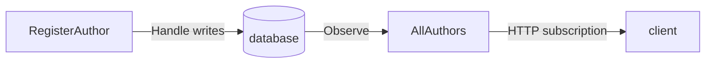

import { Steps, Aside, Tabs, TabItem } from '@astrojs/starlight/components';

A librarian registers an author; the catalog should show it. Let's express that as one command that writes current state and one query that reads it. **No events are returned or appended in this lesson.**

## Prerequisites

Complete [Set up a standalone Arc backend](/arc/backend/csharp/getting-started/) first. It supplies packages, imports, ASP.NET Core hosting, storage settings, and the proxy-generator configuration. Choose the **same database branch** below. Files are relative to that lesson's `Library/` project root.



## Define the author feature

<Steps>

1. **Name the domain values.** Create `src/Authors/AuthorId.cs`:

   ```csharp
   namespace Library.Authors;

   public record AuthorId(Guid Value) : ConceptAs<Guid>(Value)
   {
       public static AuthorId New() => new(Guid.NewGuid());
   }
   ```

   Create `src/Authors/AuthorName.cs`:

   ```csharp
   namespace Library.Authors;

   public record AuthorName(string Value) : ConceptAs<string>(Value)
   {
       public static implicit operator AuthorName(string value) => new(value);
   }
   ```

   These are standalone `ConceptAs<T>` values. `AuthorId` is not a Chronicle event-source identifier.

2. **Write the command.** Create `src/Authors/RegisterAuthor.cs` using one branch:

   <Tabs syncKey="db">
   <TabItem label="MongoDB" icon="seti:db">

   ```csharp
   namespace Library.Authors;

   [Command]
   public record RegisterAuthor(AuthorId Id, AuthorName Name)
   {
       public Task Handle(IMongoCollection<Author> authors) =>
           authors.InsertOneAsync(new Author(Id, Name));
   }
   ```

   </TabItem>
   <TabItem label="EF Core" icon="seti:db">

   ```csharp
   namespace Library.Authors;

   [Command]
   public record RegisterAuthor(AuthorId Id, AuthorName Name)
   {
       public async Task Handle(LibraryDbContext db)
       {
           db.Authors.Add(new Author(Id, Name));
           await db.SaveChangesAsync();
       }
   }
   ```

   </TabItem>
   </Tabs>

   Arc method-injects the collection or context. The explicit write is the effect; returning `Task` adds no response payload.

   <Aside type="tip" title="Separate the decision from the write">
   These direct database calls remain supported. When the write can be described from the command's inputs, prefer a pure `Handle()` that returns a command operation, with the collection or context injected into its `Execute()` method. Arc runs the declared work; database writes do not become automatically reversible. Follow [the migration recipe](../commands/operations/migrating.md) when you are ready to separate the two responsibilities.
   </Aside>

3. **Expose the read shape.** Create `src/Authors/Author.cs`:

   <Tabs syncKey="db">
   <TabItem label="MongoDB" icon="seti:db">

   ```csharp
   namespace Library.Authors;

   [ReadModel]
   public record Author(AuthorId Id, AuthorName Name)
   {
       public static ISubject<IEnumerable<Author>> AllAuthors(IMongoCollection<Author> authors) =>
           authors.Observe();
   }
   ```

   </TabItem>
   <TabItem label="EF Core" icon="seti:db">

   ```csharp
   namespace Library.Authors;

   [ReadModel]
   public record Author(AuthorId Id, AuthorName Name)
   {
       public static ISubject<IEnumerable<Author>> AllAuthors(LibraryDbContext db) =>
           db.Authors.Observe();
   }
   ```

   Also create `src/Authors/LibraryDbContext.cs`:

   ```csharp
   namespace Library.Authors;

   public class LibraryDbContext(DbContextOptions<LibraryDbContext> options) : BaseDbContext(options)
   {
       public DbSet<Author> Authors => Set<Author>();
   }
   ```

   </TabItem>
   </Tabs>

   A static query on `[ReadModel]` becomes an endpoint. MongoDB observation uses change streams; SQLite uses this host's configured `SaveChanges` notifications. The host setup establishes their prerequisites.

</Steps>

## Build and run the checkpoint

```bash
dotnet build -c Debug
dotnet run --no-build --no-launch-profile \
  -e ASPNETCORE_ENVIRONMENT=Development --urls http://localhost:5000
```

After the build, check for `src/Authors/RegisterAuthor.ts` and `src/Authors/Author.ts`. With source-file output enabled, the latter contains the `AllAuthors` query as well as the author shape. Do not edit either generated file.

The console should print `Now listening on: http://localhost:5000` and `Hosting environment: Development`. EF creates the initial SQLite schema at startup; MongoDB should already report a writable primary. If either fails, fix storage before moving to the browser.

<Aside type="caution" title="Set the environment through ASPNETCORE_ENVIRONMENT">
`--no-launch-profile` skips the Development environment that `launchSettings.json` would set, so the command sets `ASPNETCORE_ENVIRONMENT` itself. In the .NET 10 SDK, `dotnet run -e` (long form `--environment`) sets an environment *variable* as `NAME=VALUE`; `--environment Development` does not select an ASP.NET Core environment. If the log says `Hosting environment: Production`, `appsettings.Development.json` was not loaded: the MongoDB branch then stops at startup because `Server` and `Database` are required, and the authorization chapter's Development-only sign-in is never registered.
</Aside>

<Aside type="note" title="Build success is not a write test">
This checkpoint establishes compilation, proxy output, and host/storage startup. The next lesson executes a command and verifies persisted data through the query. It does not assume that a green build proves the write worked.
</Aside>

To exercise the backend before any UI exists, call the routes the generated proxies use. From a second terminal:

```bash
curl -s -X POST http://localhost:5000/api/library/authors/register-author \
  -H 'Content-Type: application/json' \
  -d '{"id":"8f7c7c52-2d5d-4c1e-9a55-0c1f2b8a6f10","name":"Ursula K. Le Guin"}'
curl -s http://localhost:5000/api/library/authors/all-authors
```

The command returns `"isSuccess":true`, and the query's `data` array contains the author. Run the command once: the id is the stored key, so repeating it reports a storage error rather than a second author. The routes come from the namespace (`Library.Authors`) plus the command or query name, and the generated `route` fields in `RegisterAuthor.ts` and `Author.ts` show the same paths. Nothing validates the name yet, so a blank name is also accepted until [chapter 2](/arc/tutorial/validation/) adds the rules.

## Continue in the browser

[Your first full-stack slice](/arc/tutorial/first-slice/) explains these same backend files and supplies the Vite bootstrap, Components prerequisites, providers, mounting, and dev proxy configuration; do not create a second copy of the backend types. [Frontend getting started](/arc/frontend/react/getting-started/) is the **alternative for an existing Vite app**: an inline `CommandForm` with Components fields, plus a route without Components. With this tutorial's source-file grouping, use `./Authors/Author` for its `AllAuthors` import.

Go deeper in [Commands](/arc/backend/csharp/commands/) and [Queries](/arc/backend/csharp/queries/). If you later choose event sourcing, [add Chronicle explicitly](/arc/backend/csharp/chronicle/add-event-sourcing/); retaining a query's public contract is a migration goal, not a guarantee that its storage implementation never changes.
