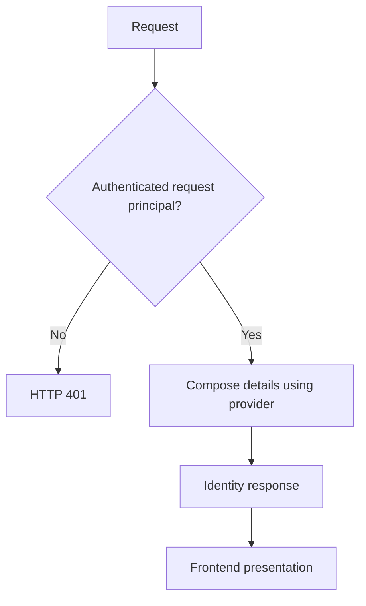

Authentication establishes a principal; identity enrichment supplies application-specific information for the frontend. Keeping those steps separate prevents a UI convenience from becoming an accidental permission boundary.

## Endpoint mapping

Normal `UseCratisArc()` activation maps `/.cratis/me` when `IProvideIdentityDetails` is registered, unless a replacement endpoint with the same endpoint name already exists. You do not need a second mapping call when using the standard host setup.

The endpoint has anonymous metadata so it can handle identity results itself. It calls `IIdentityProvider.Get()`, returns 401 for a result marked unauthenticated, 403 for a result marked unauthorized, and otherwise writes the identity as JSON. The result is always derived from the authenticated principal of the request; Arc does not read or write an identity cookie.

Arc sets `Cache-Control: no-store, private` and `Vary: Cookie` on `/.cratis/me` (including its 401 and 403 responses), `/.cratis/users`, and `/.cratis/tenants`. It also sets these headers whenever `IIdentityProvider.SetCookieForHttpResponse()` writes an identity, including after `ModifyDetails()`. Do not configure a shared cache to override these headers: the responses contain per-user data. The application-wide `/.cratis/identity-details/schema` response is not covered by this identity-response policy.

## Identity details provider

Arc discovers `IProvideIdentityDetails` implementations. On every identity request, it checks the request principal, constructs `IdentityProviderContext`, and invokes the provider. The ID comes from the principal's `sub` claim (or `"unknown"` when absent); the name comes from the principal, with the forwarded name header as a fallback.

This **illustrative type fragment** supplies display data only, allowing every already-authenticated user through this enrichment step. It is not an application membership policy:

```csharp
using Cratis.Arc.Identity;

public class IdentityDetailsProvider : IProvideIdentityDetails
{
    public Task<IdentityDetails> Provide(IdentityProviderContext context) =>
        Task.FromResult(new IdentityDetails(true, new { DisplayName = context.Name }));
}
```

For an application-entry decision, your provider must consult authoritative membership data. That decision still does not protect every command/query: enforce those permissions in their pipelines.

## Request flow and frontend integration



The frontend gets the identity by calling `/.cratis/me` and keeps the answer in memory for the page. The identity does not add trusted claims or authorize pipeline execution. Read [trust and mutation limits](identity-provider-service.md) before using `IIdentityProvider` in backend code.

For client consumption, see [React identity integration](../../../frontend/react/identity.md).
