<!-- Copyright (c) Cratis. All rights reserved.
Licensed under the MIT license. See LICENSE file in the project root for full license information. -->

## Model-bound execution

`IQueryPipeline` performs a query by fully qualified name. Generated model-bound endpoints and hub subscriptions use it. Database/provider code remains responsible for producing data; Arc does not turn a database read into a Chronicle projection.

```mermaid
flowchart LR
    Request[Read request arguments] --> Paging[Validate requested paging]
    Paging --> Resolve[Find performer and resolve dependencies]
    Resolve --> Context[Coerce arguments and establish context]
    Context --> Filters[Authorization filters then ordinary filters]
    Filters --> Performer[Invoke and await query method]
    Performer --> Render[Render data and attach metadata]
    Render --> Output[Intercept ordinary data or hand stream to transport]
```



A non-success filter verdict stops execution before the query method. This does not imply no collaborators ran: paging validation, performer lookup, dependency resolution, and argument conversion occur before the filter chain. Custom filters/dependencies are application code, not guaranteed side-effect-free.

A null method result can remain a successful model-bound result. For a stream, the pipeline passes the wrapper onward; transport handling decides how to consume and deliver values.

## Controller-specific path

MVC GET actions use `QueryActionFilter`, not this model-bound filter chain. The action filter establishes context, consults MVC model state, invokes the action, renders data, applies ordinary interception, and creates an Arc result. It recognizes streaming values through the controller adapter.

`[AspNetResult]` opts out. POST actions do not use the GET query action filter. Null data in a default wrapped MVC GET becomes `"Null data returned"`, unlike model-bound null success. See [controller return types](controller-based/return-types.md).

## Query context and renderers

`IQueryContextManager.Current` exposes query identity, correlation, arguments, dependencies, paging, sorting, and total count. It describes the current operation; do not treat it as persistent per-user state.

`QueryableQueryRenderer` handles runtime `IQueryable` values: it counts the filtered query, applies sorting, then `Skip`/`Take`. The provider controls database execution. Lists and arrays do not gain automatic slicing. See [model-bound paging](model-bound/paging.md) or [controller paging](controller-based/paging.md).

Custom renderers implement `IQueryRendererFor<T>` with `QueryRendererResult Execute(T query, QueryContext queryContext)`. They return total count plus data. Do not use an unverified renderer-order assumption as a security boundary; put access filtering before counting and paging so neither rows nor counts disclose unauthorized data.

## Query filters

Model-bound filters implement `IQueryFilter.OnPerform(QueryContext)` and return `Task<QueryResult>`. Implement `IAuthorizationQueryFilter` for access decisions that must precede ordinary validation filters. Discovered filters are resolved from the operation's service provider; **authorization filters run first**, then other filters, preserving discovery order within each group. This is not a registration-order guarantee.

| Built-in filter | Current behavior |
| --- | --- |
| `AuthorizationFilter` | Uses the performer's authorization verdict; model-bound default checks Arc authentication/roles, not named policies |
| `FluentValidationFilter` | Validates a matching argument model or individual supplied argument graphs |
| `DataAnnotationValidationFilter` | Reads annotations on parameter types, not method-parameter attributes or nested DTO properties |

Use `QueryResult.Unauthorized(context.CorrelationId)` for denial, not an input-validation error. `QueryResult.Success(...)` permits the next stage; it does not supply the final read data. The [query-health restriction example](query-health.md#restrict-exposure) is a complete authorization filter that targets one named query across direct model-bound and hub paths.

For input rules, follow [query validation](validation.md). For current policy limitations, see [model-bound authorization](model-bound/authorization.md).

## Query result metadata

The backend `Cratis.Arc.Queries.QueryResult` is **nongeneric**, with `object Data`. Generated TypeScript query results can be typed; that does not create a C# `QueryResult<T>` API. Normal query methods return data rather than constructing this infrastructure envelope.

| JSON field | Meaning |
| --- | --- |
| `data` | Returned data; can be null, and can be omitted/null on later hub delta frames |
| `paging` | `page` (int), `size` (int), `totalItems` (long), `totalPages` (computed int) |
| `correlationId` | Correlation identifier |
| `isReady` | Whether a result is available; false is distinct from failure |
| `isAuthorized` | Authorization verdict |
| `isValid` | True when `validationResults` is empty |
| `hasExceptions` | True when `exceptionMessages` is nonempty |
| `isSuccess` | `isReady && isAuthorized && isValid && !hasExceptions` |
| `validationResults` | Validation entries with severity, message, and members |
| `exceptionMessages`, `exceptionStackTrace` | Error information, subject to the transport/host's exception-detail handling |
| `changeSet` | Optional collection delta; see [transfer modes](change-stream.md) |

`PagingInfo` is `PagingInfo(int Page, int Size, long TotalItems)`. `totalPages` is zero for size zero, otherwise `Ceiling(totalItems / size)`. `PagingInfo.NotPaged` is `(0, 0, 0)` and is used for ordinary unpaged pipeline results. Observable snapshots and streaming emissions can instead report the query context's total count with page and size zero. `totalPages` remains zero when size is zero. There are no `hasNext`, `hasPrevious`, or response `pageSize` fields.

Illustrative complete success envelope under camelCase serialization (the identifiers and data are examples, not a captured server response):

```json
{
  "data": [{ "id": "account-1", "name": "Savings", "balance": 100 }],
  "paging": { "page": 0, "size": 1, "totalItems": 2, "totalPages": 2 },
  "correlationId": "12345678-1234-1234-1234-123456789012",
  "isReady": true,
  "isSuccess": true,
  "isAuthorized": true,
  "isValid": true,
  "hasExceptions": false,
  "validationResults": [],
  "exceptionMessages": [],
  "exceptionStackTrace": "",
  "changeSet": null
}
```

Default direct model-bound HTTP maps success to 200, authorization denial to 403, validation failure to 400, not-ready to 202, and other failures to 500. Observable waiting also has a 408 timeout path. Hub frames and SSE control POSTs have their own [protocol semantics](observable-query-demultiplexer.md); do not infer their status from this table.

## Streaming boundary

An `ISubject<IEnumerable<T>>` is not automatically paged: MongoDB `Observe()` implements paging using the context; arbitrary subjects must supply their own behavior. Streaming delivery applies interception per emission, while **observable HTTP snapshots currently do not**. Read [interception limitations](read-model-interception.md) before relying on masking, and [observable lifetime](model-bound/observable-queries.md#subscription-lifetime) before composing streams.
