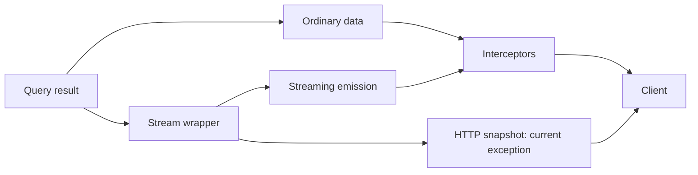

<!-- Copyright (c) Cratis. All rights reserved.
Licensed under the MIT license. See LICENSE file in the project root for full license information. -->

An interceptor lets you apply a cross-cutting transformation without repeating it in each query. Typical uses include localization, enrichment, and controlled field transformations. It is not a replacement for query authorization or safe data selection.

## Supported paths and exceptions

| Path | Interception |
| --- | --- |
| Ordinary model-bound query data | Applied after rendering |
| Ordinary Arc-wrapped MVC GET data | Applied after rendering |
| Supported direct WebSocket/SSE streams and multiplexed hub emissions | Applied per emission |
| **Observable HTTP snapshot**, including `waitForFirstResult=true` | **Not currently applied by `ObservableQueryHttp`** |
| MVC `[AspNetResult]` | Opts out of the Arc result-processing path |

> [!WARNING]
> Do not rely on an interceptor as universal masking or decryption policy. A caller can request an observable's HTTP snapshot instead of its stream. Ensure the query/provider returns only fields and rows that caller may receive on **every** exposed path. Snapshot interception would require a runtime change; this page does not imply a configuration switch fixes that gap.



## Implement an interceptor

This type example reuses the shared [`AccountId` concept](model-bound/index.md#model-account-identities-and-names); the host discovers `IInterceptReadModel<T>` implementations and resolves constructor dependencies from the supplied service provider. This example enriches public display data, rather than using masking as access control.

```csharp
using System.Globalization;
using System.Threading.Tasks;
using Cratis.Arc.Queries;

namespace Banking.Accounts;

public record AccountSummary(AccountId Id, decimal Balance, string FormattedBalance);

public class FormatAccountBalance : IInterceptReadModel<AccountSummary>
{
    public Task<AccountSummary> Intercept(AccountSummary readModel) =>
        Task.FromResult(readModel with
        {
            FormattedBalance = readModel.Balance.ToString("C", CultureInfo.GetCultureInfo("en-US"))
        });
}
```

The returned instance is served to the caller. Prefer a `with` copy over mutating a record that another subscriber may share. An interceptor is bound to its exact model type; a DTO with the same fields is not automatically intercepted.

## Multiple interceptors and streams

Interceptors run in discovery order. Avoid making security depend on an undocumented ordering between implementations. Collections are processed item by item; streaming paths process each emitted model before delivery.

The pipeline skips stream wrappers because a wrapper is not a model instance. The supported streaming transports intercept emissions instead; the HTTP snapshot path currently has no corresponding interception step. Test ordinary GET, observable snapshot GET, direct SSE/WebSocket, and hub delivery separately for any transformation the application depends on.

Continue with [observable queries](model-bound/observable-queries.md) for lifetime rules and [emission guards](observable-query-emission-guards.md) for per-emission access decisions.
