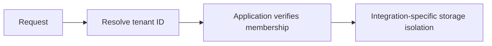

Tenancy means your application serves multiple customers or organizational units while keeping their data and operations isolated. A tenant could be a customer, a business unit, or any logical boundary that must remain separate from others.

## Why Tenancy Matters

Tenancy keeps data and behavior isolated between customers or organizational units while still sharing the same application deployment. Arc provides tenant resolution, tenant context access, and tenant-aware integrations to help you maintain strict separation and predictable behavior.

- **Data isolation**: Each tenant should only see its own data, even when sharing infrastructure.
- **Compliance**: Many regulatory requirements demand strict separation and auditable access.
- **Operational safety**: Isolation reduces the blast radius of mistakes, queries, and deployments.
- **Scalability**: Tenancy enables predictable scaling by segmenting traffic and storage by tenant.

Keep three decisions separate: **selection** resolves the tenant ID; **membership authorization** checks whether this caller may use it; **storage isolation** determines where reads and writes go. Arc supplies selection and context. The MongoDB integration supplies tenant-aware database naming; EF Core isolation is application-owned. Optional Chronicle integration selects event-store namespaces. None of these replaces membership checks.

See [database isolation](database-resolvers.md) for the exact integration boundaries.

## Best Practices

- Choose a resolver that aligns with your authentication and request flow.
- Validate that the requester is authorized to access the resolved tenant.
- Include the tenant ID in cache keys, logs, and telemetry.
- Keep tenant IDs stable and opaque to avoid enumeration.
- Prefer tenant-aware data stores and avoid cross-tenant queries.
- Use the development resolver only in local or test environments.

## Security Considerations

- Ensure tenant ID resolution happens only after authentication.
- Enforce tenant membership checks in application services and policies.
- Log tenant access for audits and incident investigation.
- Prevent tenant ID spoofing by validating headers, claims, and parameters.
- Treat tenant ID as sensitive metadata and avoid exposing it unnecessarily.

## Topics

- [Resolving tenant IDs](./resolvers.md)
- [Configuration](./configuration.md)
- [Tenant context access](./tenant-context.md)
- [Database isolation](./database-resolvers.md)
