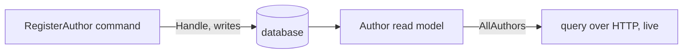

import { Steps, Aside } from '@astrojs/starlight/components';

Let's build the backend half of a real feature: registering an author in a library app. It's small, but it exercises the whole Arc loop — something *happens* (a command), it writes state, and that state is served back out (a query). We use a plain database in this lesson to keep the CQRS boundary visible; in a full Cratis information system, the same boundary usually writes events through Chronicle.

In a layered app this would be files scattered across `Commands/`, `Handlers/`, and `ReadModels/`, and you'd hop between them to follow one behavior. Arc doesn't force a layout, but we strongly recommend organizing by **feature**: everything below lives in one `Authors/` folder you read top to bottom. Here's the shape we're building:



## Prerequisites

- **.NET SDK 8 or newer.**
- **An Arc backend project** — add the `Cratis.Arc` packages to an ASP.NET Core app, or scaffold the full stack with the [Cratis templates](/chronicle/get-started/).
- **A database Arc can write to** — MongoDB, or EF Core over SQLite/Postgres. Chronicle is not required for this lesson.

<Steps>

1. **A strongly-typed id.** Never pass raw `Guid`s around the domain — wrap them so the compiler keeps them straight and your signatures document themselves:

   ```csharp
   public record AuthorId(Guid Value) : ConceptAs<Guid>(Value)
   {
       public static AuthorId New() => new(Guid.NewGuid());
   }
   ```

2. **The command — with `Handle()` on the record.** A command is a `record` marked `[Command]`. The behavior lives in a `Handle()` method **on the record itself** — there's no separate handler class to find. Here it writes the new author to the database:

   ```csharp
   [Command]
   public record RegisterAuthor(AuthorId Id, AuthorName Name)
   {
       public Task Handle(IMongoCollection<Author> authors) =>
           authors.InsertOneAsync(new Author(Id, Name));
   }
   ```

   `Handle()` returns `Task` — the write is the outcome. Need a different store or a collaborator? Add it as a parameter and Arc injects it: an `IMongoCollection<T>`, your EF Core `DbContext`, a service, anything in the container.

3. **The read model and its query.** Declare the shape you want to query and mark it `[ReadModel]`. A static method exposes the query — return an observable so consumers get live updates:

   ```csharp
   [ReadModel]
   public record Author([property: Key] AuthorId Id, AuthorName Name)
   {
       public static ISubject<IEnumerable<Author>> AllAuthors(IMongoCollection<Author> collection) =>
           collection.Observe();
   }
   ```

   <Aside type="tip" title="Notice what you didn't write">
   That static `AllAuthors` method *is* your query — Arc exposes it over HTTP automatically. No controller, no routing, no DTO. And it's **live**: `.Observe()` watches the change stream, so the moment the command writes, every subscriber re-renders.
   </Aside>

4. **Build.**

   ```bash
   dotnet build
   ```

   Building **generates the TypeScript proxies** for `RegisterAuthor` and `AllAuthors` so your frontend can call them type-safely — that's the part that makes the next step (the UI) effortless.

</Steps>

## What you built

In one folder, read top to bottom:

- A `[Command]` with `Handle()` — intent and implementation in one place, no handler class.
- A `[ReadModel]` with a live query method served over HTTP.

That's a complete vertical slice, over a plain database. The next feature is another folder just like it.

<Aside type="note" title="Storing where you like">
This slice writes straight to MongoDB. Arc is persistence-agnostic — the same shape works over [EF Core](/arc/backend/entity-framework/getting-started/) or over Chronicle. When this belongs in the event-sourced model, the [Chronicle integration](/arc/backend/chronicle/add-event-sourcing/) moves the write side to events without touching your query or your frontend.
</Aside>

## Where to go next

- **[Wire a UI to it](/arc/frontend/getting-started/)** — read this query and run this command from React, fully typed.
- **[Build the library, full-stack](/arc/tutorial/)** — the threaded tutorial builds this into a real app, chapter by chapter.
- Go deeper on [Commands](/arc/backend/commands/) and [Queries](/arc/backend/queries/).
