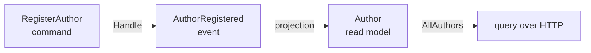

import { Steps, Aside } from '@astrojs/starlight/components';

Let's build the backend half of a real feature: registering an author in a library app. It's small, but it exercises the whole Arc loop — something *happens* (a command), it's recorded as a fact (an event), that fact is folded into queryable state (a projection builds a read model), and that state is served back out (a query).

In a layered app this would be four files scattered across four folders — `Commands/`, `Handlers/`, `Events/`, `ReadModels/` — and you'd hop between them to follow one behavior. Arc organizes by **feature** instead: everything below lives in one `Features/Authors/` folder you read top to bottom. Here's the shape we're building:



<Steps>

1. **A strongly-typed id.** Never pass raw `Guid`s around the domain — wrap them so the compiler keeps them straight and your signatures document themselves:

   ```csharp
   public record AuthorId(Guid Value) : ConceptAs<Guid>(Value)
   {
       public static AuthorId New() => new(Guid.NewGuid());
       public static implicit operator EventSourceId(AuthorId id) => new(id.Value.ToString());
   }
   ```

   That implicit conversion to `EventSourceId` is what lets Chronicle use an `AuthorId` directly as the key of an event stream — no glue.

2. **The command — with `Handle()` on the record.** A command is a `record` marked `[Command]`. The behavior lives in a `Handle()` method **on the record itself** — there's no separate handler class to find. It returns the event(s) that happened:

   ```csharp
   [Command]
   public record RegisterAuthor(AuthorId Id, AuthorName Name)
   {
       public AuthorRegistered Handle() => new(Name);
   }
   ```

   `Handle()` can return a single event, a tuple of `(event, result)`, a `Result<,>`, or several events. Need a collaborator — a service, a repository? Add it as a parameter and Arc injects it.

3. **The event.** An immutable, past-tense fact — the thing that actually happened:

   ```csharp
   [EventType]
   public record AuthorRegistered(AuthorName Name);
   ```

4. **The read model and its projection.** Declare the shape you want to query, mark it `[ReadModel]`, and tell it which event feeds it. A static method exposes the query — return an observable so consumers get live updates:

   ```csharp
   [ReadModel]
   [FromEvent<AuthorRegistered>]
   public record Author([property: Key] AuthorId Id, AuthorName Name)
   {
       public static ISubject<IEnumerable<Author>> AllAuthors(IMongoCollection<Author> collection) =>
           collection.Observe();
   }
   ```

   <Aside type="tip" title="Notice what you didn't write">
   No update code. **AutoMap** matches `AuthorRegistered.Name` straight onto `Author.Name`, so the projection fills the read model on its own. And that static `AllAuthors` method *is* your query — Arc exposes it over HTTP automatically. No controller, no routing, no DTO.
   </Aside>

5. **Build.**

   ```bash
   dotnet build
   ```

   Building does two things beyond compiling: it wires your command to append through Chronicle when it runs, and it **generates the TypeScript proxies** for `RegisterAuthor` and `AllAuthors` so your frontend can call them type-safely.

</Steps>

## What you built

In one folder, read top to bottom:

- A `[Command]` with `Handle()` — intent and implementation in one place, no handler class.
- The `[EventType]` it records — the permanent fact.
- A `[ReadModel]` whose projection builds it from events with no update code, and whose query method is served over HTTP for free.

That's a complete vertical slice. The next feature is another folder just like it — you never go back and touch this one to add the next.

## Where to go next

- **[Wire a UI to it](/arc/frontend/getting-started/)** — read this query and run this command from React, fully typed.
- **[Build a full-stack feature](/build-a-full-app/)** — the same slice end to end, backend and frontend together.
- Go deeper on [Commands](/arc/backend/commands/) and [Queries](/arc/backend/queries/).
