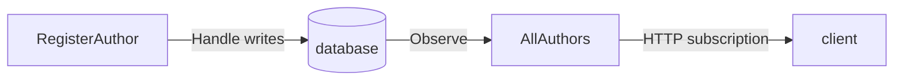

import { Steps, Aside, Tabs, TabItem } from '@astrojs/starlight/components';

A librarian registers an author; the catalog should show it. Let's express that as one command that writes current state and one query that reads it. **No events are returned or appended in this lesson.**

## Prerequisites

Complete [Set up a standalone Arc backend](/arc/backend/getting-started/) first. It supplies packages, imports, ASP.NET Core hosting, storage settings, and the proxy-generator configuration. Choose the **same database branch** below. Files are relative to that lesson's `Library/` project root.


```mermaid
flowchart LR
    Cmd[RegisterAuthor] -->|Handle writes| DB[(database)]
    DB -->|Observe| Q[AllAuthors]
    Q -->|HTTP subscription| Client[client]
```

## Define the author feature

<Steps>

1. **Name the domain values.** Create `src/Authors/AuthorId.cs`:

   ```csharp
   namespace Library.Authors;

   public record AuthorId(Guid Value) : ConceptAs<Guid>(Value)
   {
       public static AuthorId New() => new(Guid.NewGuid());
   }
   ```

   Create `src/Authors/AuthorName.cs`:

   ```csharp
   namespace Library.Authors;

   public record AuthorName(string Value) : ConceptAs<string>(Value)
   {
       public static implicit operator AuthorName(string value) => new(value);
   }
   ```

   These are standalone `ConceptAs<T>` values. `AuthorId` is not a Chronicle event-source identifier.

2. **Write the command.** Create `src/Authors/RegisterAuthor.cs` using one branch:

   <Tabs syncKey="db">
   <TabItem label="MongoDB" icon="seti:db">

   ```csharp
   namespace Library.Authors;

   [Command]
   public record RegisterAuthor(AuthorId Id, AuthorName Name)
   {
       public Task Handle(IMongoCollection<Author> authors) =>
           authors.InsertOneAsync(new Author(Id, Name));
   }
   ```

   </TabItem>
   <TabItem label="EF Core" icon="seti:db">

   ```csharp
   namespace Library.Authors;

   [Command]
   public record RegisterAuthor(AuthorId Id, AuthorName Name)
   {
       public async Task Handle(LibraryDbContext db)
       {
           db.Authors.Add(new Author(Id, Name));
           await db.SaveChangesAsync();
       }
   }
   ```

   </TabItem>
   </Tabs>

   Arc method-injects the collection or context. The explicit write is the effect; returning `Task` adds no response payload.

3. **Expose the read shape.** Create `src/Authors/Author.cs`:

   <Tabs syncKey="db">
   <TabItem label="MongoDB" icon="seti:db">

   ```csharp
   namespace Library.Authors;

   [ReadModel]
   public record Author(AuthorId Id, AuthorName Name)
   {
       public static ISubject<IEnumerable<Author>> AllAuthors(IMongoCollection<Author> authors) =>
           authors.Observe();
   }
   ```

   </TabItem>
   <TabItem label="EF Core" icon="seti:db">

   ```csharp
   namespace Library.Authors;

   [ReadModel]
   public record Author(AuthorId Id, AuthorName Name)
   {
       public static ISubject<IEnumerable<Author>> AllAuthors(LibraryDbContext db) =>
           db.Authors.Observe();
   }
   ```

   Also create `src/Authors/LibraryDbContext.cs`:

   ```csharp
   namespace Library.Authors;

   public class LibraryDbContext(DbContextOptions<LibraryDbContext> options) : BaseDbContext(options)
   {
       public DbSet<Author> Authors => Set<Author>();
   }
   ```

   </TabItem>
   </Tabs>

   A static query on `[ReadModel]` becomes an endpoint. MongoDB observation uses change streams; SQLite uses this host's configured `SaveChanges` notifications. The host setup establishes their prerequisites.

</Steps>

## Build and run the checkpoint

```bash
dotnet build -c Debug
dotnet run --no-build --no-launch-profile --environment Development --urls http://localhost:5000
```

After the build, check for `src/Authors/RegisterAuthor.ts` and `src/Authors/Author.ts`. With source-file output enabled, the latter contains the `AllAuthors` query as well as the author shape. Do not edit either generated file.

The host should listen on port 5000. EF creates the initial SQLite schema at startup; MongoDB should already report a writable primary. If either fails, fix storage before moving to the browser.

<Aside type="note" title="Build success is not a write test">
This checkpoint establishes compilation, proxy output, and host/storage startup. The next lesson executes a command and verifies persisted data through the query. It does not assume that a green build proves the write worked.
</Aside>

## Continue in the browser

[Your first full-stack slice](/arc/tutorial/first-slice/) explains these same backend files and supplies the Vite bootstrap, Components prerequisites, providers, mounting, and dev proxy configuration; do not create a second copy of the backend types. [Frontend getting started](/arc/frontend/getting-started/) is the **Arc-only alternative for an existing Vite app**, using ordinary HTML without Components. With this tutorial's source-file grouping, use `./Authors/Author` for its `AllAuthors` import.

Go deeper in [Commands](/arc/backend/commands/) and [Queries](/arc/backend/queries/). If you later choose event sourcing, [add Chronicle explicitly](/arc/backend/chronicle/add-event-sourcing/); retaining a query's public contract is a migration goal, not a guarantee that its storage implementation never changes.
