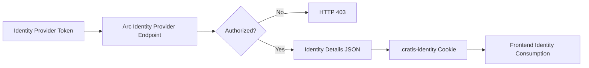

# Identity

Arc identity support lets you enrich provider tokens with domain-specific user details, perform application-level authorization at ingress, and propagate a consistent identity payload to frontend clients.

## Overview

Identity tokens from providers typically contain limited information. Arc lets you compose additional identity details in your backend, authorize users before app entry, and publish one consistent identity payload for downstream services and frontend clients.

Key capabilities:

- Enrich provider identity with domain-specific details
- Perform application-level authorization during ingress
- Return a single consolidated identity payload
- Reuse identity details across services and frontend clients

## Topics

| Topic | Description |
| ------- | ----------- |
| [Provider Flow](./provider-flow.md) | Endpoint mapping, provider implementation, request flow, and frontend cookie integration. |
| [Identity Contracts](./contracts.md) | `IdentityProviderContext` and `IdentityDetails` structures used by providers. |
| [IdentityProvider Service](./identity-provider-service.md) | Advanced runtime identity retrieval and mutation with `IIdentityProvider`. |
| [Development and Topologies](./development-and-topologies.md) | Development endpoints plus single-service and multi-service composition patterns. |

