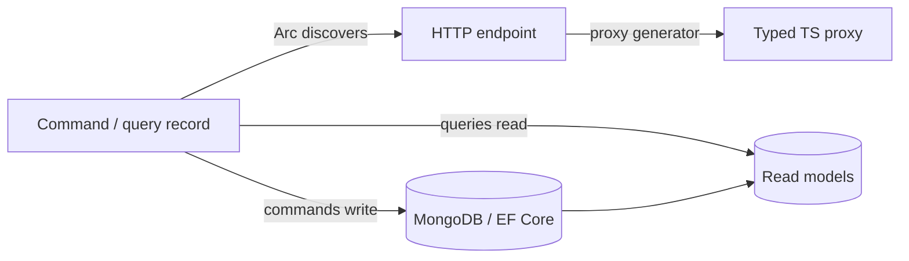

# Backend

The backend is where you express *what your application does* — the commands that change state and the
queries that read it. Arc's job is to make that expression the only thing you write: you define a
command or query as a plain record, and Arc handles the HTTP endpoint, validation, authorization, and a
typed TypeScript proxy for the frontend. CQRS without the ceremony.

## Start here

New to the backend? Walk through [Getting started](./getting-started/index.md) to build your first
command and query end to end. Then the two pillars:

- [Commands](./commands/index.md) — intents that change state through `Handle()`.
- [Queries](./queries/index.md) — reads, exposed to the frontend as typed proxies (including live, observable ones).

The magic that ties it to the frontend is [Proxy generation](./proxy-generation/index.md) — read it
early; it's why the whole stack is type-safe.

## Integrations

Arc meets the rest of your stack:

| Topic | What it covers |
| ------- | ----------- |
| [MongoDB](./mongodb/index.md) | Document storage for read models and other data. |
| [Entity Framework](./entity-framework/index.md) | EF Core integration for relational read models. |
| [Chronicle](./chronicle/index.md) | Optional event sourcing — append events from commands, build read models, feed state back into business rules. |
| [ASP.NET Core](./asp-net-core/index.md) | How Arc plugs into the ASP.NET Core pipeline. |

## Cross-cutting

| Topic | What it covers |
| ------- | ----------- |
| [Core](./core/index.md) | Commands, queries, and dependency injection at the lower level. |
| [Identity](./identity/index.md) | Who the user is — authentication and identity details. |
| [Tenancy](./tenancy/overview.md) | Multi-tenant isolation. |
| [Open API](./open-api/index.md) | OpenAPI/Swagger generation. |
| [Code Analysis](./code-analysis/index.md) | Analyzers and fixers that catch mistakes at compile time. |

Building the UI on top? Head to the [frontend](../frontend/index.md), which consumes everything here
through the generated proxies.
