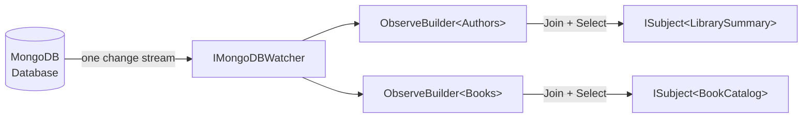

# Watching Multiple Collections with a Shared Change Stream

The `IMongoDBWatcher` provides a single, process-wide MongoDB change stream connection per database. Instead of opening one change stream per collection, you share one connection and funnel events from multiple collections through it. This reduces the number of open cursors and network connections, which matters when you observe many collections simultaneously.

## How it works



`IMongoDBWatcher` is registered as a singleton automatically when you call `UseCratisMongoDB()`. The underlying change stream opens the first time you call `Observe<T>()` and is reused by every subsequent call.

## Prerequisites

- MongoDB 3.6 or later with a replica set (required for change streams)
- `UseCratisMongoDB()` called during application startup

## Observing a single collection

Inject `IMongoDBWatcher` and call `Observe<T>()` to start watching a collection. Chain `.Join<T2>()` to include additional collections, then call `.Select()` to combine them into a result subject.

Even when you only care about one collection, you must call `.Join<T2>().Select()` to materialize the subject — a single `Observe<T>()` alone returns a builder, not a subject.

### Example — watch one collection alongside a lookup

```csharp
public class BookCatalogService(IMongoDBWatcher watcher)
{
    public ISubject<BookCatalog> GetLiveCatalog()
    {
        return watcher
            .Observe<Book>()
            .Join<Author>()
            .Select((books, authors) => new BookCatalog(books, authors));
    }
}

public record BookCatalog(IEnumerable<Book> Books, IEnumerable<Author> Authors);
```

`Select()` is called once with the full current contents of each collection. It is called again every time any watched collection receives an insert, update, replace, or delete.

## Filtering observed documents

Pass a filter expression to `Observe<T>()` or `Join<T2>()` to restrict which documents are loaded when the subject re-fetches after a change.

```csharp
public ISubject<BookCatalog> GetLivePublishedCatalog()
{
    return watcher
        .Observe<Book>(book => book.IsPublished)
        .Join<Author>(author => author.IsActive)
        .Select((books, authors) => new BookCatalog(books, authors));
}
```

> Filters apply to the re-fetch query, not to the change stream trigger. Any change to a collection causes a re-fetch regardless of whether the changed document matches the filter.

## Joining three collections

Chain a second `.Join<T3>()` to watch three collections at once.

```csharp
public ISubject<LibrarySummary> GetLiveLibrarySummary()
{
    return watcher
        .Observe<Book>()
        .Join<Author>()
        .Join<Publisher>()
        .Select((books, authors, publishers) =>
            new LibrarySummary(books, authors, publishers));
}

public record LibrarySummary(
    IEnumerable<Book> Books,
    IEnumerable<Author> Authors,
    IEnumerable<Publisher> Publishers);
```

## Using the subject in a query

`ISubject<TResult>` implements both `IObservable<TResult>` and `IObserver<TResult>`. You can pass it directly to any observable query:

```csharp
[Route("api/catalog")]
public class CatalogController(IMongoDBWatcher watcher) : Controller
{
    [HttpGet("live")]
    public ISubject<BookCatalog> LiveCatalog()
    {
        return watcher
            .Observe<Book>(book => book.IsPublished)
            .Join<Author>()
            .Select((books, authors) => new BookCatalog(books, authors));
    }
}
```

## Lifetime and disposal

`IMongoDBWatcher` is a singleton. The underlying change stream lives for the lifetime of the application. You do not need to manage its lifecycle.

Individual subjects returned by `Select()` run a background loop that is tied to the subject itself — the loop stops when the subject completes or errors. Unsubscribing all observers from a subject causes it to complete and cleans up its internal resources automatically.

## See also

- [Observing Collections](observing-collections.md) — Per-collection `IMongoCollection.Observe()` extension methods for single-collection scenarios.
- [Getting Started](getting-started.md) — How to register the MongoDB integration, including `IMongoDBWatcher`.
