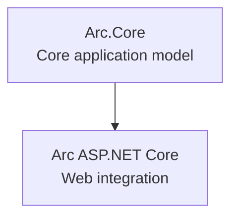

# Backend Overview

Arc is a layered application framework. The Arc.Core package provides the base application model without ASP.NET Core, while the Arc ASP.NET Core package builds on top of Arc.Core to add web-specific integration.

## What Is Arc.Core

Arc.Core gives you the core application model for commands, queries, multi-tenancy, identity, and extensibility without pulling in ASP.NET Core. It is the right choice when you:

- Need a minimal hosting surface
- Run on platforms where ASP.NET Core is not available or not allowed
- Want to avoid ASP.NET Core dependencies or AOP constraints
- Build device or desktop workloads such as MAUI

## What Arc Adds

The Arc ASP.NET Core package builds on Arc.Core and adds web framework capabilities like controllers, model binding, middleware integration, and OpenAPI/Swagger features. It is the right choice when you:

- Build HTTP APIs and web backends
- Need ASP.NET Core routing and filters
- Want automatic endpoint generation and API documentation

## Layering Model

The relationship is a strict layering model: Arc.Core is the foundation, and Arc with ASP.NET Core builds on top of it.

## Deployment Scenarios

Arc.Core is the safe default when you cannot use ASP.NET Core, for example on devices that run MAUI or similar technologies where AOP-based ASP.NET Core builds are not allowed.

Arc with ASP.NET Core is the best fit for web services and APIs that benefit from the full ASP.NET Core stack.

## Related Topics

- [Arc.Core Overview](./core/overview.md)
- [ASP.NET Core Integration](./asp-net-core/index.md)
- [Getting Started](./getting-started/index.md)

