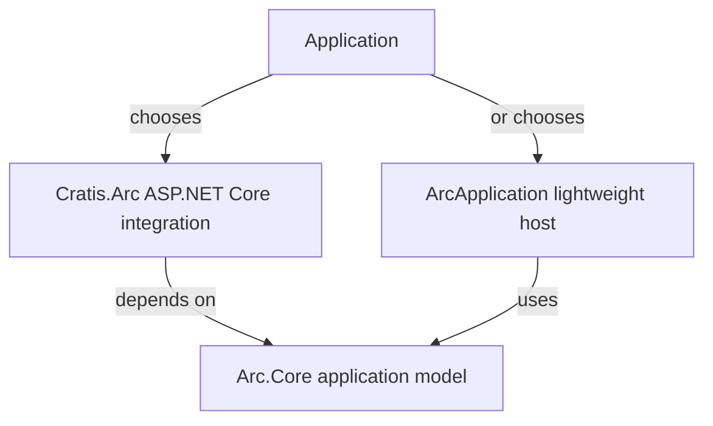

You want one command/query model without accidentally choosing an event store or the wrong web host. Arc separates those decisions: **Arc.Core provides the application model**, and **Cratis.Arc adds ASP.NET Core integration**. Neither requires Chronicle.

## Choose the host first

| Host | Package and bootstrap | Use it when… |
| --- | --- | --- |
| ASP.NET Core | `Cratis.Arc`, `WebApplication.CreateBuilder(args)`, `builder.AddCratisArc()`, `app.UseCratisArc()` | You want ASP.NET Core routing, middleware, controllers alongside model-bound endpoints, and its authentication ecosystem |
| Lightweight host | `Cratis.Arc.Core`, `ArcApplication.CreateBuilder(args)` | You intentionally want Arc's generic-host / HttpListener-based endpoint surface without ASP.NET Core |

The [standalone getting-started path](./getting-started/index.md) uses ASP.NET Core throughout. The [Arc.Core getting-started guide](./core/getting-started.md) explains the alternative. Do not copy one host's extension-method sequence into the other.

```mermaid
flowchart TB
    ASP[Cratis.Arc ASP.NET Core integration] -->|depends on| Core[Arc.Core application model]
    Light[ArcApplication lightweight host] -->|uses| Core
    App[Application] -->|chooses| ASP
    App -->|or chooses| Light
```

Arc.Core is useful when you do not need ASP.NET Core, but that is not a guarantee of compatibility with every device, desktop, browser, AOT, or restricted runtime. Validate the selected host and dependencies on your deployment target.

## Then choose persistence and client output

Commands may call application services, write MongoDB collections, or use EF Core contexts. Add [Chronicle](./chronicle/index.md) explicitly when the slice needs event persistence, projections, or reactors. Returning an event-shaped object from standalone Core is ordinary response handling, not an automatic append.

[Proxy generation](./proxy-generation/getting-started.md) is a separate post-build tool. Install its build package and configure an output path; it inspects compiled assemblies and PDB source information rather than querying your running endpoints. Generate in Debug before type-checking the frontend.

## Continue

- [Set up standalone Arc](./getting-started/index.md) — packages, imports, database configuration, and the first runnable checkpoint.
- [ASP.NET Core integration](./asp-net-core/index.md) — middleware, authentication, and host-specific behavior.
- [Arc.Core overview](./core/overview.md) — the lightweight surface and its limits.
- [Backend guide](./index.md) — commands, queries, providers, identity, and tenancy.
