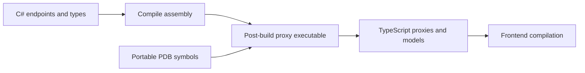

Keeping frontend request types in sync with backend endpoints is repetitive work. Arc's proxy generator turns your compiled commands, queries, and models into TypeScript clients, including React hooks and serialization metadata.

This is a **standalone Arc capability**. It does not require Chronicle or event sourcing; commands may call application services and return ordinary responses.

## How it works

The `CratisProxyGenerator` MSBuild target runs **after `AfterBuild`**, when `CratisProxiesOutputPath` is nonempty. It launches a .NET executable over your compiled assembly. It is **not a Roslyn source generator** running inside the C# compilation.

The executable discovers controller-based and model-bound endpoints, examines request and response types, extracts supported validation rules, and writes clients. PDB symbols optionally help choose output filenames; namespaces determine folders.

## What you receive

- **Commands**: classes with typed properties, `execute()`, and React `use()` hooks.
- **Queries**: one-shot or observable clients, parameter interfaces when needed, and React hooks.
- **Models**: classes with runtime serialization metadata by default.
- **Enums**: numeric TypeScript enums, including an all-flags constant for `[Flags]` enums.
- **Identity details**: types discovered through `IProvideIdentityDetails<TDetails>`.
- **Barrel files**: `index.ts` exports, unless generation is disabled.

There is no generated `Bindings` artifact or generated `Bindings.initialize()` call. Configure React with the [`Arc` provider](../../frontend/react/arc.md).

## Choose your next step

1. [Set up generation](getting-started.md), including a safe output location and frontend dependencies.
2. Inspect [command](commands.md), [query](queries.md), and [type mapping](type-mapping.md) contracts.
3. Adjust [configuration](Configuration/index.md) when your folder structure or routes differ from the defaults.
4. Read [output behavior](Configuration/output-behavior.md) before mixing generated and handwritten files. Cleanup is not a general-purpose source-preservation mechanism.

For specialized output, see [identity details](identity-details.md), [validation extraction](validation.md), and [file tracking](file-index-tracking.md).
