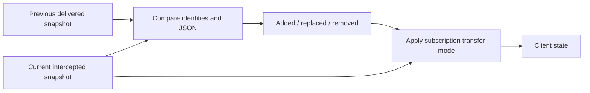

<!-- Copyright (c) Cratis. All rights reserved.
Licensed under the MIT license. See LICENSE file in the project root for full license information. -->

## Transfer modes

The observable-query hub can compare collection snapshots and send a `ChangeSet` describing added, replaced, and removed items. This is a transport-level comparison of query results, not a Chronicle event stream or a promise of durable replay.

Set `transferMode` on the [hub subscription request](observable-query-demultiplexer.md). The modes below describe subject-backed **collection** emissions:

| Mode | First emission | Later emissions |
| --- | --- | --- |
| Omitted (legacy) | Full `data` plus change set (initial items added) | Full `data` plus change set |
| `full` | Full `data`, no change set | Full `data`, no change set |
| `delta` | Full `data`, no change set | Change set; full `data` is null/omitted |

Legacy additive deltas can reduce client reconciliation work, but sending both the snapshot and delta does **not** reduce payload bytes. Delta mode is the bandwidth-saving choice. Single-object and async-enumerable streams are not covered by this collection-delta contract. Direct per-query transports do not automatically inherit hub transfer-mode behavior.

## How changes are identified

For items with an `Id` property (case-insensitive), `ChangeSetComputor` compares identity and serialized JSON:

- `added`: an identity appears in the new snapshot.
- `replaced`: the identity remains but its serialized representation differs.
- `removed`: an identity disappears; entries are removed **items**, not merely ID strings.

Without an `Id` property, full serialized JSON is used as the comparison key. Changes then appear as removal/addition rather than replacement. Use stable, unique identifiers when clients must reconcile collection state.



## Wire format

Illustrative **payload fragment** for a later delta-mode frame; the surrounding `QueryResult` metadata and hub envelope are intentionally not repeated:

```json
{
  "data": null,
  "changeSet": {
    "added": [{ "id": "account-2", "balance": 50 }],
    "replaced": [{ "id": "account-1", "balance": 120 }],
    "removed": [{ "id": "account-3", "balance": 0 }]
  }
}
```

When no change set is present, treat `data` as the current snapshot. A reconnect/replacement subscription starts with a fresh snapshot; a change set is not a resume token. Under delta mode, do not replace client state with null just because the later frame omits full data.

## Backend API

`ChangeSet` has `IEnumerable<object>` properties `Added`, `Replaced`, and `Removed`. `ChangeSetComputor` takes `JsonSerializerOptions`; its `Compute(previousItems, currentItems)` returns a change set, and `FindIdentityProperty(Type)` locates the conventional ID property.

These APIs compare snapshots you supply; they do not observe a database independently. For database observation, see [MongoDB-backed observable queries](model-bound/observable-queries.md). For client reconstruction, see [frontend change streams](../../frontend/react/queries/change-stream.md).
