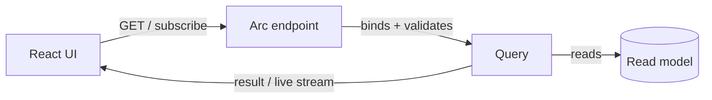

# Queries

If [commands](../commands/index.md) are how your system *changes*, queries are how it's *read*. A query
pulls data out and shapes it for a caller — a list, a detail view, a dashboard. Arc takes the same
approach it does for commands: you express the read, and it handles parameter binding, validation,
authorization, and a typed TypeScript proxy for the frontend. No hand-written API client, no untyped
JSON.

And queries have a superpower commands don't: they can be **observable**. An observable query holds a
live connection and pushes fresh results to the client whenever the underlying data changes — so a React
list re-renders the moment a command updates the read model behind it.



## Two ways to define one

| Style | What it looks like | Reach for it when |
| --- | --- | --- |
| [Model-bound](./model-bound/index.md) | A read method declared on the model, discovered by convention | **The default.** Least boilerplate; the query lives with the data it reads. |
| [Controller-based](./controller-based/index.md) | A query method on a controller | You need full control over the HTTP route, or you're integrating with existing controllers. |

A controller-based read is as plain as it looks:

```csharp
[HttpGet("starting-with")]
public IEnumerable<DebitAccount> StartingWith([FromQuery] string? filter) =>
    _collection.Find(Builders<DebitAccount>.Filter.Regex(
        "name", $"^{filter ?? string.Empty}.*")).ToList();
```

Parameters you declare (`[FromQuery]`, route values) become **typed arguments** on the generated proxy
— so the frontend calls `StartingWith.use({ filter: '' })` with the compiler checking the shape.

## Request/response or live?

This is the choice that defines a query:

| | Request / response | [Observable](../../frontend/react/queries/observable-queries.md) |
| --- | --- | --- |
| **Behavior** | Fetch once, return a result | Subscribe; results push on every change |
| **Transport** | A normal HTTP `GET` | SSE or WebSocket, hub-routed by default |
| **Use it for** | One-off reads, reports, exports | Anything a user watches — lists, dashboards, status |

Favor observable queries for screens that should stay current. The live loop — a command appends an
event, a projection updates the read model, every subscribed browser re-renders — is the experience Arc
is built to make effortless.

## The pipeline around it

Every query runs through a pipeline where Arc applies the cross-cutting concerns for you:

| Concern | Page |
| --- | --- |
| How a query is processed end to end | [Query Pipeline](./query-pipeline.md) |
| Validate query parameters | [Validation](./validation.md) |
| Authorize by role or policy | [Authorization](../core/authorization.md) |
| Transform read models before they're served (mask, decrypt, enrich) | [Read Model Interception](./read-model-interception.md) |
| Stream many live queries over one connection | [Observable Query Hub](./observable-query-demultiplexer.md) |
| Debug a live query from the terminal | [Use Observable Queries with cURL](./using-observable-queries-with-curl.md) |

## The payoff: typed reads in React

As with commands, building the backend generates a typed proxy for every query. From React you call its
`.use()` hook and get back a strongly-typed result with its loading and validation state — see
[Queries in React](../../frontend/react/queries/index.md). One definition, read safely from C# all the
way to the component.
