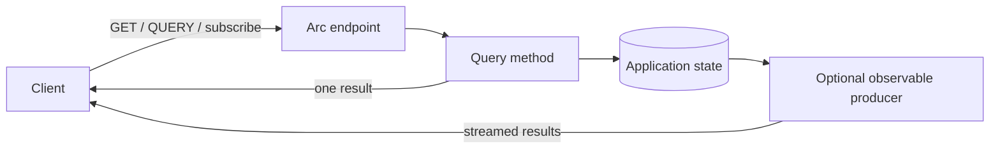

<!-- Copyright (c) Cratis. All rights reserved.
Licensed under the MIT license. See LICENSE file in the project root for full license information. -->

A screen needs a list, a detail view, or a dashboard—not another hand-written API client. Arc lets you declare the read, expose it through HTTP, and generate a typed TypeScript proxy for the frontend.

Queries read **application state**. That can be a MongoDB document, an EF Core entity, data from a service, or an in-memory model. **Arc queries do not require Chronicle or event sourcing.** A database query or MongoDB `Observe()` call is not a Chronicle projection. If your application optionally uses Chronicle, its projected read models can be queried too; see [Chronicle integration](../chronicle/index.md).

## Choose a declaration style

| Style | What you write | Choose it when |
| --- | --- | --- |
| [Model-bound](model-bound/index.md) | Static query method on the `[ReadModel]` type it returns | You want the query next to its data shape with minimal endpoint boilerplate |
| [Controller-based](controller-based/index.md) | MVC GET action | You need MVC route-value/DTO binding, filters, or HTTP response control |

The two paths share result rendering but **not all binding, validation, or authorization behavior**. Start with the model-bound example, then use the controller path deliberately where its contract fits better.

## Request once or observe updates

```mermaid
flowchart LR
    UI[Client] -->|GET / QUERY / subscribe| Arc[Arc endpoint]
    Arc --> Query[Query method]
    Query --> State[(Application state)]
    State --> Producer[Optional observable producer]
    Query -->|one result| UI
    Producer -->|streamed results| UI
```

| Mode | Behavior | Use it for |
| --- | --- | --- |
| Request/response | Read once through GET or [generated HTTP QUERY](using-the-http-query-method.md) | One-off reads and reports |
| [Observable](model-bound/observable-queries.md) | Subscribe to a producer over SSE/WebSocket | Lists or dashboards that should stay current |

An observable query needs a producer that detects changes; a return type alone does not watch your database. Arc's MongoDB integration supplies `Observe()`. Other providers need their own observation mechanism. An update may follow a [command](../commands/index.md) changing database state directly, or an optional Chronicle projection updating it.

## Learn the contract in order

1. [Declare a model-bound read](model-bound/index.md), then add [arguments](model-bound/query-arguments.md).
2. Apply [validation](validation.md) and [authorization](model-bound/authorization.md), including their current limitations.
3. Read the [QueryResult contract](query-pipeline.md#query-result-metadata) and add [paging](model-bound/paging.md).
4. Expose [observable updates](model-bound/observable-queries.md) and understand subscription disposal.
5. For advanced delivery, use the [hub protocol](observable-query-demultiplexer.md), [change streams](change-stream.md), and [emission guards](observable-query-emission-guards.md).

[Read-model interception](read-model-interception.md) transforms supported result paths, but currently excludes observable HTTP snapshots. [Query health](query-health.md) helps diagnose hub subscriptions but exposes sensitive telemetry unless you restrict it. Use [cURL workflows](using-observable-queries-with-curl.md) to distinguish a snapshot from a live stream.

## Consume the read in React

A successful backend proxy-generation build supplies typed client declarations. Use the generated query's hook and result state instead of maintaining a separate transport model. Continue with [queries in React](../../frontend/react/queries/index.md) and [proxy generation](../proxy-generation/index.md).
