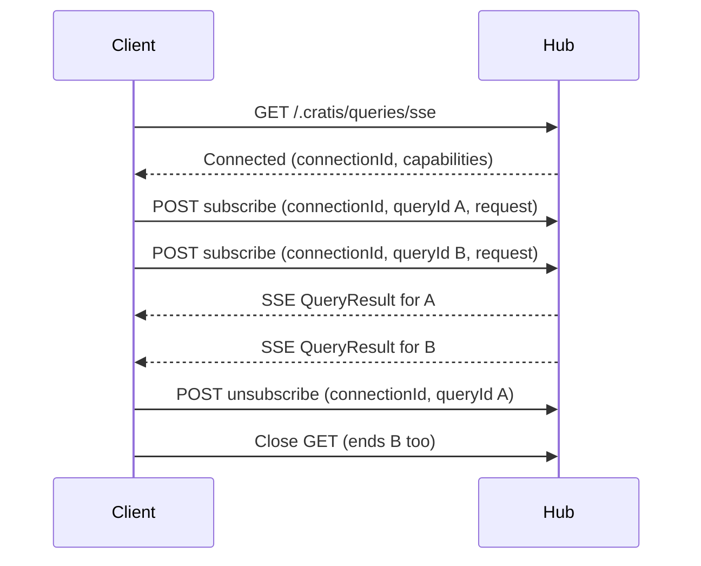

<!-- Copyright (c) Cratis. All rights reserved.
Licensed under the MIT license. See LICENSE file in the project root for full license information. -->

## Endpoints

The demultiplexer carries multiple named observable queries over one connection. **Both WebSocket and SSE are multiplexed.** Arc maps four fixed routes:

| Method/transport | Route | Purpose |
| --- | --- | --- |
| WebSocket upgrade | `/.cratis/queries/ws` | Bidirectional subscription and result messages |
| GET, SSE | `/.cratis/queries/sse` | Long-lived output stream |
| POST, JSON | `/.cratis/queries/sse/subscribe` | Add/replace a subscription on an SSE connection |
| POST, JSON | `/.cratis/queries/sse/unsubscribe` | End a subscription on an SSE connection |

A direct per-query SSE GET is a different protocol: it streams plain `QueryResult` frames for that route, not hub envelopes. See [cURL streaming](using-observable-queries-with-curl.md#stream-updates-over-sse).

## Message types

`ObservableQueryHubMessage.Type` has its own `JsonStringEnumConverter`. The server emits the following **PascalCase string values**, not the camelCase field names or numeric enum constants. Numeric values are listed only to identify the enum; use strings in new protocol clients.

| `type` | Enum value | Purpose/payload |
| --- | --- | --- |
| `Subscribe` | 0 | Client sends a subscription request in `payload` |
| `Unsubscribe` | 1 | Client ends `queryId` |
| `QueryResult` | 2 | Server sends a `QueryResult` in `payload` |
| `Unauthorized` | 3 | Server denies the subscription |
| `Error` | 4 | Server sends an error string in `payload` |
| `Ping` | 5 | Keep-alive; `timestamp` is Unix milliseconds |
| `Pong` | 6 | Echo of a ping timestamp |
| `Connected` | 7 | Connection ID in `payload`, plus capability/keep-alive metadata |

Envelope properties are `type`, `queryId`, `revision`, `payload`, `timestamp`, `keepAliveIntervalMs`, and `supportsSubscriptionRevisions`. Not every field is meaningful on every message; nullable/default fields may be omitted according to serializer configuration.

## WebSocket transport

After upgrade, the server sends `Connected` before reading subscriptions. Illustrative frame (null fields omitted for readability):

```json
{
  "type": "Connected",
  "payload": "ws-1",
  "supportsSubscriptionRevisions": true,
  "keepAliveIntervalMs": 30000
}
```

For the `Banking.Accounts.DebitAccount.ObserveAccounts` method in the [model-bound example](model-bound/observable-queries.md), send:

```json
{
  "type": "Subscribe",
  "queryId": "accounts-list",
  "revision": 1,
  "payload": {
    "queryName": "Banking.Accounts.DebitAccount.ObserveAccounts",
    "arguments": { "minimumBalance": "0" },
    "page": 0,
    "pageSize": 25,
    "sortBy": "name",
    "sortDirection": "asc",
    "transferMode": "delta"
  }
}
```

`queryName` is the fully qualified **performer name**, not its HTTP path. `queryId` is chosen by the client and is unique per active subscription within that connection. Arguments are a string-value dictionary; nested JSON/array binding is not added by this protocol. Paging, sorting, and transfer mode are optional request properties.

Updates carry `type: "QueryResult"`, the matching `queryId` and revision, and the [result envelope](query-pipeline.md#query-result-metadata) in `payload`. Subscribe again with a different `queryId` to observe another query on the same connection. To end the first subscription:

```json
{ "type": "Unsubscribe", "queryId": "accounts-list", "revision": 1 }
```

A client `Ping` receives a `Pong` with its timestamp. Connection shutdown disposes the connection's subscriptions; it is not a durable replay checkpoint.

## SSE transport

1. Open `GET /.cratis/queries/sse` and keep it open.
2. Read the first `Connected` frame and retain its GUID connection ID.
3. POST a subscription body to `/.cratis/queries/sse/subscribe` using that ID.
4. Read updates on the **original GET**, correlated by `queryId` and revision.
5. POST unsubscribe when done; close the GET to end all its subscriptions.



Illustrative subscribe body; replace the connection ID with the one just received:

```json
{
  "connectionId": "11111111-1111-1111-1111-111111111111",
  "queryId": "accounts-list",
  "revision": 1,
  "request": {
    "queryName": "Banking.Accounts.DebitAccount.ObserveAccounts",
    "arguments": { "minimumBalance": "0" },
    "transferMode": "full"
  }
}
```

The unsubscribe body is:

```json
{
  "connectionId": "11111111-1111-1111-1111-111111111111",
  "queryId": "accounts-list",
  "revision": 1
}
```

Send both POSTs as `application/json`. The validated control requests return 400 for missing required values/invalid revisions, 404 for unknown connections, and normally 200 after processing. Subscribe returns 401 when authorization denies the query; denial is also delivered as an `Unauthorized` frame. A 200 control response is not proof that a first data result arrived—observe the stream's results/errors.

`?query=...` on the SSE GET does **not** subscribe. On reconnect, wait for the new `Connected` ID and re-create desired subscriptions. Connection state is server-process-local; route the GET and its control POSTs to the same instance in a multi-instance deployment.

## Revisions and compatibility

When `Connected.supportsSubscriptionRevisions` is true, use positive monotonically increasing revisions for each `queryId`. A higher subscribe revision replaces older work; duplicate or stale subscribes are ignored. Unsubscribe uses the exact revision being canceled, and can arrive before a delayed subscribe to tombstone it. An older unsubscribe cannot tear down a newer subscription. Discard stale result/error/denial frames on the client.

Legacy clients may omit revisions. Once a query ID has become revision-aware, revisionless operations cannot replace/cancel that state. Older servers may omit `Connected` on WebSocket or omit the capability field; clients requiring compatibility must support the legacy behavior rather than indefinitely waiting for an advertisement those servers never send.

Tombstones are bounded: the current implementation retains them for two minutes and at most 1,024 inactive entries per connection. This is an ordering window, not indefinite deduplication or durable resumption.

## Transfer modes

For subject-backed collections, omitted `transferMode` uses legacy snapshot-plus-delta behavior; `full` sends snapshots only; `delta` sends an initial snapshot then changes without full data. See [change streams](change-stream.md) for the first/subsequent emission matrix. Arbitrary subjects do not automatically implement paging just because subscription metadata requests it.

## Authorization and exposure

The hub transport endpoints themselves allow anonymous access; each subscription goes through the query pipeline's authorization filters. Model-bound [policy limitations](model-bound/authorization.md) still apply. WebSocket identity is captured at upgrade. SSE subscription identity is captured from its subscribe POST; consistently send the application's normal credentials on connection/control requests.

Treat the SSE connection ID as sensitive connection-control data, not as an authorization policy. The current SSE control handlers locate the stream by that ID; they do not themselves verify that the POST caller owns the original GET connection. Query authorization checks the subscribe POST's right to read the query, not ownership of the destination stream. Do not publish connection IDs or log them unnecessarily.

If the deployment requires per-user connection-control isolation, keep the host/control surface private until that ownership check is enforced and tested by application/gateway infrastructure or a runtime fix. There is no built-in ownership option documented here. The anonymous [health feed](query-health.md) includes connection/subscriber metadata and needs explicit protection too.

The initial verdict does not automatically revoke a long-lived stream. Use [emission guards](observable-query-emission-guards.md) to check current permission/session state during delivery.

## Keep-alive

`ArcOptions.Query.KeepAliveInterval` defaults to 30 seconds. Idle WebSocket/SSE connections receive a `Ping`; ongoing data suppresses unnecessary keep-alives. Zero or negative disables keep-alive, advertised as `keepAliveIntervalMs: 0` on `Connected`. Clients should derive their idle threshold from that advertisement rather than hard-coding 30 seconds.

See [frontend multiplexing](../../frontend/react/queries/observable-query-multiplexing.md) for the supplied client rather than implementing the lifecycle from scratch.
