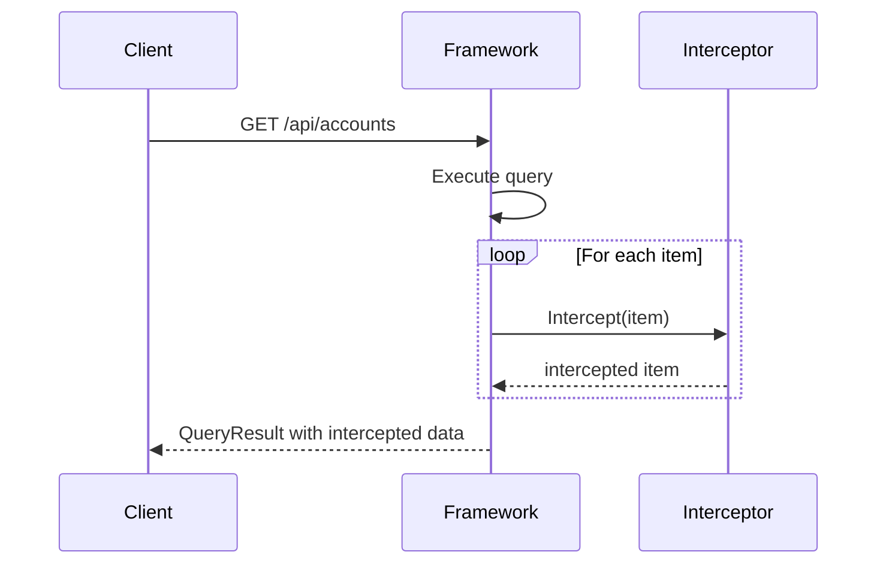

# Read Model Interception

Read model interception lets you apply cross-cutting operations to every read model instance before it is served to a client. Common uses include decryption, field masking, localization, and audit enrichment. Interceptors run automatically for all query types — controller-based, model-bound, and observable (WebSocket and SSE).

## How It Works

When a query returns, the framework passes each read model instance through every registered interceptor for that type before serializing the response. For collections every item is intercepted individually. For observable queries the interception happens on every emission.



## Implementing an Interceptor

Implement `IInterceptReadModel<TReadModel>`. No DI registration is required — the framework discovers all implementations in your assemblies automatically via `ITypes` and creates instances on demand, resolving any constructor dependencies from the service provider.

```csharp
public class DecryptAccountNumbers : IInterceptReadModel<AccountSummary>
{
    readonly IEncryptionService _encryption;

    public DecryptAccountNumbers(IEncryptionService encryption)
    {
        _encryption = encryption;
    }

    public Task<AccountSummary> Intercept(AccountSummary readModel)
    {
        var decrypted = readModel with
        {
            AccountNumber = _encryption.Decrypt(readModel.AccountNumber)
        };
        return Task.FromResult(decrypted);
    }
}
```

> **Note:** The `Intercept` method returns the read model to serve. Read models are typically immutable records, so create a modified copy with a `with` expression and return it rather than mutating the original in place. Arc serves the instance you return.

## Multiple Interceptors

You can register any number of interceptors for the same read model type. They run in the order they are discovered.

```csharp
public class MaskSensitiveFields : IInterceptReadModel<AccountSummary>
{
    public Task<AccountSummary> Intercept(AccountSummary readModel)
    {
        var masked = readModel with
        {
            AccountNumber = $"****{readModel.AccountNumber[^4..]}"
        };
        return Task.FromResult(masked);
    }
}

public class EnrichWithLocale : IInterceptReadModel<AccountSummary>
{
    readonly ILocalizationService _locale;

    public EnrichWithLocale(ILocalizationService locale)
    {
        _locale = locale;
    }

    public Task<AccountSummary> Intercept(AccountSummary readModel)
    {
        var localized = readModel with
        {
            FormattedBalance = _locale.FormatCurrency(readModel.Balance)
        };
        return Task.FromResult(localized);
    }
}
```

Both interceptors run for every `AccountSummary` returned by any query.

## Observable Queries

Interceptors apply equally to observable (real-time) queries. Each time the observable emits new data, every item passes through the registered interceptors before the payload is sent to the client.

```csharp
// No changes needed in your observable query — interception is automatic.
[HttpGet("observable")]
public ISubject<IEnumerable<AccountSummary>> GetAccountSummaries()
{
    return _collection.Observe();
}
```

## Type Safety

An interceptor is bound to exactly one read model type through the generic parameter. An interceptor for `AccountSummary` never runs for `TransactionHistory`, even if both are returned by different queries in the same request.
