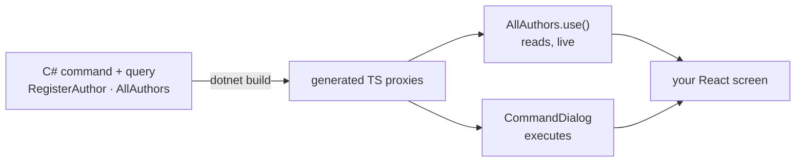

import { Steps, Aside } from '@astrojs/starlight/components';

You finished the [backend slice](/arc/backend/getting-started/your-first-command/): a `RegisterAuthor` command and an `AllAuthors` query, and `dotnet build` turned both into typed TypeScript proxies. Now for the other half — a React screen that lists authors and adds one.

Normally this is where the type safety ends. You'd hand-write a `fetch` wrapper, redeclare the request and response shapes in TypeScript, and hope the two sides stay in sync. Arc skips all of that: the proxies are generated *from your C#*, so the frontend already knows the exact types — and the compiler catches you the moment they drift. Let's read data and run a command through them.

## Prerequisites

- **The backend slice from [Your first command and query](/arc/backend/getting-started/your-first-command/)** — its `RegisterAuthor` command and `AllAuthors` query are what this screen calls.
- **A successful `dotnet build`** — that's what generates the TypeScript proxies the frontend imports.
- **A Vite + React app** with `@cratis/arc.react` and `@cratis/components` installed — the `dotnet new cratis` template scaffolds exactly that.

<Aside type="note" title="Backend first">
Proxies appear when you **build the backend** — until `dotnet build` succeeds, the proxy files don't exist. If you scaffolded with `dotnet new cratis`, the frontend and a sample feature are already wired; this page explains what's happening so you can add your own.
</Aside>



## Wire it up

<Steps>

1. **Initialize the bindings and mount the providers.** The `cratis` template gives you a Vite + React app with `@cratis/arc.react` and `@cratis/components` installed. Two things happen at startup — the generated bindings learn how to reach the backend, and the app is wrapped in the Cratis providers:

   ```tsx title="App.tsx"
   import { Bindings } from './Bindings';        // generated
   import { CratisComponentsProvider } from '@cratis/components';

   Bindings.initialize();

   export const App = () => (
       <CratisComponentsProvider>
           <YourRoutes />
       </CratisComponentsProvider>
   );
   ```

2. **Read data with a query.** The query you wrote in C# is generated as a typed proxy. Because `AllAuthors` is an **observable** query, the `.use()` hook re-renders the component whenever the underlying read model changes — live updates, no polling:

   ```tsx title="Authors.tsx"
   import { AllAuthors } from './Authors/Author';   // generated proxy

   export const Authors = () => {
       const [authors] = AllAuthors.use();
       return (
           <ul>
               {authors.data.map(a => <li key={String(a.id)}>{a.name}</li>)}
           </ul>
       );
   };
   ```

3. **Execute a command.** `CommandDialog` runs a generated command — it instantiates it, renders the form fields and the confirm/cancel buttons, and disables confirm while it executes:

   ```tsx title="AddAuthor.tsx"
   import { CommandDialog } from '@cratis/components/CommandDialog';
   import { InputTextField } from '@cratis/components/CommandForm';
   import { RegisterAuthor } from './Authors/RegisterAuthor';   // generated proxy

   export const AddAuthor = () => (
       <CommandDialog<RegisterAuthor> command={RegisterAuthor} title="Add author" okLabel="Add">
           <InputTextField<RegisterAuthor> value={i => i.name} title="Name" />
       </CommandDialog>
   );
   ```

</Steps>

## Where the type safety pays off

Look at the field accessor `i => i.name`. It isn't a string you typed and hope matches — it's a property on the generated `RegisterAuthor` type. Rename `Name` in the C# command, rebuild, and `i => i.name` stops compiling until you update it. The same goes for `a.name` on the query side. There's no second source of truth to drift, and no runtime surprise when a shape changes: the mismatch is a build error, on your machine, before anyone runs it.

And the form is wired to the live list for nothing extra — `AllAuthors.use()` is subscribed to the read model, so the moment the command writes, the list re-renders. You didn't write any of that plumbing.

## Recap

You initialized the generated **bindings**, read a read model through a typed, observable **query proxy**, and executed a typed **command** with `CommandDialog` — and the whole screen stays type-checked against the C# it came from. That round trip, C# to React and back, all typed, is the thing Arc exists to give you.

## Where to go next

- **[Build a full-stack feature](/build-a-full-app/)** — the same slice, end to end, backend and frontend together.
- Go deeper on the [React](./react/) integration, or the [MVVM with React](./react.mvvm/) approach for larger screens.
- Browse the building blocks in [Components](/components/).
