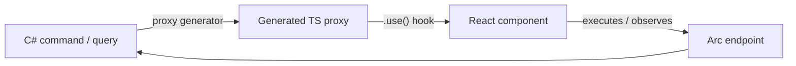

import { Aside, LinkCard, CardGrid } from '@astrojs/starlight/components';
import FullStackTabs from '@components/FullStackTabs.astro';

Building a React frontend against a backend usually means writing the same plumbing over and over: a
`fetch` call here, a hand-written request type there, validation rules copied from the server, and a
pile of state to track whether the request is in flight, succeeded, or failed. Every time the backend
changes, you go hunting for the frontend code that drifted out of sync.

Arc removes that whole layer. When you build a command or query in C#, Arc **generates a typed
TypeScript proxy** for it. On the frontend you import that proxy and call its `.use()` hook — the
request shape, the response shape, and the validation rules all come along, type-checked end to end.
Change the C# and the generated proxy changes with it, so the compiler catches the drift instead of
your users.

## How the pieces fit


```mermaid
flowchart LR
    CS["C# command / query"] -->|proxy generator| TS["Generated TS proxy"]
    TS -->|".use() hook"| RC["React component"]
    RC -->|executes / observes| API["Arc endpoint"]
    API --> CS
```

You write the backend once. The proxy generator runs on build and emits a typed client. Your React
code consumes it through each proxy's static `.use()` hook — and because the types flow across the
boundary, there is no DTO to keep in sync and no untyped JSON to second-guess.

## Execute a command from React

A command is an intent to change something — *open an account*, *check out a book*. You define it in
C#; Arc generates a proxy whose static `.use()` hook gives you an instance, explicit React value updates, change tracking,
and execution. The following paired fragments assume the application's `AccountId`, `AccountHolder`, `Account`, and MongoDB registration; they are not a complete backend bootstrap.

<FullStackTabs>
<Fragment slot="csharp">

```csharp
// Backend — the command and the read model it serves live together
[Command]
public record OpenAccount(AccountId Id, AccountHolder Owner)
{
    public Task Handle(IMongoCollection<Account> accounts) =>
        accounts.InsertOneAsync(new Account(Id, Owner));
}
```

</Fragment>
<Fragment slot="typescript">

```tsx
// Frontend — the generated proxy, driven by its static .use() hook
import { useState } from 'react';
import { Guid } from '@cratis/fundamentals';
import { OpenAccount } from './api/accounts/OpenAccount';

export const OpenAccountForm = () => {
    const [id] = useState(() => Guid.create());
    const [command, setValues] = OpenAccount.use({ id, owner: '' });
    const [saving, setSaving] = useState(false);
    const [saved, setSaved] = useState(false);
    const [message, setMessage] = useState('');

    const submit = async () => {
        setSaving(true);
        try {
            const result = await command.execute();
            setSaved(result.isSuccess);
            setMessage(result.isSuccess ? 'Account opened.' : 'Could not open account. You can retry.');
        } finally {
            setSaving(false);
        }
    };

    return (
        <>
            <input value={command.owner ?? ''} disabled={saving || saved}
                onChange={(e) => setValues({ owner: e.target.value })} />
            <button onClick={submit} disabled={saving || saved}>Open account</button>
            <p role="status">{message}</p>
        </>
    );
};
```

</Fragment>
</FullStackTabs>

The `.use()` hook returns `[command, setValues, clearValues]`. Use the setter for reliable per-edit React rendering; raw assignment is change tracking, not a guarantee of every render or automatic validation. Set required properties explicitly: here a Guid-based `AccountId` needs a Fundamentals `Guid`, created once for this operation. A reusable create form must start a fresh operation after success, as the [getting-started checkpoint](/arc/frontend/getting-started/) shows.

Call `command.execute()` and check `result.isSuccess`. The button tracks in-flight and successful completion explicitly, not `hasChanges`: a rejected request can update the change-tracking baseline, so that flag alone can disable a needed retry. See [execution baseline limitations](./react/commands/data-binding.md#execution-baseline-limitations). Supported projected validation rules run on the client; server validation remains authoritative. Not every backend rule can be projected.

<Aside type="tip" title="Don't hand-roll forms">
    For real forms, reach for the [Command form](./react/command-form/) fields and the
    [Components](/components/) library's `CommandDialog` instead of wiring inputs by hand — they bind to
    the command, surface validation, and handle the in-flight state for you.
</Aside>

## Show live data with an observable query

A query reads data. An *observable* query keeps reading — its `.use()` hook holds a live connection and
re-renders your component whenever the underlying read model changes, so your UI stays current without
polling.

```tsx
import { AllAccounts } from './api/accounts/AllAccounts';

export const AccountsList = () => {
    const [accounts] = AllAccounts.use();   // observable: re-renders as the read model changes

    return (
        <ul>
            {accounts.data.map((account) => (
                <li key={String(account.id)}>{account.owner}</li>
            ))}
        </ul>
    );
};
```

The result is a `QueryResultWithState` — `accounts.data` holds the rows, with `isPerforming`, `hasData`,
and validation state alongside. The backend must supply an emitting observable source, such as MongoDB `Observe()` or an optional Chronicle integration. When that source emits changed data, subscribed consumers receive the new list without polling. A command write alone does not establish this live connection; see [backend observable queries](/arc/backend/queries/model-bound/observable-queries/).

## Two ways to build: hooks or MVVM

Most screens are simplest with the **hooks** shown above — they keep state in the component and read
naturally. For complex, stateful screens you can opt into a **Model-View-ViewModel** structure that
moves logic into a view model class.

| Reach for… | When |
| --- | --- |
| [Hooks](./react/) | The default. Forms, lists, and most screens — less boilerplate, state stays in the component. |
| [MVVM for React](./react.mvvm/) | Complex screens with substantial view logic you want to test and reuse apart from the markup. |

Start with hooks; move a screen to MVVM only when its logic outgrows the component.

## Where to go next

<CardGrid>
    <LinkCard title="Getting started (React)" href="./getting-started/" description="Wire Arc into a React app and call your first command and query." />
    <LinkCard title="Commands in React" href="./react/commands/" description="The .use() hook, validation, and command scopes." />
    <LinkCard title="Queries in React" href="./react/queries/" description="Observable, paged, and conditional queries." />
    <LinkCard title="Command forms" href="./react/command-form/" description="Typed form fields that bind straight to a command." />
    <LinkCard title="Identity in React" href="./react/identity/" description="Who the user is and what they're allowed to do." />
    <LinkCard title="Components" href="/components/" description="Prebuilt dialogs, forms, and tables that consume these proxies." />
</CardGrid>
