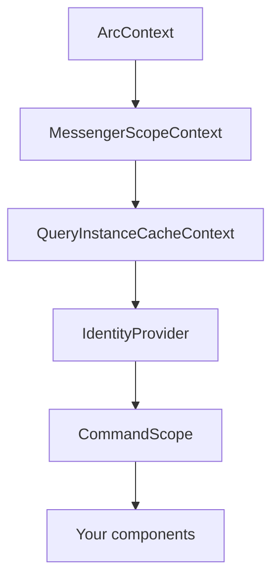

Mount `<Arc>` above your command and query consumers so they share runtime configuration. It initializes bindings; you do not need a generated startup module.

```tsx
import { Arc } from '@cratis/arc.react';

export const App = () => <Arc><main>Your application</main></Arc>;
```

## Context nesting

Arc supplies these contexts, from outside to inside:



`QueryScope` is not included: add it where you need a query-loading callback. An optional Components provider does not replace Arc.

## Configuration options

| Prop | Type | Default / purpose |
| --- | --- | --- |
| `microservice` | `string` | `''`; service identifier for a configured ingress |
| `development` | `boolean` | `false` |
| `origin` | `string` | `''`; current origin |
| `basePath` | `string` | `''`; application base path |
| `apiBasePath` | `string` | `''`; additional API path prefix; do not duplicate the proxy route's `/api` |
| `httpHeadersCallback` | `() => HeadersInit` | Extra headers on fetch paths, not native streaming handshakes |
| `eventSourceFactory` | `(url: string) => EventSource` | Override the SSE client constructor |
| `queryTransportMethod` | `QueryTransportMethod` | `ServerSentEvents` |
| `queryDirectMode` | `boolean` | `false`; use shared hubs |
| `queryConnectionCount` | `number` | `1`; hub connection slots (SSE capped at four) |
| `observableQueryTransferMode` | `ObservableQueryTransferMode` | `Delta`; see [change streams](./queries/change-stream.md) |
| `queryCacheRetentionMs` | `number` | `30000`; retention after the last cache consumer releases an entry |

`observableQueryDiagnostics` is a service exposed **on `ArcContext`**, not an `<Arc>` prop. See [diagnostics](./queries/observable-query-diagnostics.md).

## Microservice support

`microservice` supplies routing metadata in request headers or transport messages/query parameters. Your ingress must understand that metadata; Arc cannot configure the gateway for you.

### Multiple microservices in one frontend

Nested providers create separate context values, caches, and messengers, and hook-created commands/queries receive some per-instance settings. However, bindings also write **module-global** transport/header/identity configuration. Multiplexed observables use one shared multiplexer; switching its service/configuration key disposes the previous one.

Do not use nested `<Arc>` providers as a guarantee of independent authenticated hubs or isolated identity contexts. Defaults are not inherited either: an inner provider with no `apiBasePath` uses `''`, not its parent's value. Simultaneous services with different origins or credentials need an independently verified integration. Isolated multiplexer ownership and global configuration removal are runtime follow-up candidates, not behavior promised by the current provider.

## HTTP headers callback

Use `httpHeadersCallback` for dynamic headers on fetch requests. The callback does not change browser restrictions on streaming constructors:

| Request path | Callback headers | Credentials |
| --- | --- | --- |
| Command, ordinary query, identity fetch | Yes | Browser-managed cookies according to fetch/origin policy; callback may supply Authorization |
| SSE hub subscribe/unsubscribe POST | Yes, from global bindings | Separate fetch requests using the default credential mode, not `credentials: 'include'`; a credentialed SSE factory does not configure these POSTs |
| Native EventSource handshake, direct or hub | No | Browser-managed cookies; cross-origin credentialed SSE needs an appropriate factory and server CORS |
| Native WebSocket handshake, direct or hub | No | Browser-managed cookies under browser policy; no arbitrary Authorization header option |

Do not attempt to set `Cookie` through the callback: it is a forbidden browser request header. A custom EventSource factory receives the URL only; any extra authentication capability belongs to that implementation and must be configured explicitly. See [query configuration](./queries/configuration.md#custom-eventsource-factory).

## Reconnecting queries

After your authentication system completes login or logout, call `reconnectQueries()` to replace observable connections. New handshakes use whatever credentials the browser actually has at that point; callback bearer headers still do not become native streaming headers.

This illustrative control accepts an application-owned sign-out function. That function must complete real sign-out, including the server/identity-provider session where applicable:

```tsx
import { useContext } from 'react';
import { ArcContext } from '@cratis/arc.react';
import { useIdentity } from '@cratis/arc.react/identity';

export function SignOut({ signOut }: { signOut: () => Promise<void> }) {
    const arc = useContext(ArcContext);
    const identity = useIdentity();

    async function logout() {
        await signOut();
        identity.clearIdentity();
        arc.reconnectQueries?.();
    }

    return <button onClick={() => void logout()}>Sign out</button>;
}
```

Clearing identity removes the UI cache cookie, **not** authentication cookies, tokens, or server sessions. Reconnection is not sign-out and does not guarantee an anonymous result.

### What happens internally

Reconnection tears down subscriptions in this provider's query cache without evicting their data, resets the **shared** multiplexer, and increments a query version so observable effects resubscribe. Cached data can remain visible; do not treat reconnecting as a secure data purge. The shared reset can also affect other providers.

Continue with [identity](./identity.md), [query scopes](./queries/scope.md), or the [transport protocol](./queries/observable-query-multiplexing.md).
