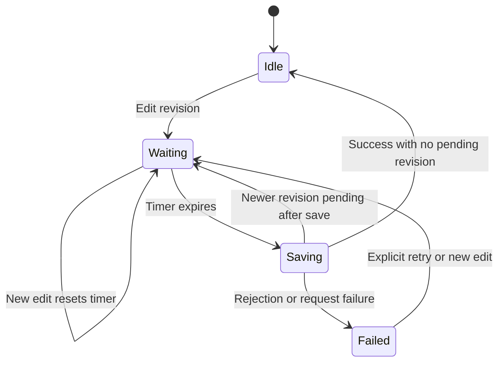

Once fields are bound, keep extensions on the same form instance. A preview reads context; a dialog footer uses the form handle. Neither needs an independently constructed command.

## Computed fields

This complete component expects a generated `CreateInvoice` with numeric `quantity` and `unitPrice` properties. The total is a **display preview**, not a trusted price calculation or a persisted command field.

```tsx
import { CommandForm, NumberField, useCommandInstance } from '@cratis/arc.react/commands';
import { CreateInvoice } from './commands/CreateInvoice';

function InvoicePreview() {
    const command = useCommandInstance<CreateInvoice>();
    const total = command.quantity * command.unitPrice;
    return <output aria-live="polite">Preview total: {total.toFixed(2)}</output>;
}

export function InvoiceForm() {
    return (
        <CommandForm command={CreateInvoice} initialValues={{ quantity: 1, unitPrice: 0 }}>
            <NumberField<CreateInvoice> value={c => c.quantity} title="Quantity" min={1} step={1} />
            <NumberField<CreateInvoice> value={c => c.unitPrice} title="Unit price" min={0} step={0.01} />
            <InvoicePreview />
            <button type="submit">Create invoice</button>
        </CommandForm>
    );
}
```

The descendant rerenders after form field edits and reads their current values. Enforce valid quantities and authoritative prices in the backend; numeric input attributes and a JavaScript preview are not business validation. If you transform command values before execution, return the existing instance synchronously from [onBeforeExecute](./form-lifecycle.md#before-execute-hook).

## Integration with external libraries

For a modal, page toolbar, or wizard footer, use the complete [parent-control example](./form-lifecycle.md#reaching-the-form-from-a-parent). It supplies both `formRef` (execution) and `onStateChange` (reactive busy state), and routes keyboard submission through the same confirmation gate.

Keep the modal's open/close state in its owning component. Close only after `result.isSuccess` or `onSuccess`; validation or authorization failure should leave the edited form available for correction. Use the dialog API from your installed UI package rather than an invented modal abstraction. [Arc dialogs](../dialogs.md) and an optional Components integration are separate presentation choices; neither changes the CommandForm context boundary.

Load edit data with [query population](./data-loading.md#populating-a-form-from-a-query) or mount the form with resolved initial values. Passing a separate command instance as `initialValues` does not make that instance the form's executable command, and spreading a generated command does not copy its accessor-backed properties.

## Autosave boundaries

An edit revision, not `hasChanges`, is the unit of autosave work. Use the form's `commandVersion` or actual values to reset a timer. The following diagram is an **application design outline**, not a built-in Arc autosave API:



Your implementation must decide how to snapshot edits, serialize requests, handle retries, preserve edits made during a save, and avoid resaving a failed revision in a loop. Run execution through the form to preserve its callbacks. Keep a last-successful revision or value snapshot outside the command when you need an accurate “saved” indicator.

Current limitation: `Command.execute()` snapshots its baseline after a completed server request even when that result failed; its snapshot helper skips falsy values. It is therefore unsafe to infer persisted state solely from `hasChanges`. CommandForm also does not prevent overlapping submissions. These are runtime boundaries to account for, not behaviors a documentation example can repair.

## Check the behavior

Exercise empty, invalid, valid, in-flight, and rejected states. Also test rapid edits, responses arriving out of order, unmount while loading, keyboard submit, and canceling confirmation. A successful build does not establish that the edited values—not an independent command—were submitted.

## See also

- [Layouts](./layouts.md)
- [Working with hooks](./hooks.md)
- [Validation](./validation.md)
- [Form lifecycle](./form-lifecycle.md)
