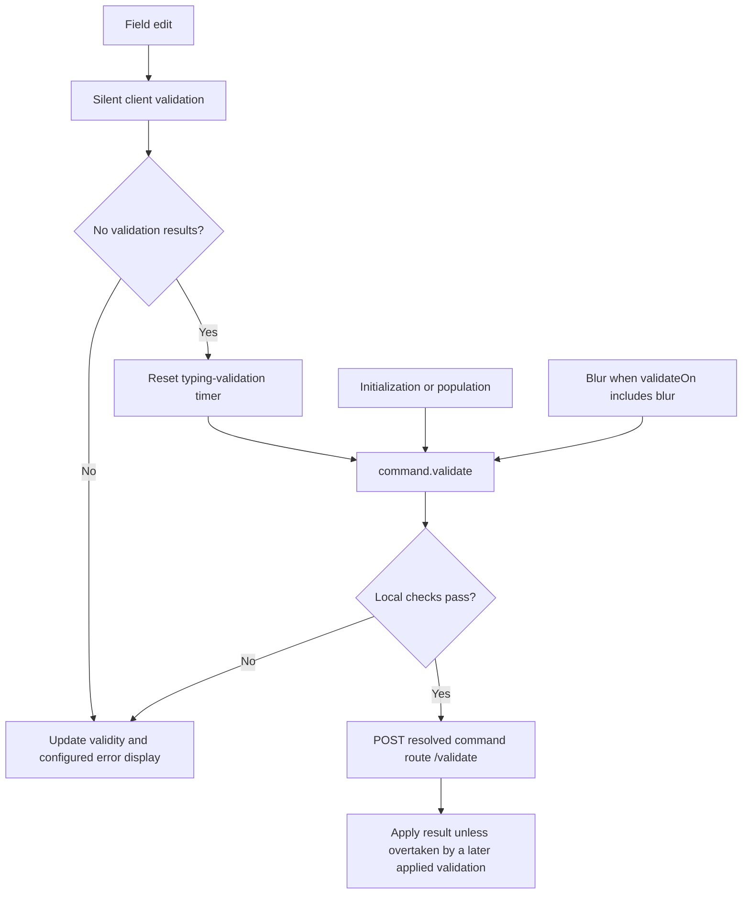

A name or email can pass local formatting rules and still fail a database-backed rule. Enable `autoServerValidate` to surface such server-only failures while the user fills out the form. It is optional and defaults to `false`; ordinary submission always validates on the server when local validation passes.

## Enable preflight feedback

This complete component uses the generated `UpdateProfile` from the [validation example](./validation.md#backend-validation). Configure Arc and generate the proxy before using it.

```tsx
import { CommandForm, InputTextField, useIsCommandExecuting } from '@cratis/arc.react/commands';
import { UpdateProfile } from './commands/UpdateProfile';

function SubmitButton() {
    const isExecuting = useIsCommandExecuting();
    return <button type="submit" disabled={isExecuting}>{isExecuting ? 'Saving…' : 'Save'}</button>;
}

export function ProfileForm() {
    return (
        <CommandForm
            command={UpdateProfile}
            initialValues={{ name: '', email: '' }}
            validateOn="change"
            autoServerValidate
            autoServerValidateThrottle={500}
        >
            <InputTextField<UpdateProfile> value={c => c.name} title="Name" />
            <InputTextField<UpdateProfile> value={c => c.email} title="Email" type="email" />
            <SubmitButton />
        </CommandForm>
    );
}
```

After locally valid edits settle, the form calls the generated command's `validate()` and displays returned field errors. The validation request uses the command's resolved route with `/validate` appended; use the generated route rather than guessing a kebab-case URL. This requires an Arc command endpoint, not an arbitrary JSON validation service.

## Validation flow



The typing timer is a **debounce**, despite the prop's `Throttle` name: another edit clears the pending timer. The default is 500 ms; a value of zero removes the delay on this path. Choose a longer delay for expensive checks.

The delay is **not a global request limiter**. With `autoServerValidate` enabled, initialization/population and eligible blur validation also call `validate()` and are not delayed by that timer. `validateOnInit={false}` only hides initial error display; it does not prevent the initialization check. `validateOn` controls interaction error display, while silent client validation runs on each edit. Do not promise exactly one request per typing burst or per form.

## Add a server-only rule

First define an actual endpoint, such as `UpdateProfile` in [Backend validation](./validation.md#backend-validation). A standalone DTO and validator alone are not this model-bound endpoint.

The following **application integration fragment** replaces that example's validator. It compiles alongside `UpdateProfile`; to run it, supply and register your application's `IProfileDirectory` implementation. `IsEmailAllowed` must apply your own profile/tenant policy, including allowing an unchanged email for an existing profile.

```csharp
using System.Threading;
using System.Threading.Tasks;
using Cratis.Arc.Commands;
using FluentValidation;

namespace MyApp.Profiles;

public interface IProfileDirectory
{
    Task<bool> IsEmailAllowed(EmailAddress email, CancellationToken cancellationToken);
}

public class UpdateProfileValidator : CommandValidator<UpdateProfile>
{
    public UpdateProfileValidator(IProfileDirectory profiles)
    {
        RuleFor(command => command.Name)
            .NotEmpty().MinimumLength(3).MaximumLength(100);
        RuleFor(command => command.Email)
            .MustAsync((command, _, cancellationToken) => profiles.IsEmailAllowed(command.Email, cancellationToken))
            .WithMessage("This email cannot be used for this profile.");
    }
}
```

Keep the `EmailAddressValidator` from the linked example: it owns the required/format rules. Arc's concept-aware `RuleFor` unwraps the property, so the three-argument `MustAsync` overload reads the named `command.Email` from the command when calling the application service. The asynchronous directory rule remains server-side; the name rules and concept's supported format rules can be generated for the client. `MinimumLength` and `MaximumLength` are FluentValidation method names. No `minLength`, `maxLength`, or `pattern` props are supported on the built-in `InputTextField`.

A server preflight runs pipeline filters and validators but skips the command handler and handler-argument resolution. Validators and filters must avoid unwanted side effects and disclosing sensitive information. A successful check does not reserve an email or enforce uniqueness under concurrent writes: enforce that invariant when the application performs the write as well.

## Read the response

Arc returns a command result with a `validationResults` array, not a `validationErrors` dictionary. This is an **illustrative failure envelope**; the correlation ID and rule message are example values:

```json
{
  "correlationId": "34c66385-006a-4ab6-a3f9-cb34c751ec30",
  "isSuccess": false,
  "isValid": false,
  "isAuthorized": true,
  "hasExceptions": false,
  "validationResults": [
    {
      "severity": 3,
      "message": "This email cannot be used for this profile.",
      "members": ["email"],
      "state": null,
      "reason": "rule"
    }
  ],
  "exceptionMessages": [],
  "exceptionStackTrace": "",
  "authorizationFailureReason": "",
  "response": null
}
```

A failed preflight has no command response to consume; some server results omit that optional member rather than returning null. CommandForm matches `members` to fields and displays the first matching message by default. Use an [error summary](./validation.md#accessing-validation-state) for all messages or results without members.

## Limits and operating guidance

- `isExecuting` reports **execution**, not preflight network activity. CommandForm currently exposes no validation-pending/loading state. Do not label it “Checking availability.”
- A previous validity verdict can remain while a new request runs. Internal issue tokens reject results overtaken by later applied validation, but do not guarantee every visible verdict describes the latest edit. For a custom gated UI, use the [revision-guarded pattern](./validation.md#progressive-validation).
- Preflight may short-circuit on client rules; it does not always reach server authorization. Execution must validate and authorize again.
- The timer reduces traffic; it does not stop abuse. Configure ASP.NET Core rate-limiting middleware/policies or equivalent gateway controls in your application and verify they cover the generated validation endpoint. Arc does not provide the previously illustrated `RateLimitAttribute(MaxRequests, TimeWindowSeconds)` API.
- Keep lookups indexed and bounded. Cache only with correct tenant/user keys and expiration; stale cached availability is advisory, never write-time enforcement.
- Prefer submit-only validation for expensive endpoints or rules whose answers reveal private data. Handle request failures without treating them as success.

## See also

- [Validation](./validation.md)
- [Backend command validation](../../../backend/commands/command-validation.md)
- [Form lifecycle](./form-lifecycle.md)
- [Customization](./customization.md)
