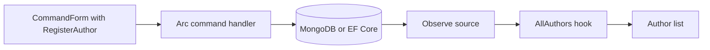

import { Aside } from '@astrojs/starlight/components';

You have a backend that registers authors and streams an author list. Let's put a screen in front of it without writing a second API contract in TypeScript, and without wiring `value`, `onChange`, pending state, and result handling by hand for every input. Arc's generated proxies provide the request types and React hooks. Arc's `CommandForm` owns the command instance, its execution, and its feedback. Cratis Components supplies the styled, accessible fields that go inside it. Chronicle is not required.

By the end of this page you'll type a name, submit it, and watch the author list update without a refresh.

## Prerequisites

Complete [Your first command and query](/arc/backend/csharp/getting-started/your-first-command/) and generate its proxies with a Debug build. You need a Vite + React 19 app with `react`, `react-dom`, `@cratis/fundamentals`, `@cratis/arc`, and `@cratis/arc.react` installed.

Add Components and its required peers:

```bash
npm install @cratis/components@^4 reflect-metadata@0.2.2 tsyringe@4.10.0
```

Keep `@cratis/arc` and `@cratis/arc.react` on the version your generated proxies were produced with, within Components' peer range (`>=20.3.1 <23`). See [Components setup](/components/getting-started/) for strict installers and other options. To start without Components, see [Without Components](#without-components).

The checkpoint below imports from `./Authors/RegisterAuthor` and `./Authors/Author`, where the backend setup's source-file grouping places the `AllAuthors` query beside the `Author` type. Without `CratisProxiesUseSourceFileAsOutputFile`, each query gets its own file, so import `AllAuthors` from `./Authors/AllAuthors` instead. Match the paths to your configured output directory and namespace mapping. There is **no generated `Bindings` startup file**.

## Load the Components styles

Import the Components stylesheets once, at the top of your existing entry point, with `tokens` first:

```tsx title="src/main.tsx (excerpt)"
import 'reflect-metadata';
import '@cratis/components/tokens';
import '@cratis/components/styles';
import '@cratis/components/theme';
```

`tokens` supplies shared CSS variables, `styles` supplies component structure, and `theme` adds the baseline appearance, including dark mode. The stylesheet subpaths ship no type declarations, so current TypeScript releases report `TS2882` for each import. Declare them once in `src/cratis-components-styles.d.ts`:

```typescript title="src/cratis-components-styles.d.ts"
declare module '@cratis/components/tokens';
declare module '@cratis/components/styles';
declare module '@cratis/components/theme';
```

## Mount Arc and the author screen

Put this component in `App.tsx` and render it from your entry point:

```tsx title="src/App.tsx"
import { useState } from 'react';
import { Guid } from '@cratis/fundamentals';
import { Arc } from '@cratis/arc.react';
import { CommandForm, useIsCommandExecuting } from '@cratis/arc.react/commands';
import { CratisComponentsProvider } from '@cratis/components';
import { InputTextField } from '@cratis/components/CommandForm';
import { AllAuthors } from './Authors/Author';
import { RegisterAuthor } from './Authors/RegisterAuthor';

function RegisterButton() {
    const isExecuting = useIsCommandExecuting();
    return <button type="submit" disabled={isExecuting}>Register author</button>;
}

function Authors() {
    const [authors] = AllAuthors.use();
    const [id, setId] = useState(() => Guid.create());
    const [message, setMessage] = useState('');

    return (
        <section>
            <h1>Authors</h1>
            {!authors.isReady || authors.isPerforming
                ? <p>Loading authors…</p>
                : !authors.isSuccess
                    ? <p>Could not load authors.</p>
                    : <ul>{authors.data.map(author => (
                        <li key={String(author.id)}>{author.name}</li>
                    ))}</ul>}
            <CommandForm<RegisterAuthor>
                key={String(id)}
                command={RegisterAuthor}
                initialValues={{ id }}
                onSuccess={() => {
                    setMessage('Author registered.');
                    setId(Guid.create());
                }}
                onFailed={() => setMessage('Registration failed. Check the name and your permissions.')}>
                <InputTextField<RegisterAuthor> value={c => c.name} title="Name" />
                <RegisterButton />
            </CommandForm>
            <p role="status">{message}</p>
        </section>
    );
}

export const App = () => (
    <Arc>
        <CratisComponentsProvider>
            <Authors />
        </CratisComponentsProvider>
    </Arc>
);
```

Here is what you did not write. `CommandForm` creates one `RegisterAuthor` instance from the generated class and seeds it from `initialValues`. `InputTextField` binds to `name` through the typed accessor `c => c.name`, so there is no `value`/`onChange` pair to keep in sync. Submitting the form executes the command, shows validation messages beside the field they belong to, and shows a safe message when the server throws. `RegisterButton` renders **inside** the form, so `useIsCommandExecuting()` reads that form's in-flight state; the same hook called in `Authors` would be outside the form and throw.

The backend requires both `Id` and `Name`. Its `AuthorId` concept maps to a Fundamentals `Guid` in the generated command. Create an ID **once per new registration**, keep it while editing or retrying, and generate the next one only after success. The user never types the ID, so it belongs in `initialValues`. Changing `initialValues` after mount does not repopulate the form, which is why the form is keyed by the ID: a new ID after success mounts a fresh form with an empty name.

`<Arc>` initializes the runtime bindings and provides command, identity, messaging, and query-cache contexts. `CratisComponentsProvider` supplies Components' locale and labels; it does not replace `<Arc>`.

With no origin configured, requests target your current origin, so the Vite dev server must forward Arc's routes to the backend. Add both prefixes to your existing `vite.config.ts`, pointing at the port the backend checkpoint uses:

```typescript title="vite.config.ts (excerpt)"
server: {
    proxy: {
        '/api': { target: 'http://localhost:5000' },
        '/.cratis': { target: 'http://localhost:5000', ws: true }
    }
}
```

`/api` carries the command and query requests; `/.cratis` carries the observable-query stream (Server-Sent Events by default) and identity. See [Vite configuration](./vite-configuration.md) for the other options.

## Check the round trip

Start the backend and frontend. You should see the author list, enter a name, and see “Author registered.” after a successful submission, with an empty name field ready for the next author. The list updates when the backend's `Observe()` source emits the changed collection: MongoDB change streams, or EF Core's `SaveChanges` notifications in the same host. Arc transports those emissions; executing a command alone does not create a persistence subscription.



<Aside type="note" title="This backend accepts a blank name">
The backend checkpoint has no validation rules yet, so a blank name is registered. When you add rules on the backend, `CommandForm` shows their messages beside the field without further frontend code. Keep authoritative rules on the backend; see [Command form validation](./command-form/validation.mdx).
</Aside>

## Without Components

Components is optional for Arc. If you don't want the Components package, stylesheets, and provider, Arc ships its own basic field set that works inside the same `CommandForm`. That is the shorter route: skip the Components install and styles, remove `CratisComponentsProvider`, and take `InputTextField` from Arc instead:

```tsx
import { CommandForm, InputTextField, useIsCommandExecuting } from '@cratis/arc.react/commands';
```

The rest of `App.tsx` stays the same. See [CommandForm field types](./command-form/field-types/index.md) for the other built-in fields.

### Own the whole sequence yourself

When an application must control every step itself, such as a design system whose inputs cannot be wrapped as command form fields, you can drive the generated command hook directly. This is the longer route: you bind every input and track the pending state and the result yourself, which `CommandForm` does for you above. The component replaces `Authors` from the Components version:

```tsx
import { useState } from 'react';
import { Guid } from '@cratis/fundamentals';
import { AllAuthors } from './Authors/Author';
import { RegisterAuthor } from './Authors/RegisterAuthor';

function Authors() {
    const [authors] = AllAuthors.use();
    const [id, setId] = useState(() => Guid.create());
    const [command, setValues] = RegisterAuthor.use({ id, name: '' });
    const [saving, setSaving] = useState(false);
    const [message, setMessage] = useState('');

    async function register() {
        setSaving(true);
        try {
            const result = await command.execute();
            if (result.isSuccess) {
                const nextId = Guid.create();
                setId(nextId);
                command.setInitialValues({ id: nextId, name: '' });
                setValues({ id: nextId, name: '' });
                setMessage('Author registered.');
            } else {
                setMessage('Registration failed. Check the name and your permissions.');
            }
        } finally {
            setSaving(false);
        }
    }

    return (
        <section>
            <h1>Authors</h1>
            {!authors.isReady || authors.isPerforming
                ? <p>Loading authors…</p>
                : !authors.isSuccess
                    ? <p>Could not load authors.</p>
                    : <ul>{authors.data.map(author => (
                        <li key={String(author.id)}>{author.name}</li>
                    ))}</ul>}
            <form onSubmit={event => { event.preventDefault(); void register(); }}>
                <label>
                    Name
                    <input value={command.name ?? ''} disabled={saving}
                        onChange={event => setValues({ name: event.target.value })} />
                </label>
                <button disabled={saving}>Register author</button>
                <p role="status">{message}</p>
            </form>
        </section>
    );
}
```

Mount it with `<Arc><Authors /></Arc>`. The hook reads initial values when it creates the command, not on every render, so after success the component resets both the change-tracking baseline and the current values to the next ID. Validation messages are not displayed here; read them from the result yourself. See [Commands in React](./commands/react-usage.md) for the hook contract.

## Parameterized queries

When you add a generated `BooksForAuthor` query with an `authorId` parameter, pass an argument object, not the ID directly. This illustrative component fragment assumes that query and its book model already exist:

```tsx
const [books] = BooksForAuthor.use({ authorId });
```

Only enumerable queries expose paging variants. See the [hook signature reference](./queries/usage.mdx) before switching query shapes.

## Where to go next

- [Command forms](./command-form/) cover field types, validation timing, loading form data, and lifecycle callbacks.
- [Components](/components/) adds `CommandDialog`, data tables, and other command and query surfaces on top of the same proxies.
- [Build your first full-stack slice](/arc/tutorial/first-slice/) opens the same command in a `CommandDialog` and threads the author domain through the tutorial.
- [MVVM with React](./mvvm/) separates larger screens from their view logic.
- [Build a full-stack feature](/build-a-full-app/) continues the complete application workflow.
