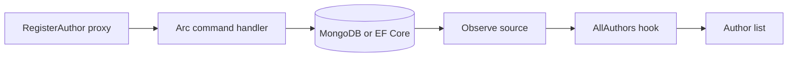

import { Aside } from '@astrojs/starlight/components';

You have a backend that registers authors and streams an author list. Let's put a screen in front of it without writing a second API contract in TypeScript. Arc's generated proxies provide the request types and React hooks; ordinary HTML is enough for this lesson. Chronicle and Components are optional, not prerequisites.

## Prerequisites

Complete [Your first command and query](/arc/backend/csharp/getting-started/your-first-command/) and generate its proxies with a Debug build. You need a Vite + React app with `react`, `react-dom`, `@cratis/fundamentals`, `@cratis/arc`, and `@cratis/arc.react` installed.

The checkpoint below imports from `./Authors/RegisterAuthor` and `./Authors/Author`, where the backend setup's source-file grouping places the `AllAuthors` query beside the `Author` type. Without `CratisProxiesUseSourceFileAsOutputFile`, each query gets its own file, so import `AllAuthors` from `./Authors/AllAuthors` instead. Match the paths to your configured output directory and namespace mapping. There is **no generated `Bindings` startup file**.

## Mount Arc and the author screen

Put this component in `App.tsx` and render it from your existing React entry point:

```tsx
import { useState } from 'react';
import { Guid } from '@cratis/fundamentals';
import { Arc } from '@cratis/arc.react';
import { AllAuthors } from './Authors/Author';
import { RegisterAuthor } from './Authors/RegisterAuthor';

function Authors() {
    const [authors] = AllAuthors.use();
    const [id, setId] = useState(() => Guid.create());
    const [command, setValues] = RegisterAuthor.use({ id, name: '' });
    const [saving, setSaving] = useState(false);
    const [message, setMessage] = useState('');

    async function register() {
        setSaving(true);
        try {
            const result = await command.execute();
            if (result.isSuccess) {
                const nextId = Guid.create();
                setId(nextId);
                command.setInitialValues({ id: nextId, name: '' });
                setValues({ id: nextId, name: '' });
                setMessage('Author registered.');
            } else {
                setMessage('Registration failed. Check the name and your permissions.');
            }
        } finally {
            setSaving(false);
        }
    }

    return (
        <section>
            <h1>Authors</h1>
            {!authors.isReady || authors.isPerforming
                ? <p>Loading authors…</p>
                : !authors.isSuccess
                    ? <p>Could not load authors.</p>
                    : <ul>{authors.data.map(author => (
                        <li key={String(author.id)}>{author.name}</li>
                    ))}</ul>}
            <form onSubmit={event => { event.preventDefault(); void register(); }}>
                <label>
                    Name
                    <input value={command.name ?? ''} disabled={saving}
                        onChange={event => setValues({ name: event.target.value })} />
                </label>
                <button disabled={saving || !command.name?.trim()}>Register author</button>
                <p role="status">{message}</p>
            </form>
        </section>
    );
}

export const App = () => <Arc><Authors /></Arc>;
```

`<Arc>` initializes the runtime bindings and provides command, identity, messaging, and query-cache contexts. With no origin configured, requests target your current origin, so the Vite dev server must forward Arc's routes to the backend. Add both prefixes to your existing `vite.config.ts`, pointing at the port the backend checkpoint uses:

```typescript title="vite.config.ts (excerpt)"
server: {
    proxy: {
        '/api': { target: 'http://localhost:5000' },
        '/.cratis': { target: 'http://localhost:5000', ws: true }
    }
}
```

`/api` carries the command and query requests; `/.cratis` carries the observable-query stream (Server-Sent Events by default) and identity. See [Vite configuration](.././react/vite-configuration.md) for the other options.

The backend requires both `Id` and `Name`. Its `AuthorId` concept maps to a Fundamentals `Guid` in the generated command. Create an ID **once per new registration**, keep it while editing or retrying, and generate the next one only after success. Generated properties do not initialize themselves. The hook reads initial values when it creates the command, not on every render.

## Check the round trip

Start the backend and frontend. You should see the author list, enter a name, and see “Author registered.” after a successful submission. The list updates when the backend's `Observe()` source emits the changed collection: MongoDB change streams, or EF Core's `SaveChanges` notifications in the same host. Arc transports those emissions; executing a command alone does not create a persistence subscription.



<Aside type="note" title="UI checks are not server validation">
The disabled button is a convenience, not an authorization or validation boundary. Keep authoritative rules on the backend. For field-level messages and submission lifecycle handling, continue with [Command forms](.././react/command-form/).
</Aside>

## Parameterized queries

When you add a generated `BooksForAuthor` query with an `authorId` parameter, pass an argument object, not the ID directly. This illustrative component fragment assumes that query and its book model already exist:

```tsx
const [books] = BooksForAuthor.use({ authorId });
```

Only enumerable queries expose paging variants. See the [hook signature reference](.././react/queries/usage.mdx) before switching query shapes.

## Where to go next

- [Command forms](.././react/command-form/) provide typed fields and validation feedback.
- [Components](/components/) adds optional dialogs and tables. Its provider does not replace `<Arc>`.
- [MVVM with React](./mvvm/) separates larger screens from their view logic.
- [Build a full-stack feature](/build-a-full-app/) continues the complete application workflow.
