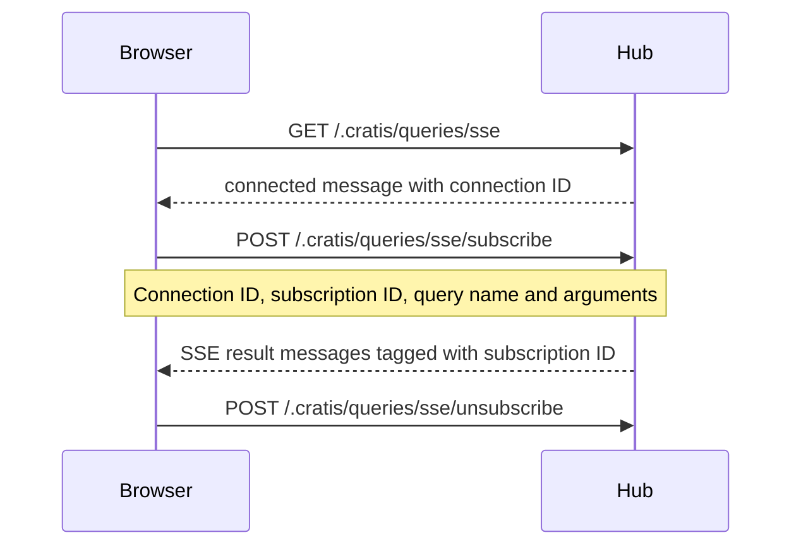

A screen with many live queries does not need one persistent connection per query. Hub mode shares transport connections and routes each result to its subscription. Direct mode remains useful for per-query debugging or hosts without hub endpoints.

## How it works

The two configuration choices are independent:

| `queryTransportMethod` | `queryDirectMode` | Connection and subscription path |
| --- | --- | --- |
| `ServerSentEvents` | `false` | Shared EventSource hub at `/.cratis/queries/sse`; subscribe/unsubscribe through POSTs |
| `WebSocket` | `false` | Shared WebSocket hub at `/.cratis/queries/ws`; subscribe/unsubscribe through socket messages |
| `ServerSentEvents` | `true` | EventSource to each query's own URL |
| `WebSocket` | `true` | WebSocket to each query's own URL |

Paths above are relative to the configured origin/API base path. `<Arc>` defaults to SSE hub mode with one connection slot. The core `Globals` transport default, before React bindings initialize it, is WebSocket.

### SSE hub connection

The streaming GET does **not** subscribe with `?query=Name`. After the connection handshake supplies a connection ID, the client submits control requests:



Multiple subscriptions share that EventSource. Reconnection and resubscription are managed by the client. For payloads and server authorization, use the [hub protocol reference](../../../backend/queries/observable-query-demultiplexer.md).

### WebSocket hub connection

The client sends typed subscription messages over the shared WebSocket and routes incoming results by subscription ID. It does not issue SSE control POSTs. Both transport handshakes are subject to browser credential restrictions; see [HTTP headers](../arc.md#http-headers-callback).

## Configuring transport and mode

This configuration fragment selects direct SSE; direct mode does not implicitly mean WebSocket:

```tsx
import { Arc } from '@cratis/arc.react';
import { QueryTransportMethod } from '@cratis/arc/queries';

export const App = () => (
    <Arc queryTransportMethod={QueryTransportMethod.ServerSentEvents} queryDirectMode={true}>
        <main>Your query components</main>
    </Arc>
);
```

For normal shared-hub use, leave `queryDirectMode` false. `queryConnectionCount` configures pool slots, not subscriptions; direct mode does not use the pool.

### SSE connection limit (HTTP/1.1)

The client unconditionally caps SSE **hub** connections at four and warns if you request more. This leaves room for control POSTs and ordinary fetches in browsers with HTTP/1.1 per-origin connection limits. HTTP/2 changes network multiplexing but **does not remove Arc's current four-slot cap**. Direct SSE connections are not protected by this pool cap.

WebSocket hub pools do not use this SSE cap. More slots are not automatically faster; measure your workload before increasing the count.

## Provider ownership

The multiplexer is module-global, not isolated per nested `<Arc>`. Changing its origin/service/configuration key disposes the previous shared multiplexer. Do not use provider nesting as a guarantee of simultaneous independent authenticated hubs. See [provider limitations](../arc.md#multiple-microservices-in-one-frontend).

## Controlling change-stream transfer mode

`observableQueryTransferMode` is included in shared-hub subscription requests. Full mode asks the server for full snapshots; Delta mode sends an initial snapshot followed by delta-only collection updates. The same global setting controls fallback handling in `useChangeStream`; server-provided changesets take precedence over that fallback. Set it before establishing subscriptions, not as a per-provider isolation mechanism. It does not select SSE versus WebSocket. See [change streams](./change-stream.md) and the [observable Suspense delta limitation](./suspense-queries.md#observable-collections-and-delta-only-updates).

## See also

- [Query configuration](./configuration.md)
- [Query instance caching](./query-instance-caching.md)
- [Backend observable hub](../../../backend/queries/observable-query-demultiplexer.md)
- [Vite configuration](../vite-configuration.md)
