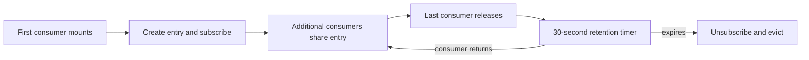

Navigating away from a live list and back should not always start from an empty screen. Arc retains query instances and last-known data, but instance reuse and request deduplication are different contracts.

## How it works

`<Arc>` creates one `QueryInstanceCache` per mount. Keys use the generated stable `queryName` and JSON-serialized arguments with top-level keys sorted. The cache class does not itself include origin, credentials, paging, or sorting in that key; do not treat it as an isolation boundary for independent views or users.

| Hook family | Shared instance | Network/results |
| --- | --- | --- |
| `useObservableQuery` | Yes, for the same cache key | Shares subscription ownership and registers cache listeners for updates |
| `useQuery` | Yes | Each enabled mount performs a request; no cache-listener broadcast to all mounted consumers |
| Suspense hooks | Separate module-level resource caches | See [Suspense queries](./suspense-queries.md); not governed by this cache's retention setting |

An ordinary query cache hit can seed a new component with successful cached data, but it does not eliminate the new request. Concurrent consumers can interact through the same mutable query instance; do not assume independent paging/sorting or request lifetimes merely because they are different components.

## Lifecycle

When the last consumer releases an entry, Arc schedules eviction after `queryCacheRetentionMs`, **30,000 ms by default**. Cached data and an established observable subscription remain alive during that window. A new consumer cancels pending eviction and can reuse them. On expiry the entry is removed and its subscription torn down.



Configure retention once when mounting Arc:

```tsx
import { Arc } from '@cratis/arc.react';

export const App = () => (
    <Arc queryCacheRetentionMs={60_000}>
        <main>Your query components</main>
    </Arc>
);
```

A value of zero schedules eviction without the retention delay. A cache entry expiring does not imply every pooled hub connection immediately closes.

## React StrictMode compatibility

Reacquiring an entry cancels its cleanup timer. Provider teardown also defers disposal so an immediate remount can cancel it. That provider-disposal mechanism is distinct from the per-entry retention window; normal last-consumer release is not always `setTimeout(0)`.

## Relationship with the conditional when hook

Disabled non-Suspense hooks still create/look up and acquire cache entries. The condition suppresses their automatic request/subscription, not allocation or cache access. Another consumer can already own a live subscription for the same entry. A previously established subscription can also survive through retention.

Use the explicit condition to choose UI, rather than treating `hasData` as an enabled flag. Generated single-result defaults are `{}`, so `hasData` can be true without loaded data. See [conditional queries](./conditional-queries.md).

## Trust and ownership limits

Cached UI data can outlive its last viewer. Clearing identity or reconnecting observables is not a data purge, and nested providers do not isolate the global transport multiplexer. Treat account-switching and sensitive-data eviction as an explicit application concern. See [Arc provider boundaries](../arc.md).

## See also

- [Observable query multiplexing](./observable-query-multiplexing.md)
- [Query diagnostics](./observable-query-diagnostics.md)
- [Query usage](./usage.md)
