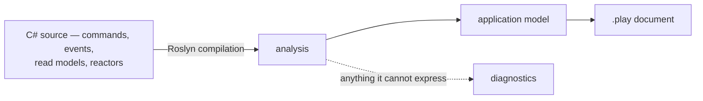

An [event model](/event-modeling/) is the picture of your system: which commands change state, which events they produce, which read models those events build, and which reactors turn one thing into another. Teams draw it on a whiteboard at the start, and then the code moves on without it. Six months later the picture is fiction and nobody trusts it enough to open.

**Screenplay** is a small language for writing that picture down as text — a `.play` file — so it can live in the repository next to the code it describes. Arc can *generate* one from your application's source. The model stops being something you maintain by hand and becomes something you regenerate, the same way the [TypeScript proxies](./understanding-the-proxy-boundary.mdx) are regenerated rather than hand-written.

## Generated from source, not from a running system

The generator reads a Roslyn compilation of your C# — the same thing the compiler sees. It never starts your application, connects to Chronicle, or looks at a deployed instance.

That choice is what makes the output useful:

- **It works from a checkout.** No database, no configuration, no environment. Clone and generate.
- **It is diffable in a pull request.** A commit that adds a command shows up as a few lines added to the `.play`. Reviewers see the model change next to the code change, and "did this alter the event model?" becomes a question the diff answers.
- **It is reproducible.** The same source always produces byte-identical output. Everything is ordered explicitly rather than by whatever order symbols happened to arrive in, so regenerating in CI and failing on a diff is a viable check.

A runtime-derived model would answer a different question — what one deployed instance looks like right now — and would vary with configuration and environment. There is one model, and its source of truth is your source code.



## Running it

The generator is used through the Cratis CLI, which ships separately from Arc:

```shell
cratis screenplay generate ./MyApp/MyApp.csproj --file MyApp.play
```

Point it at a project or a solution. A solution is one application rather than several, so its projects are read together into a single document — see [an application written as several projects](#an-application-written-as-several-projects). Anything the generator could not express is reported on the way out, and a run that reports an error exits non-zero — so a document nothing trustworthy went into never quietly looks fine. What the CLI has to do before it hands the source over is covered in [what the generator expects of its host](#what-the-generator-expects-of-its-host).

Because output is reproducible, a CI step can regenerate and fail when the committed `.play` no longer matches the source.

## Nothing is dropped silently

The gap between "what C# can say" and "what Screenplay can say" is real, and the worst thing a generator can do is paper over it. Every construct that cannot be expressed is reported as a located diagnostic — a stable code, a message you can act on, and where it came from — rather than quietly disappearing.

```text
Warning SP0019: The query 'Raw' returns 'IActionResult', which says how the result is
transported rather than what it is, so the query was left out (Library.Messaging.Feed)
```

Diagnostics come in three severities. **Information** means something is worth knowing but the document is complete. **Warning** means something was left out. **Error** means the document should not be trusted at all — either because the generator produced something the language rejects, or because nothing at all was recovered from source the compiler accepted.

## What the generator expects of its host

The generator takes a Roslyn `Compilation` and nothing else. It never opens a project file or loads a workspace, which is what lets it be driven from a CLI, from a specification, or from an editor. The other side of that bargain is that **assembling the compilation the way a real build would is the caller's job** — the generator reads what it is handed and cannot tell a missing type from a type that was never written.

The part hosts get wrong is source generators. `MSBuildWorkspace.GetCompilationAsync()` does not run them, and neither does any loading mode that stops at the compile items the project file lists. An Arc application leans on generation heavily — `[LoggerMessage]` partial classes, strongly-typed resource designer classes, the proxy and metrics generators — so a compilation loaded that way is missing every type those emit, and every reference to one becomes an unresolved-symbol error. This is the common case rather than an edge case.

A host should run the project's generators before handing the compilation over:

```csharp
var driver = CSharpGeneratorDriver.Create(
    generators: project.AnalyzerReferences
        .SelectMany(reference => reference.GetGenerators(LanguageNames.CSharp))
        .Select(GeneratorExtensions.AsSourceGenerator),
    parseOptions: (CSharpParseOptions)project.ParseOptions!);

driver.RunGeneratorsAndUpdateCompilation(compilation, out var generated, out _);
```

Then generate from `generated` rather than from `compilation`.

### What happens when it does not

Nothing is hidden, and nothing correct is thrown away. A compilation carrying errors is still analyzed, and `SP0024` says what happened — how many errors there were, the first of them, and how many artifacts came through anyway:

```text
Warning SP0024: The source did not compile - 607 error(s), the first being 'The name
'AccountsMessages' does not exist in the current context'. 341 artifact(s) were recovered
anyway, 341 of them from a declaration no error sits inside, so the document describes those
exactly as the source states them - a missing type named like 'SomethingMessages' or a
designer class usually means the compilation was handed over without the compile items a
build generates (Accounts)
```

Its **severity is decided rather than fixed**, because "the source did not compile" covers two outcomes that could not be further apart:

- **Warning** when at least one artifact was recovered from a declaration no compilation error sits inside. Those artifacts are described exactly as their source states them whatever failed elsewhere, so the run is successful and the document is worth keeping. A compilation missing its generated symbols lands here — the errors sit in code that declares no artifact, and the model is unaffected.
- **Error** when none were, either because nothing was recovered at all or because every declaration something came out of is one the compiler could not make sense of. There is then no part of the document a reader could trust, and a host following the contract exits non-zero.

A count is used rather than a proportion deliberately: any threshold would make the same recovery pass for a large application and fail for a small one, and zero is the only number that means recovery was *prevented* rather than merely dented.

Either way the document is written out, so what was recovered can be read.

### An application written as several projects

Nothing says an application is one project. A layered one puts its contracts in a project of their own; a host sitting beside the bounded contexts it serves is two projects at least — and no single one of them describes the application. Pointed at any one, the generator would describe half of it and refer to events it never introduced.

So `Generate` takes a list of compilations as well as a single one, and a host generating from a solution hands over one per project:

```csharp
var result = generator.Generate([contracts, application, host], options);
```

What comes back is one document rather than one per project, because the boundaries between projects are a build concern rather than something the model has:

- A namespace two projects declare into is **one slice**, whichever project each artifact sits in.
- A concept is **declared once**, however many projects refer to it.
- An event a sibling project declares is one the application **has**, so it is declared like anything else — not imported the way an event from a referenced package outside the application is.

Paths stay readable because they are written relative to the directory all the projects sit under rather than to each project's own root, so every path opens with the project it belongs to — `Library/Shipping/Dispatching/Dispatching.cs` beside `Library.Contracts/Ordering/Placing/Placing.cs`. Projects checked out in unrelated places share no such directory; each one's paths then fall back to its own root, and `SP0038` says so, because two files can then come out as the same path.

The order the projects arrive in never reaches the document. Nothing decides what order a host enumerates a solution in, so they are sorted by assembly name before anything is read and the same projects always print the same bytes. Where that order has to decide something it says so: two projects declaring the same artifact name into one slice keep the first and report `SP0037`.

## The generator checks its own output

Every diagnostic above names something about *your application* — a construct the language cannot hold, source that did not compile, projects that share no directory. There is one that names a defect in the generator instead.

After the document is written, the generator hands it straight back to the Screenplay compiler. If the compiler rejects it, `SP0034` is reported as an error — because a `.play` that does not compile is output nobody can use, and there is no way of writing an application that avoids it. This is not a mode you turn on: it runs on every generation, since the only way a rejected document is ever found is by reading each one back.

```text
Error SP0034: The generated document did not compile - 1 error(s), the first being
'Invalid description 'description RequestDescription' - expected 'description "<text>"''
on line 6. That is the generator being wrong rather than anything the source declared,
and the document is returned as it stands so the line can be read (Library)
```

The document is still written out, so you can open it at the reported line and see what happened. If you hit this, it is a bug worth [reporting](https://github.com/Cratis/Arc/issues) — include the line, and the C# declaration it came from.

Source that did not compile (`SP0024`) suppresses `SP0034` **when it is reported as an error** — a model recovered from symbols the compiler never accepted describes an application that does not exist, so a poor document made from it is a consequence of the broken build rather than a second, separate defect. Fix the build and generate again.

As a warning it suppresses nothing. That severity says the model stands, and a document built from a model that stands is exactly what the check exists for — suppressing it there would hand back a `.play` the language rejects with nothing wrong reported.

## A value is only ever what the source states

Wherever the document states a value — the mapping a command's `produces` writes into an event, the values a scenario is issued with, the message a validation rule fails with — it states what the source states and nothing beyond it. Two sources survive: a constant the compiler already holds, and a path into the command's own input. Anything arrived at while the request runs is left out and reported, because a guessed value is worse than an absent one.

Messages are where that bites. An application speaking more than one language declares each message once in a resource and names it from the validator, and the property it names resolves its text against the caller's culture — so there is no text for the compiler to hold, and no single text the document could honestly state.

The key is there to be read even though the text is not, and it is the better of the two to take: text would settle the document on one language the application itself never settled on. So the key is what is written, unresolved:

```text
command RequestBook
  title String
  validate
    title not empty message $strings.RequestMessages.TitleRequired
```

A key is qualified by the class declaring it, because a key is unique to its own resource and to nothing wider. Two areas of one application both requiring an organization number is ordinary rather than a mistake, and bare, those two would be one key that can carry only one text.

A message genuinely put together in code — `string.Format`, an interpolation — still has no text to write down, and is reported as `SP0016` rather than guessed at. So is a key the language has no way of writing: a reference is a path of bare words, and a resource key is under no such constraint.

## The scenarios a slice is specified by

A `.play` says what a slice does. The Chronicle integration specs in the folder beneath it already say the same thing by example — what had happened, the command that was issued, what followed — which is exactly the shape of a Screenplay `specification`. So they are read too, and the document carries the examples proving the model rather than only the model:

```text
slice StateChange Registration

  command RegisterAuthor
    name String
    produces AuthorRegistered
      name = name

  event AuthorRegistered
    name String

  specification WhenRegisteringAndTheNameIsTaken
    given AuthorRegistered
      name = "Jane Austen"
    given readmodel Author
      id = "author"
      name = "Jane Austen"
    when RegisterAuthor
      name = "Jane Austen"
    then error "unique-author-name"
```

- **`given`** is what the specification started from — the events it seeded, and the read model it pinned.
- **`when`** is the command it executed.
- **`then`** is each event it asserted was appended, and **`then error`** a rejection it asserted.

Both shapes Arc documents are read: the in-process one driving the pipeline through a scenario (`Scenario.Given…`, `Scenario.Execute`) and the one driving a running host (`EventLog.Append`, `Client.ExecuteCommand`). Which calls are which is decided by the type each one sits on, so neither testing package has to be referenced for either to be read.

A rejection the source asserts without naming a reason is written as bare `then error`. The source gives no code or presentation message, and inventing either would put meaning in the document the application never states.

Expect the document to grow. On a real application this roughly doubled it, at about seven lines per scenario.

### A scenario is read whole or not at all

A mapping stands on its own, so one that cannot be read can be left out while the rest of its block still says something true. A scenario cannot: an example missing the state it started from, the command it issued, or the outcome it expected is not that example — it is a different one nobody wrote. So a step that cannot be read takes the whole scenario with it, and `SP0039` names the scenario and what made it unreadable.

Conditional steps are the common case. Anything written under an `if`, a `switch`, a loop, a ternary or a lambda happened in some runs of the specification and not in others, and the source text does not say which — so a step recovered as unconditional would state a world nobody specified. That is the one failure mode a reader has no way of catching, which is why it is reported rather than guessed at.

A step need not construct what it states where it is written. A specification routinely holds the event or the command in a member and names that member in the step — `Scenario.Given.ForEventSource(id).ReadModel(TargetUser)`, `Scenario.Execute(_command)` — because the same value is asserted on later, or because it is built where the values it needs already are. Such a member is followed **one hop**, to the single place it was put together, and the step reads exactly as the inline form does. A `= null!` or `= default` declaration is not one of those places: it exists to satisfy the compiler and states no value.

One hop, and only from one place. A member given a value twice, or given it under a condition, held different values in different runs and the source does not say which one the step saw — so it stays unread and the scenario is left out with `SP0039`, the same as any other conditional step. Following a chain would mean reasoning about what a value was at the moment the step ran, which is a different discipline from reading what was written.

Values are the exception for the compatibility document generator, because a value stands on its own the way a mapping does. They follow [the discipline every other value follows](#a-value-is-only-ever-what-the-source-states): the identity two steps agree on is routinely a fresh identifier held in a field rather than something written down, and such a value is reported on its own while the rest of the legacy scenario stands.

### Neutral specification facts are stricter

`ArcSpecificationFactAdapter` is the independently consumable source-evidence surface. It contributes Generation scenario, ordered-step, and typed-value facts only when every explicitly authored step and value is exact. One computed or unreadable required value, conditional/repeated step, unretained read-model assertion, or event predicate value blocks the whole neutral scenario with `ARCSP0001`; it never contributes a smaller example than the source wrote.

The adapter retains scenario-, step-, value-, and rejection-level source ranges separately from the existing Arc model. This does not change legacy model equality or the current `.play` generator's compatibility output. Generation resolves the neutral facts by stable source identity, attaches the scenario through the exact target artifact placement, and lowers it only after complete atomic admission.

This distinction is deliberate: the compatibility generator keeps existing consumers stable, while the neutral adapter provides the fail-closed evidence required for render→recover semantic fidelity.

## Screens

A [vertical slice](./vertical-slices.md) puts the React component that realizes a slice's screen in the same folder as its C#. Roslyn syntax trees carry real file paths, so the generator knows where each slice's source lives and declares a `screen` for every `.tsx` component sitting next to it, named after the file:

```text
slice StateView Listing
  query AllAuthors => Author[]
  query AuthorById(id : String) => Author

  screen AuthorList
    file Authors/Listing/AuthorList.tsx
    data Author[] via query AllAuthors
    data Author via query AuthorById by id
```

Two things about a screen are recovered, and both come from something that can be checked.

**The `file` reference** says which file realizes the screen. It is what a reader opens, and no directive replaces it, so it stays on the screen even when directives sit beside it.

**The `data` directives** say which of the slice's queries the screen reads through. Arc generates a TypeScript proxy per query and a component imports that proxy by name, so the component's `import` statements name candidates — and a candidate is kept only when it matches a query the slice really declares. Nothing about the binding comes from the component beyond that name: the read model, whether there is one or many of it, and the parameter it is keyed by all come from the C# query. An import naming anything else — a package, a command, a sibling component, a type-only import — leaves nothing behind.

Everything else in the declarative form — `title`, `section`, `table` and `summary` with their columns and fields, `action`, `navigate to`, `layout` — is **never inferred**. That is structure expressed in JSX and component properties, and a guessed column is worse than an absent one: it puts a confident falsehood into a document whose entire value is that it describes the real application. Every screen reports `SP0028` to say so. Write those directives by hand if you want them, and expect a regeneration to leave them out.

Two more rules keep the result honest:

- **Components only, no descending.** A file carrying a second extension — `AddAuthor.stories.tsx`, `AddAuthor.spec.tsx` — is a companion of a component, not a screen. A folder *inside* a slice folder is a slice of its own under the same convention, so its files belong to it.
- **Anything uncertain is reported.** The relationship between a file and a slice comes entirely from where the file sits, so `SP0025` is reported whenever sitting there says less than usual: a slice whose source is spread over several folders, one folder holding the source of several slices, or two files claiming a single screen name.

## What is not expressed

A `.play` is a description of an application, not a second copy of it. **It does not round-trip back to code**, and reading one will not tell you everything the code does. The losses run in both directions.

### Screenplay constructs the generator cannot infer

These are part of the language, but nothing in C# says them, so a generated document never contains them. Add them by hand if you want them, and expect a regeneration to leave them out:

| Construct | Why it cannot be inferred |
|---|---|
| `capture` | Describes ingesting an external system. Nothing in an Arc application declares one. |
| `persona` | Who uses the system is a product decision, not a code artifact. |
| `seed` | Sample data is a modeling concern, not something the source states. |
| The declarative body of a `screen` — `title`, `section`, `table`, `summary`, `action`, `navigate to`, `layout` | What a screen *shows and does* is JSX. Its `file` reference and its `data` bindings are generated; the rest would be a guess — see [Screens](#screens). |
| `@sensitive` | `@pii` is the one of the two concept attributes with a counterpart — `[PII]`. Nothing in Arc or Chronicle says `@sensitive`. |

### Detail Screenplay cannot represent

These exist in your application and do not reach the document, because the language has no counterpart. Each is reported as a diagnostic when encountered, so the document tells you it is silent about them.

| In Arc or Chronicle | Why it is not in the document |
|---|---|
| Event generations, `[Tombstone]`, `[CompensationFor]` | Screenplay describes the current shape of an event. It has no notion of versioning, of a deletion marker, or of one event compensating another. `SP0014`. |
| Reducer folds (`IReducerFor<T>`) | The fold is code. The read model and the events it observes are recovered; the logic that combines them is not. `SP0020`. |
| Aggregate roots no command reaches | The events an aggregate root applies are stated through the command that hands its work to it. One that nothing calls has nothing to state them through — a document has no construct for a class that decides on its own. `SP0018`. |
| A behavior deciding on the state an aggregate root holds | A `produces when` condition compares the input of the command, which is all a document knows at the moment the command is issued. A behavior refusing to act on what it has already seen is a real decision with nowhere to go, so the event is stated unconditionally and `SP0027` reports the decision. A behavior deciding on one of its own *parameters* is recovered, because the call site says which command input that parameter was given. |
| Inline `policy` code and requirements built in code | `RequireAssertion(…)` and a policy registered from an `AuthorizationPolicy` built elsewhere are code. `RequireAuthenticatedUser`, `RequireRole`, and `RequireClaim` given the values it accepts are recovered; the rest is reported as `SP0026` — including a `RequireClaim` naming only a claim type, which a policy condition has no way to state. |
| The event source id from a `(TKey, TEvent)` handler | The event is recovered; the identifier saying *which* event source it goes to has no counterpart. `SP0013`. |
| Emptying a scope with `[ClearWith]`; removing a child with `[RemovedWith]` on the property holding it | Nothing in the model a projection is built from carries a scope being emptied again, so `[ClearWith]` has nowhere to go (`SP0015`). A removal does have somewhere — but it is read from the type of the child, alongside the events filling that child in, so the same removal written beside the collection is reported as `SP0007` instead. |
| Read model tags | A read model has no declaration of its own — it appears as the type a query returns — so there is nowhere to hang a tag. Tags on *events* are recovered and written out. `SP0042`. |
| Query paging and sorting, custom routes | These say how a model is served rather than what it is. The parameters the host fills in are left out, and a route template — `[Path]`, `[Route]`, or a template on an HTTP verb — has no counterpart. `SP0041`. |

If a generated `.play` is missing something you expected, the diagnostics are the first place to look — the omission is almost always reported.

## When this is the wrong fit

If you maintain a `.play` by hand as the *design* your code is written against — modeling first, then implementing — generation is the wrong direction and will overwrite your intent. Generation suits the opposite flow: code exists, and you want the model it already describes, kept honest automatically.

## Related

- [Vertical slices](./vertical-slices.md) — the folder shape the generator recovers slices from. A slice per namespace produces a far better document than artifacts sitting in the root namespace.
- [Understanding the proxy boundary](./understanding-the-proxy-boundary.mdx) — the other thing Arc generates from the same source of truth.
